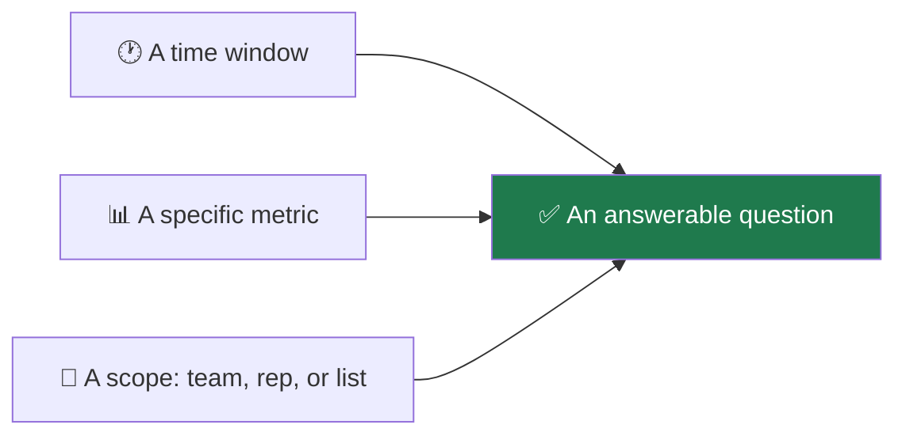

Once [MCP is connected](/connect-mcp), your AI assistant can read your AI Sync
data and answer questions directly. No dashboard, no clicking.

This page is about **asking well**. A vague question gets a vague answer; a
precise one gets a number you can act on.

<Note>
Set this up first: [Connect MCP](/connect-mcp). Everything below assumes your
agent can already reach your account.
</Note>

## 🎯 The shape of a good question



<CardGroup cols={2}>
<Card title="✅ Works" icon="circle-check">
*"What was our connect rate last week, and how did it compare to the week
before?"*

A window, a metric, and an implied comparison.
</Card>
<Card title="❌ Too vague" icon="circle-xmark">
*"How are we doing?"*

Doing at what, over what period, compared to what?
</Card>
</CardGroup>

## 💬 Questions worth asking

<AccordionGroup>

<Accordion title="Daily check-in" icon="sun">
- "How many dials and connects did we do today?"
- "Is anyone online and dialling right now?"
- "What's our connect rate today versus yesterday?"
</Accordion>

<Accordion title="Finding what is broken" icon="wrench">
- "Our connect rate dropped this week. What changed?"
- "How many calls were answered but never reached a rep?"
- "What share of our dials hit voicemail or got screened?"
- "Are any of our numbers getting flagged as spam?"

<Tip>
That first question is the most useful one on this page. It makes the agent
check the outcome breakdown rather than guess, and the answer usually points at
screening, bad numbers, or pacing — not at your reps.
</Tip>
</Accordion>

<Accordion title="Coaching your team" icon="users">
- "Rank my reps by connects for the last 7 days."
- "Which rep has the best connect rate with at least 100 dials?"
- "How much talk time did each rep log this week?"

<Warning>
Always include a minimum dial count when asking about rates. Without one, a rep
with four dials and one connect can top the list at 25%.
</Warning>
</Accordion>

<Accordion title="Deciding which list to call" icon="list-check">
- "Which power list has the best connect rate?"
- "Which lists have we barely touched?"
- "How many bad numbers are in our lists?"
</Accordion>

<Accordion title="Pipeline and outcomes" icon="chart-line">
- "How many appointments were set this week?"
- "What's our disposition breakdown for the last 30 days?"
- "How many contacts are sitting in follow-up?"
</Accordion>

</AccordionGroup>

## 🧠 Give your agent the vocabulary

Your agent answers better when it knows what your numbers mean. Paste this once
at the start of a session:

```text
Before answering questions about my dialer numbers, use these definitions:

- A CONNECT is a real conversation: a person answered AND reached a rep.
  Voicemail, answering machines and screened calls are never connects.
- ANSWERED includes voicemail. It is not the same as connected.
- "Answered, no rep" means a person picked up and got nobody. That is an
  abandoned call and the regulatory limit is 3% of live human answers.
- SCREENED means a handset (iPhone, carrier) answered on the lead's behalf.
  It is not voicemail and not a person.
- Any rate based on fewer than 10 dials is noise. Say "not enough data"
  rather than reporting a percentage.
- All day boundaries follow my profile time zone, not UTC.

If a number looks wrong, check the outcome breakdown before blaming the reps.
```

<Note>
Most of that is enforced in the product too, so the agent and the dashboard give
you the same answer. The paste-in just stops your agent inventing its own
definitions in conversation.
</Note>

## 🔍 Checking an answer you doubt

<Steps>
<Step title="Ask for the window and scope">
*"What date range and which reps did that cover?"* Most wrong answers are right
numbers over the wrong window.
</Step>
<Step title="Ask it to reconcile">
*"Do those outcome numbers add up to the total dials?"* They always should. If
they do not, something is off.
</Step>
<Step title="Cross-check one figure">
Open [Dialer Performance](/dashboard/dialer-performance) and compare a single
number over the same range.
</Step>
<Step title="Watch for false zeros">
A rate of exactly 0% on a small sample usually means *not measured*. Ask how
many dials it was based on.
</Step>
</Steps>

<Warning>
If your agent gives a confident percentage for a rep or list with only a handful
of dials, push back. That is the single most common way a good list or a good
rep gets cut on bad evidence.
</Warning>

## ➡️ Where to go next

<CardGroup cols={2}>
<Card title="Run your dialer by chat" icon="terminal" href="/agents/running-your-dialer">
Go beyond questions and make changes.
</Card>
<Card title="How calls actually work" icon="diagram-project" href="/dialer/how-calls-work">
The definitions behind every answer.
</Card>
<Card title="Connect MCP" icon="plug" href="/connect-mcp">
Set up the connection.
</Card>
<Card title="Dialer Performance" icon="chart-line" href="/dashboard/dialer-performance">
The same numbers, on screen.
</Card>
</CardGroup>
