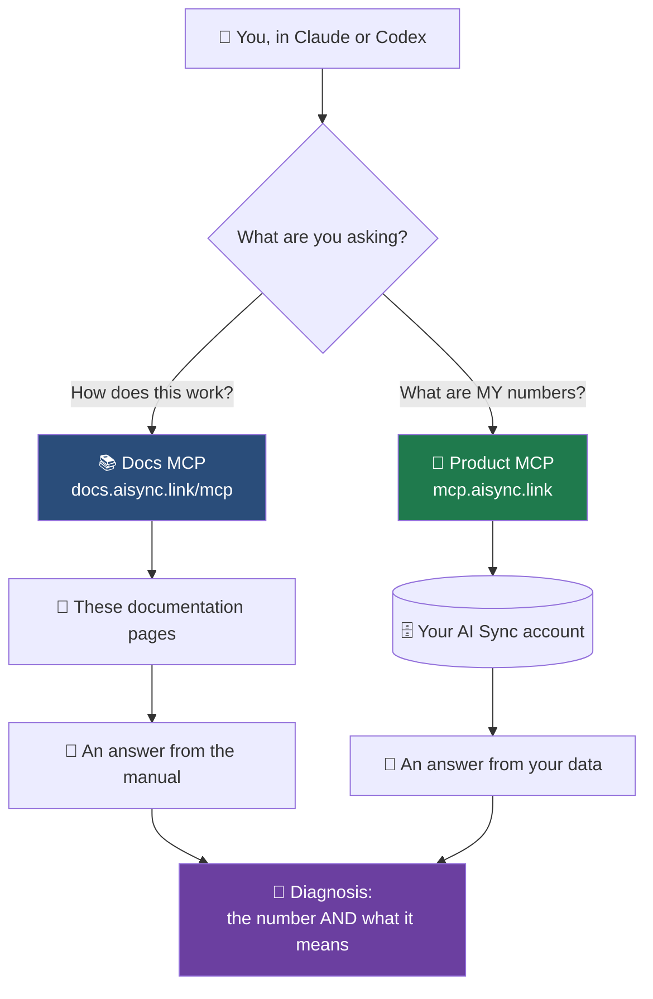
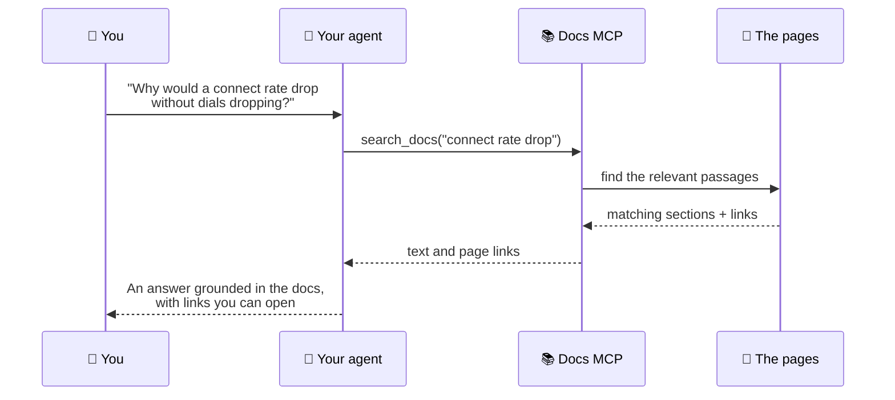

There are **two** AI Sync connections, and they do different jobs. Most teams
want both.

<Warning>
**`docs.aisync.link/mcp` is not a web page.** It is a machine endpoint — open it
in a browser and you get a raw JSON error, because it only speaks to AI clients
over the MCP protocol.

**This page is the documentation for it.** You are in the right place.
</Warning>

<CardGroup cols={2}>
<Card title="📚 Docs MCP — reads the manual" icon="book">
`https://docs.aisync.link/mcp`

Answers *how does this work* from these pages. Read-only, no login, nothing to
approve. Works for anyone.
</Card>
<Card title="🔧 Product MCP — reads your account" icon="plug">
`https://mcp.aisync.link/mcp-oauth`

Answers *what are my numbers* and makes changes. Needs your login. See
[Connect MCP](/connect-mcp).
</Card>
</CardGroup>

## 🗺️ How the two connections fit together



Neither connection alone gives you the last box. The docs know what a falling
connect rate usually means; only your account knows that yours fell.

<Note>
The docs connection is the quicker win. It needs no account, so you can give it
to a new rep, a contractor, or anyone helping you set up.
</Note>

## 🔌 Connect in one command

<Tabs>
<Tab title="Claude">
```bash
claude mcp add --transport http aisync-docs https://docs.aisync.link/mcp
```
No login step. It works immediately.
</Tab>

<Tab title="Codex">
```bash
codex mcp add aisync-docs --url https://docs.aisync.link/mcp
```
</Tab>

<Tab title="Cursor / VS Code">
Add to your MCP settings:

```json
{
  "mcpServers": {
    "aisync-docs": {
      "url": "https://docs.aisync.link/mcp"
    }
  }
}
```
</Tab>
</Tabs>

## 🧰 What your agent gets

| Tool | What it does |
|---|---|
| **search_docs_ai_sync** | Searches every page and returns the relevant passage with a link. |
| **query_docs_filesystem** | Browses the docs like a filesystem, for when a question spans several pages. |
| **submit_feedback** | Reports a documentation problem straight to the docs team. |

<Tip>
That last one is worth using. If your agent gives you a wrong or confusing
answer from the docs, tell it to submit feedback. The page gets fixed for
everyone.
</Tip>

## 🔄 What happens when you ask



<Tip>
Your agent cites the page it used. If an answer looks wrong, open the link and
check it — and if the page itself is wrong, tell your agent to submit feedback.
</Tip>

## 💬 Questions it answers well

<AccordionGroup>

<Accordion title="Understanding your numbers" icon="chart-line">
- "In AI Sync, what's the difference between answered and connected?"
- "Why would a connect rate drop without dials dropping?"
- "What does 'answered, no rep' mean and why does it matter?"

These pull from [How calls actually work](/dialer/how-calls-work) rather than
from whatever the model assumes a dialer does.
</Accordion>

<Accordion title="Setting things up" icon="gear">
- "How do I map dispositions to pipeline stages?"
- "How many phone numbers do I need for five reps on three lines?"
- "How do I turn on predictive pacing?"
</Accordion>

<Accordion title="Fixing something" icon="wrench">
- "My dashboard shows zeros but we're dialling. What's wrong?"
- "A rep shows a dash instead of a connect rate. Is that a bug?"
- "The screening message isn't playing on my phone."
</Accordion>

<Accordion title="Training a new rep" icon="graduation-cap">
- "Explain what each banner colour means in the dialer."
- "What should a rep do when a call gets screened?"

Point a new rep's own assistant at the docs and let them ask instead of
interrupting you.
</Accordion>

</AccordionGroup>

## 🤝 Using both together

With both connections live, your agent can answer a question that neither could
alone:

> *"My connect rate dropped this week. Pull my actual numbers, then tell me what
> the docs say usually causes that."*

The product MCP fetches your outcome breakdown. The docs MCP explains that
rising Declined and Screened counts point at caller ID rather than at your reps.
You get the diagnosis, not just the number.

<Warning>
Only the product connection can change anything. The docs connection is
read-only, so there is no risk in giving it to anyone.
</Warning>

## 📄 Other ways agents read these docs

Some tools prefer a plain text feed over MCP. Both are always current:

- `https://docs.aisync.link/llms.txt` — an index of every page
- `https://docs.aisync.link/llms-full.txt` — the full text of the whole site

Paste either URL into any assistant that accepts a link.

## ➡️ Where to go next

<CardGroup cols={2}>
<Card title="Connect the product MCP" icon="plug" href="/connect-mcp">
Let your agent read your account and act on it.
</Card>
<Card title="Ask about your data" icon="robot" href="/agents/asking-about-your-data">
Questions that work, and how to trust an answer.
</Card>
<Card title="Run your dialer by chat" icon="terminal" href="/agents/running-your-dialer">
Make changes safely.
</Card>
<Card title="How calls actually work" icon="diagram-project" href="/dialer/how-calls-work">
The definitions your agent will quote back to you.
</Card>
</CardGroup>
