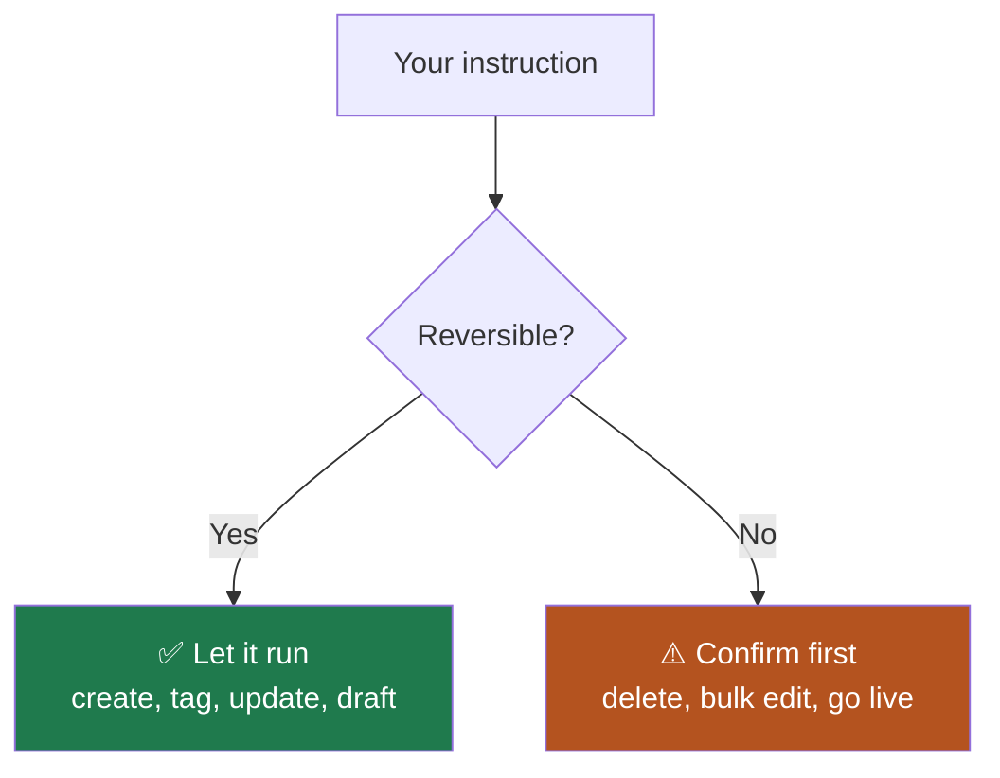

Questions are the safe half. This page covers the other half: letting your agent
**change** things in AI Sync.

<Warning>
Your agent acts as **you**. It has your permissions and its changes are real. A
request to "clean up the old lists" can delete lists. Be specific, and ask it to
confirm before anything destructive.
</Warning>

## 🚦 What to let an agent do

<CardGroup cols={2}>
<Card title="✅ Safe to delegate" icon="circle-check">
Creating lists, tagging contacts, drafting SMS templates, building agents,
searching numbers, pulling reports.
</Card>
<Card title="⚠️ Confirm first" icon="triangle-exclamation">
Deleting anything, bulk contact edits, buying numbers, starting a live campaign,
changing dispositions your pipeline depends on.
</Card>
</CardGroup>

## 🛠️ Things worth asking for

<AccordionGroup>

<Accordion title="Lists and contacts" icon="list-check">
- "Create a power list called *Q4 Solar Follow-up*."
- "Tag every contact dispositioned *Interested* in the last 30 days as `hot`."
- "How many contacts in this list have no phone number?"

<Tip>
Ask for a count before a bulk change: *"How many contacts would that affect?"*
A number you did not expect is your signal to stop.
</Tip>
</Accordion>

<Accordion title="Phone numbers" icon="hashtag">
- "Search for numbers in the 312 area code."
- "Which of my numbers are flagged for spam?"
- "List every number and what it is used for."

See [Caller ID and numbers](/dialer/caller-id-and-numbers) for how many you
need.
</Accordion>

<Accordion title="Dispositions and pipeline" icon="diagram-project">
- "List my dispositions and the pipeline stage each maps to."
- "Which dispositions have no pipeline stage?"

<Warning>
Dispositions drive your pipeline and your reporting. Have your agent show you
the current mapping before changing any of it. See
[Dispositions and pipeline](/go-live/dispositions-and-pipeline).
</Warning>
</Accordion>

<Accordion title="Campaigns" icon="phone">
- "Create a voice campaign for the *Q4 Solar Follow-up* list."
- "What's the status of my running campaigns?"
- "Pause the campaign called *Aged Leads*."

Creating a campaign never starts calls. Going live is always separate — see
[Predictive pacing](/dialer/predictive-pacing).
</Accordion>

<Accordion title="Reports and exports" icon="file-lines">
- "Export last week's call report as CSV."
- "Summarise yesterday's calls by disposition."
</Accordion>

</AccordionGroup>

## ✍️ How to phrase a change

<Steps>
<Step title="Name the exact thing">
"The power list called *Q4 Solar Follow-up*" beats "the solar list". Names are
unambiguous; descriptions are not.
</Step>
<Step title="Say the scope out loud">
"Contacts dispositioned *Not Interested* in the last 90 days" beats "the dead
ones".
</Step>
<Step title="Ask for a dry run">
*"Tell me what that would change before you do it."*
</Step>
<Step title="Then approve">
*"Yes, go ahead."* Now it acts, and you know what you approved.
</Step>
</Steps>

<Note>
The dry-run step costs one message and prevents the expensive mistakes. Use it
for anything touching more than a handful of records.
</Note>

## 🧯 If something goes wrong

<AccordionGroup>

<Accordion title="It changed more than you meant" icon="triangle-exclamation">
Ask immediately: *"What exactly did you just change? List every record."* Then
check [Activity logs](/activity-logs/activity-logs), which record what happened
regardless of what the agent reports.
</Accordion>

<Accordion title="It says it cannot find something" icon="magnifying-glass">
Usually a naming mismatch. Ask it to list what it *can* see: *"List all my power
lists"*, then use the exact name it returns.
</Accordion>

<Accordion title="It claims an ID belongs to another platform" icon="circle-question">
Ask it to look the ID up in your account rather than guess. If it is not
recognised, it is not in your account.
</Accordion>

<Accordion title="Numbers disagree with the dashboard" icon="chart-line">
Check the window and scope first, then see
[Asking about your data](/agents/asking-about-your-data).
</Accordion>

</AccordionGroup>

## ➡️ Where to go next

<CardGroup cols={2}>
<Card title="Ask about your data" icon="robot" href="/agents/asking-about-your-data">
The read-only half, and how to trust an answer.
</Card>
<Card title="Connect MCP" icon="plug" href="/connect-mcp">
Set up or reconnect the account link.
</Card>
<Card title="Connect the docs" icon="book-open-reader" href="/agents/docs-mcp">
Read-only access to these pages, safe for anyone.
</Card>
<Card title="Activity logs" icon="clock-rotate-left" href="/activity-logs/activity-logs">
What actually changed, independent of the agent.
</Card>
<Card title="Troubleshooting" icon="wrench" href="/go-live/troubleshooting">
When the product itself is misbehaving.
</Card>
</CardGroup>
