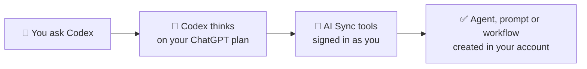

If you pay for ChatGPT (Plus, Pro or Business), you can use that plan to build
inside AI Sync. No API key, no extra AI bill.

You connect **Codex**, OpenAI's assistant that runs on your ChatGPT plan, to
your AI Sync account once. After that you type what you want, and it does the
work in your account.



<Note>
Codex only sees **your** account, and only after you sign in and approve it.
It can do what your AI Sync login can do, nothing more.
</Note>

## 🧭 Set it up (about 5 minutes, once)

<Steps>
<Step title="Install or update Codex and sign in with ChatGPT">
Open the **Terminal** app and run:

```bash
npm install -g @openai/codex@latest && codex login
```

Choose **Sign in with ChatGPT** when asked. If you already have Codex, still
run this: an older Codex can refuse your plan's newest model.
</Step>

<Step title="Add your AI Sync account">
```bash
codex mcp add ai-sync --url https://mcp.aisync.link/mcp-oauth
```

Your browser opens an AI Sync sign-in page. Sign in with your normal AI Sync
login and approve.
</Step>

<Step title="If no sign-in page opened">
```bash
codex mcp login ai-sync
```

Then sign in and approve in the browser.
</Step>

<Step title="Check it worked">
```bash
codex mcp list
```

`ai-sync` should show **OAuth** in the Auth column.
</Step>
</Steps>

You can also copy these commands in AI Sync: click your profile (top right) → **Settings** → **Integration** → **MCP** → **Connect** → **Codex** tab.

## 💬 Three things to ask first

Open Codex (type `codex` in Terminal) and try:

<CardGroup cols={1}>
<Card title="Write a voice agent prompt" icon="microphone">
"Create a new inbound agent called *Front Desk* and write and save a prompt for
a friendly medspa receptionist who answers Botox pricing questions and offers
to book a consultation."
</Card>
<Card title="Build a workflow" icon="diagram-project">
"Create a draft workflow: when a contact gets the tag *no-show*, wait one day,
then send them a text asking to rebook. Leave it off so I can review it."
</Card>
<Card title="Ask about your numbers" icon="chart-line">
"How many calls did my reps make this week, and what was each rep's connect
rate?"
</Card>
</CardGroup>

<Tip>
Ask for workflows as **drafts** and turn them on yourself after a look. Codex
will do exactly what you ask, including turning things on.
</Tip>

## ❓ Good to know

- **It uses your ChatGPT plan's limits.** Heavy use can hit your plan's usage
  cap; it resets on ChatGPT's schedule.
- **Prefer an API key?** You can still paste an OpenAI key under
  **Settings → Integration → OpenAI** for workflow AI steps.
- **Disconnect any time:** `codex mcp logout ai-sync`.

See also [Connect your AI assistant (MCP)](/connect-mcp) and
[Asking about your data](/agents/asking-about-your-data).
