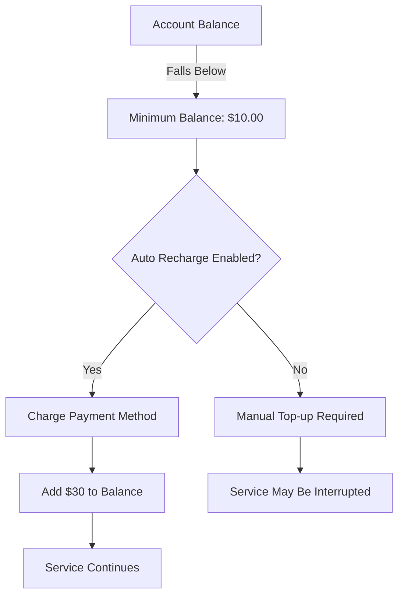
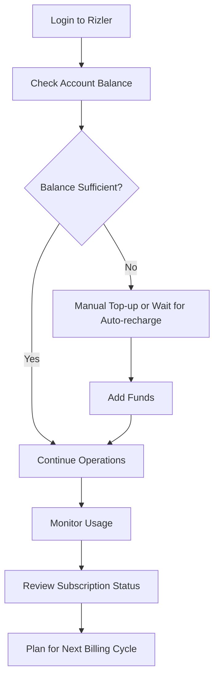

# Manage Subscription

The Manage Subscription page is your central hub for controlling all aspects of your Rizler subscription, from monitoring usage and billing to configuring payment methods and auto-recharge settings.

<CardGroup cols={2}>
  <Card title="Subscription Overview" icon="calendar-check" iconType="duotone">
    Monitor trial periods, renewal dates, and subscription status
  </Card>
  <Card title="Payment Management" icon="credit-card" iconType="duotone">
    Configure and manage payment methods securely
  </Card>
  <Card title="Auto-Recharge" icon="arrows-rotate" iconType="duotone">
    Set up automatic balance top-ups for uninterrupted service
  </Card>
  <Card title="Pricing Plans" icon="tags" iconType="duotone">
    View and upgrade to different pricing packages
  </Card>
</CardGroup>

## 📊 Current Balance & Overview

<Info>
**Current Balance: $941.69831** - Your account balance is displayed prominently at the top right of the interface for quick reference.
</Info>

## 🗓️ Subscription Details

The subscription details section provides crucial information about your current subscription status and important dates.

### Key Fields

<AccordionGroup>
  <Accordion title="Trial Date Start" icon="calendar-plus">
    **Current Value**: 2024-10-21
    
    The date when your trial period began. This helps track how long you've been using the service and when trial benefits expire.
  </Accordion>
  
  <Accordion title="Trial Date End" icon="calendar-minus">
    **Current Value**: 2024-10-22
    
    The date when your trial period ends. After this date, regular subscription pricing applies.
  </Accordion>
  
  <Accordion title="Renewal At" icon="calendar-arrow-up">
    **Current Value**: 2024-10-26
    
    Your next billing cycle date. This is when your subscription will automatically renew and your payment method will be charged.
  </Accordion>
</AccordionGroup>

<Tip>
Keep track of your renewal date to avoid unexpected charges. You can modify or cancel your subscription before the renewal date if needed.
</Tip>

## 💳 Setup Payment Method

Secure payment processing is essential for maintaining uninterrupted service. The payment method section allows you to configure your preferred payment option.

### Payment Method Configuration

<Steps>
  <Step title="Add Payment Method">
    Click the **Edit** button to add or modify your payment method
  </Step>
  <Step title="Enter Card Details">
    Provide your credit card information securely
    - Card Number: ****2604
    - Cardholder Name: JANE TEST
    - Expiration: 8/2029
  </Step>
  <Step title="Verify and Save">
    Complete the verification process to activate your payment method
  </Step>
</Steps>

<Warning>
Ensure your payment method is valid and has sufficient funds to avoid service interruptions. Update your payment information before the card expires.
</Warning>

## 🔄 Auto Recharge Settings

Auto Recharge ensures your account maintains a minimum balance for continuous service without manual intervention.

### Configuration Options

| Setting | Description | Current Value |
|---------|-------------|---------------|
| **Enabled** | Toggle auto-recharge functionality | No |
| **Minimum Balance** | Balance threshold that triggers recharge | $10.00 |
| **Recharge Amount** | Amount added when auto-recharge activates | $30 |

### How Auto Recharge Works

<Steps>
  <Step title="Monitor Balance">
    System continuously monitors your account balance
  </Step>
  <Step title="Threshold Check">
    When balance falls below $10.00, auto-recharge triggers
  </Step>
  <Step title="Automatic Charge">
    $30 is automatically charged to your configured payment method
  </Step>
  <Step title="Balance Updated">
    Your account balance is immediately updated with the recharged amount
  </Step>
</Steps>

<Note>
Click **Save** after making any changes to your auto-recharge settings to apply the new configuration.
</Note>

## 📦 Packages Pricing

The Dev Package offers comprehensive features for development and testing environments.

### Dev Package - $1.00/Monthly

<CardGroup cols={1}>
  <Card title="Dev Package Features" icon="code" iconType="duotone">
    Perfect for developers and small-scale testing environments
    
    **BYOC (Bring Your Own Carrier)**
    
    ✅ **1.00$ Per Seat Without Carrier**
    ✅ **Power Dial Upto 10 at a time**
    ✅ **5 Phone Number Include**
    ✅ **Free GetLogLevel Account**
    ✅ **0.50$ Per Phone Number Cost**
    ✅ **Hello Dev**
  </Card>
</CardGroup>

### Package Benefits

<AccordionGroup>
  <Accordion title="Cost-Effective Scaling" icon="dollar-sign">
    At just $1.00 per seat, the Dev Package provides affordable access to core functionality for development teams.
  </Accordion>
  
  <Accordion title="BYOC Flexibility" icon="network-wired">
    Bring Your Own Carrier (BYOC) support allows you to use your preferred telecommunications provider while leveraging AISync's platform.
  </Accordion>
  
  <Accordion title="Power Dialing" icon="phone">
    Concurrent dialing capability for up to 10 calls simultaneously, perfect for testing call center operations.
  </Accordion>
  
  <Accordion title="Phone Number Allocation" icon="hashtag">
    Includes 5 phone numbers in the base package, with additional numbers available at $0.50 each.
  </Accordion>
  
  <Accordion title="GetLogLevel Integration" icon="chart-line">
    Free access to GetLogLevel account for enhanced logging and monitoring capabilities.
  </Accordion>
</AccordionGroup>

## 🔧 Workflow & Usage Guide

### Daily Operations Workflow

### Monthly Subscription Management

<Steps>
  <Step title="Review Usage">
    Check your monthly usage patterns and costs
  </Step>
  <Step title="Evaluate Plan">
    Determine if your current package meets your needs
  </Step>
  <Step title="Update Payment Method">
    Ensure payment information is current and valid
  </Step>
  <Step title="Configure Auto-recharge">
    Set appropriate thresholds based on usage patterns
  </Step>
  <Step title="Plan Upgrades">
    Consider upgrading if you're approaching package limits
  </Step>
</Steps>

## 🎯 Best Practices

<CardGroup cols={2}>
  <Card title="Proactive Monitoring" icon="chart-line" iconType="duotone">
    - Check balance regularly
    - Set up auto-recharge with appropriate thresholds
    - Monitor renewal dates
  </Card>
  <Card title="Payment Security" icon="shield-check" iconType="duotone">
    - Keep payment methods updated
    - Use secure, valid credit cards
    - Monitor for unauthorized charges
  </Card>
  <Card title="Usage Optimization" icon="gauge-high" iconType="duotone">
    - Track feature usage patterns
    - Upgrade plans when needed
    - Utilize included features fully
  </Card>
  <Card title="Cost Management" icon="piggy-bank" iconType="duotone">
    - Set reasonable recharge amounts
    - Monitor per-seat costs
    - Plan for scaling needs
  </Card>
</CardGroup>

## ⚡ Quick Actions

<AccordionGroup>
  <Accordion title="Enable Auto-Recharge" icon="toggle-on">
    1. Navigate to Auto Recharge section
    2. Toggle **Enabled** to "Yes"
    3. Set desired minimum balance and recharge amount
    4. Click **Save**
  </Accordion>
  
  <Accordion title="Update Payment Method" icon="credit-card">
    1. Click **Edit** in the Setup Payment Method section
    2. Enter new payment information
    3. Verify card details
    4. Save changes
  </Accordion>
  
  <Accordion title="Check Next Billing Date" icon="calendar">
    View the **Renewal At** field in Subscription Details to see your next billing date: **2024-10-26**
  </Accordion>
</AccordionGroup>

## 🚨 Troubleshooting

<Warning>
**Common Issues and Solutions**

- **Payment Failed**: Update payment method or contact your bank
- **Service Interrupted**: Check account balance and payment status
- **Auto-recharge Not Working**: Verify payment method and settings
- **Billing Questions**: Contact support with your account details
</Warning>

## 📞 Support & Assistance

For additional help with subscription management:

- **Documentation**: Refer to billing and payment method guides
- **Support Team**: Contact customer support for billing issues
- **Account Management**: Use the settings panel for self-service options

<Info>
Your subscription status and billing information are updated in real-time. Changes to payment methods or auto-recharge settings take effect immediately upon saving.
</Info>
