 
 

## Overview

The Transaction History feature provides a comprehensive view of all financial transactions within your account. This powerful tool allows you to track payments, monitor billing activities, and maintain detailed records of all monetary interactions with the platform.

<CardGroup cols={3}>
  <Card title="📊 Track Payments" icon="chart-line">
    Monitor all payment transactions in real-time
  </Card>
  <Card title="🔍 Search & Filter" icon="magnifying-glass">
    Find specific transactions using advanced filters
  </Card>
  <Card title="📋 Export Records" icon="download">
    Download transaction data for accounting purposes
  </Card>
</CardGroup>

## Key Features

<AccordionGroup>
  <Accordion title="💳 Payment Tracking" icon="credit-card">
    Track all payment methods including credit cards, bank transfers, and digital wallets
  </Accordion>
  
  <Accordion title="📅 Date Range Filtering" icon="calendar">
    Filter transactions by custom date ranges or predefined periods
  </Accordion>
  
  <Accordion title="💰 Amount Filtering" icon="dollar-sign">
    Search transactions by amount ranges and currency types
  </Accordion>
  
  <Accordion title="📱 Mobile Responsive" icon="mobile">
    Access your transaction history from any device
  </Accordion>
</AccordionGroup>

## Transaction Workflow

```mermaid
graph TD
    A[🛒 Purchase/Service] --> B[💳 Payment Processing]
    B --> C[✅ Payment Verification]
    C --> D[📝 Transaction Created]
    D --> E[📧 Email Notification]
    D --> F[📊 Added to History]
    F --> G[🔍 Available for Search]
    G --> H[📊 Analytics Update]
 
```



### Workflow Steps

1. **🛒 Purchase Initiated**: User makes a purchase or subscribes to a service
2. **💳 Payment Processing**: Payment gateway processes the transaction
3. **✅ Verification**: System verifies payment success/failure
4. **📝 Record Creation**: Transaction record is created in the database
5. **📧 Notification**: User receives email confirmation
6. **📊 History Update**: Transaction appears in transaction history
7. **🔍 Search Available**: Transaction becomes searchable and filterable

## Transaction Fields

<Note>
Understanding each field helps you better track and manage your financial records.
</Note>

### Core Fields

<CardGroup cols={2}>
  <Card title="Invoice Number" icon="hashtag">
    **Format**: INV-YYYY-XXXXXX
    
    **Example**: `INV-2025-000123`
    
    Unique identifier for each transaction
  </Card>
  
  <Card title="User" icon="user">
    **Format**: User Email/Name
    
    **Example**: `john.doe@company.com`
    
    Account holder who initiated the transaction
  </Card>
  
  <Card title="Amount" icon="dollar-sign">
    **Format**: $XXX.XX
    
    **Example**: `$99.99`
    
    Transaction amount including taxes and fees
  </Card>
  
  <Card title="Status" icon="circle-info">
    **Values**: Success, Failed, Pending, Refunded
    
    **Example**: `Success`
    
    Current state of the transaction
  </Card>
</CardGroup>

### Detailed Field Descriptions

| Field | Description | Example Value | Data Type |
|-------|-------------|---------------|-----------|
| **#** | Sequential transaction number | `1247` | Integer |
| **User** | Account email or username | `sarah.wilson@techcorp.com` | String |
| **Invoice Number** | Unique transaction identifier | `INV-2025-000456` | String |
| **Amount** | Transaction value with currency | `$249.99` | Currency |
| **Status** | Transaction completion state | `Success` | Enum |
| **Created At** | Transaction timestamp | `2025-01-15 14:30:25` | DateTime |
| **Payment Method** | How payment was processed | `Visa **** 1234` | String |
| **Description** | Transaction details | `Monthly Pro Subscription` | String |

## Sample Transaction Data

<Tabs>
  <Tab title="Recent Transactions">
    ```json
    {
      "transactions": [
        {
          "id": 1247,
          "user": "john.doe@company.com",
          "invoice_number": "INV-2025-000123",
          "amount": "$99.99",
          "status": "Success",
          "created_at": "2025-01-15 09:30:00",
          "payment_method": "Visa **** 4242",
          "description": "Pro Plan Monthly Subscription"
        },
        {
          "id": 1246,
          "user": "sarah.wilson@techcorp.com",
          "invoice_number": "INV-2025-000122",
          "amount": "$249.99",
          "status": "Success",
          "created_at": "2025-01-14 16:45:30",
          "payment_method": "Mastercard **** 5555",
          "description": "Enterprise Plan Quarterly"
        },
        {
          "id": 1245,
          "user": "mike.brown@startup.io",
          "invoice_number": "INV-2025-000121",
          "amount": "$49.99",
          "status": "Failed",
          "created_at": "2025-01-14 11:20:15",
          "payment_method": "Amex **** 3782",
          "description": "Basic Plan Monthly"
        }
      ]
    }
    ```
  </Tab>
  
  <Tab title="Failed Transactions">
    ```json
    {
      "failed_transactions": [
        {
          "id": 1245,
          "user": "mike.brown@startup.io",
          "invoice_number": "INV-2025-000121",
          "amount": "$49.99",
          "status": "Failed",
          "error_code": "insufficient_funds",
          "retry_count": 2,
          "created_at": "2025-01-14 11:20:15"
        },
        {
          "id": 1243,
          "user": "temp.user@example.com",
          "invoice_number": "INV-2025-000119",
          "amount": "$19.99",
          "status": "Failed",
          "error_code": "card_declined",
          "retry_count": 1,
          "created_at": "2025-01-13 14:15:45"
        }
      ]
    }
    ```
  </Tab>
  
  <Tab title="Refunded Transactions">
    ```json
    {
      "refunded_transactions": [
        {
          "id": 1240,
          "user": "refund.customer@email.com",
          "invoice_number": "INV-2025-000116",
          "amount": "$99.99",
          "status": "Refunded",
          "refund_amount": "$99.99",
          "refund_reason": "Customer cancellation within 30 days",
          "refunded_at": "2025-01-12 10:30:00",
          "created_at": "2025-01-10 09:15:30"
        }
      ]
    }
    ```
  </Tab>
</Tabs>

## Use Cases & Applications

### 📊 Business Analytics

Track revenue patterns and identify trends in your transaction data:

<CardGroup cols={2}>
  <Card title="Revenue Tracking" icon="chart-line">
    Monitor monthly and quarterly revenue growth
  </Card>
  <Card title="Customer Insights" icon="users">
    Analyze customer payment behaviors and preferences
  </Card>
  <Card title="Payment Method Analysis" icon="credit-card">
    Understand which payment methods are most popular
  </Card>
  <Card title="Failure Rate Monitoring" icon="chart-line-down">
    Track and reduce payment failure rates
  </Card>
</CardGroup>

### 🔍 Financial Auditing

<Steps>
  <Step title="Generate Reports">
    Export transaction data for specific date ranges for accounting review
  </Step>
  <Step title="Reconcile Payments">
    Match transactions with bank statements and payment processor records
  </Step>
  <Step title="Identify Discrepancies">
    Find and resolve any inconsistencies in payment records
  </Step>
  <Step title="Compliance Documentation">
    Maintain detailed records for regulatory compliance requirements
  </Step>
</Steps>
 
 
 

 

### Status Definitions

<Tabs>
  <Tab title="Success ✅">
    **Meaning**: Payment completed successfully
    
    **Characteristics**:
    - ✅ Payment processed without issues
    - ✅ Funds transferred successfully
    - ✅ Service/product delivered
    - ✅ Invoice marked as paid
    
    **Next Steps**:
    - No action required
    - Service remains active
    - Receipt sent to customer
  </Tab>
  
  <Tab title="Failed ❌">
    **Meaning**: Payment could not be processed
    
    **Common Reasons**:
    - 💳 Insufficient funds
    - 🚫 Card declined
    - 🔒 Security restrictions
    - ⏰ Expired payment method
    
    **Next Steps**:
    - Contact customer for payment update
    - Retry payment with updated method
    - Review failure reason
  </Tab>
  
  <Tab title="Pending ⏳">
    **Meaning**: Payment is being processed
    
    **Characteristics**:
    - 🔄 Payment gateway processing
    - ⏰ Bank verification in progress
    - 🏦 ACH transfer pending
    - 🔍 Fraud check in progress
    
    **Next Steps**:
    - Wait for processing completion
    - Monitor for status updates
    - Contact support if delayed
  </Tab>
  
  <Tab title="Refunded 💸">
    **Meaning**: Payment was returned to customer
    
    **Characteristics**:
    - 💰 Funds returned to original payment method
    - 📋 Refund reason documented
    - 📧 Customer notified
    - 📊 Analytics updated
    
    **Next Steps**:
    - Service access may be revoked
    - Customer satisfaction follow-up
    - Review refund policies
  </Tab>
</Tabs>

 

### 💳 Payment Method Distribution

<CardGroup cols={3}>
  <Card title="Credit Cards" icon="credit-card">
    **65%** of all transactions
    
    Most popular payment method
  </Card>
  
  <Card title="Bank Transfers" icon="building-columns">
    **25%** of all transactions
    
    Preferred for large amounts
  </Card>
  
  <Card title="Digital Wallets" icon="wallet">
    **10%** of all transactions
    
    Growing payment method
  </Card>
</CardGroup>

### 📊 Transaction Success Rate

<Info>
Our platform maintains a **97.8%** transaction success rate, exceeding industry standards.
</Info>

**Success Metrics**:
- ✅ **97.8%** - Overall success rate
- ⚡ **2.3 seconds** - Average processing time
- 🔄 **1.2%** - Retry success rate
- 💰 **$125** - Average transaction value

 
 

 