 
## 📊 Overview

The Transaction History feature provides a comprehensive dashboard for monitoring all financial transactions in your account. Track payments, view detailed invoice information, and manage your billing records with powerful filtering and search capabilities.

<CardGroup cols={3}>
  <Card title="💳 Payment Tracking" icon="credit-card">
    Monitor all payment transactions with real-time status updates
  </Card>
  <Card title="🔍 Advanced Filtering" icon="magnifying-glass">
    Search by date range, amount, status, and user information
  </Card>
  <Card title="📄 Invoice Management" icon="file-invoice">
    View detailed invoice information and download receipts
  </Card>
</CardGroup>

## 🚀 Key Features

<AccordionGroup>
  <Accordion title="📋 Transaction Table" icon="table">
    Comprehensive table view showing all transaction details with sortable columns
  </Accordion>
  
  <Accordion title="📅 Date Range Filtering" icon="calendar">
    Filter transactions by custom date ranges with quick preset options (Last 14 Days, etc.)
  </Accordion>
  
  <Accordion title="💰 Payment Status Tracking" icon="circle-check">
    Real-time status updates: Paid, Pending, Failed, Refunded
  </Accordion>
  
  <Accordion title="📱 Action Controls" icon="gear">
    View details, download invoices, and manage transactions directly from the table
  </Accordion>
</AccordionGroup>

## 🔄 Transaction Workflow

The transaction workflow follows a systematic process from initiation to completion:

```mermaid
graph TD
    A[🛒 Service Purchase] --> B[💳 Payment Processing]
    B --> C[✅ Payment Verification]
    C --> D[📝 Invoice Generation]
    D --> E[📧 Email Notification]
    D --> F[📊 Transaction Record]
    F --> G[🔍 Available in History]
    G --> H[📄 Receipt Download]
```

### 📝 Workflow Steps

<Steps>
  <Step title="🛒 Purchase Initiation">
    User selects a service package (Dev Package, Pro Plan, etc.) and proceeds to checkout
  </Step>
  <Step title="💳 Payment Processing">
    Payment gateway (Stripe) processes the payment using the selected payment method
  </Step>
  <Step title="✅ Payment Verification">
    System verifies payment success and validates transaction details
  </Step>
  <Step title="📝 Invoice Generation">
    Unique invoice number is generated (e.g., BD949C2A-0018) and invoice details are recorded
  </Step>
  <Step title="📧 Notification Sent">
    Payment confirmation email is sent to the user with invoice details
  </Step>
  <Step title="📊 History Update">
    Transaction appears in the Transaction History table with all relevant details
  </Step>
  <Step title="🔍 Search & Filter">
    Transaction becomes searchable and filterable in the dashboard
  </Step>
</Steps>

## 📋 Transaction Fields

Understanding each field in your transaction history helps you track and manage your financial records effectively.

### 🔢 Core Fields

<CardGroup cols={2}>
  <Card title="#" icon="hashtag">
    **Sequential Number**
    
    Auto-incremented transaction ID for easy reference
    
    **Example**: `1`
  </Card>
  
  <Card title="User" icon="user">
    **Account Identifier**
    
    Username or email of the account holder
    
    **Example**: `Dev2`
  </Card>
  
  <Card title="Invoice Number" icon="file-invoice">
    **Unique Transaction ID**
    
    System-generated unique identifier for each transaction
    
    **Example**: `BD949C2A-0018`
  </Card>
  
  <Card title="Amount" icon="dollar-sign">
    **Transaction Value**
    
    Total amount charged including taxes and fees
    
    **Example**: `$1.00`
  </Card>
</CardGroup>

### 📊 Status & Tracking Fields

<CardGroup cols={2}>
  <Card title="Status" icon="circle-info">
    **Payment State**
    
    Current status of the transaction
    
    **Values**: `paid`, `pending`, `failed`, `refunded`
  </Card>
  
  <Card title="Created At" icon="clock">
    **Transaction Timestamp**
    
    Date and time when the transaction was created
    
    **Example**: `09-01-2025 10:25 PM`
  </Card>
  
  <Card title="Action" icon="gear">
    **Available Operations**
    
    Actions you can perform on the transaction
    
    **Options**: View Details, Download Receipt
  </Card>
</CardGroup>

### 📊 Detailed Field Reference

| Field | Description | Example Value | Data Type |
|-------|-------------|---------------|-----------|
| **#** | Sequential transaction number | `1` | Integer |
| **User** | Account username/identifier | `Dev2` | String |
| **Invoice Number** | Unique transaction identifier | `BD949C2A-0018` | String |
| **Amount** | Transaction value with currency | `$1.00` | Currency |
| **Status** | Payment completion state | `paid` | Enum |
| **Created At** | Transaction timestamp | `09-01-2025 10:25 PM` | DateTime |
| **Action** | Available operations | View/Download buttons | Actions |

## 🎯 Transaction Status Definitions

<Tabs>
  <Tab title="✅ Paid">
    **Meaning**: Payment completed successfully
    
    **Characteristics**:
    - ✅ Payment processed without issues
    - ✅ Funds transferred successfully
    - ✅ Service/product activated
    - ✅ Invoice marked as paid
    
    **Actions Available**:
    - View invoice details
    - Download receipt
    - Access purchased services
  </Tab>
  
  <Tab title="⏳ Pending">
    **Meaning**: Payment is being processed
    
    **Characteristics**:
    - 🔄 Payment gateway processing
    - ⏰ Bank verification in progress
    - 🏦 ACH transfer pending
    - 🔍 Fraud check in progress
    
    **Actions Available**:
    - Monitor for status updates
    - Contact support if delayed
    - Wait for processing completion
  </Tab>
  
  <Tab title="❌ Failed">
    **Meaning**: Payment could not be processed
    
    **Common Reasons**:
    - 💳 Insufficient funds
    - 🚫 Card declined
    - 🔒 Security restrictions
    - ⏰ Expired payment method
    
    **Actions Available**:
    - Update payment method
    - Retry payment
    - Contact support
  </Tab>
  
  <Tab title="💸 Refunded">
    **Meaning**: Payment was returned to customer
    
    **Characteristics**:
    - 💰 Funds returned to original payment method
    - 📋 Refund reason documented
    - 📧 Customer notified
    - 🚫 Service access revoked
    
    **Actions Available**:
    - View refund details
    - Download refund receipt
    - Contact support for questions
  </Tab>
</Tabs>

## 🔍 Filtering & Search Features

### 📅 Date Range Filtering

<CardGroup cols={2}>
  <Card title="Quick Presets" icon="calendar-days">
    **Last 14 Days** - Most commonly used filter
    
    **Last 30 Days** - Monthly overview
    
    **Last 90 Days** - Quarterly review
  </Card>
  
  <Card title="Custom Range" icon="calendar">
    **Start Date**: Select beginning date
    
    **End Date**: Select ending date
    
    **Filter Button**: Apply custom date range
  </Card>
</CardGroup>

### 🔍 Search & Display Options

<CardGroup cols={2}>
  <Card title="Results Display" icon="list">
    **Show Entries**: Configure number of results per page
    
    **Options**: 10, 25, 50, 100 entries
    
    **Default**: 10 entries per page
  </Card>
  
  <Card title="Search Function" icon="magnifying-glass">
    **Global Search**: Search across all fields
    
    **Real-time**: Results update as you type
    
    **Fields**: User, Invoice Number, Amount, Status
  </Card>
</CardGroup>

## 📄 Invoice Details & Actions

### 💳 Payment Information

Based on your transaction screenshots, here's what you'll see in invoice details:

  
<CardGroup cols={2}>
  <Card title="Transaction Summary" icon="file-invoice">
    **To**: Company receiving payment
    
    **From**: Payment processor (Meta Tech LLC)
    
    **Invoice**: Unique identifier
    
    **Amount**: Total paid
  </Card>

  <Card title="Payment Details" icon="credit-card">
    **Payment Date**: When payment was processed
    
    **Payment Method**: Card type and last 4 digits
    
    **Status**: Current payment state
    
    **Receipt**: Download options available
  </Card>
</CardGroup>

### 🎯 Available Actions

<Steps>
  <Step title="👁️ View Details">
    Click the eye icon to view complete invoice information including payment breakdown and billing details
  </Step>
  <Step title="📥 Download Invoice">
    Use the "Download invoice" button to get a PDF copy of the complete invoice
  </Step>
  <Step title="📄 Download Receipt">
    Use the "Download receipt" button to get a payment confirmation receipt
  </Step>
  <Step title="🔍 Transaction Lookup">
    Use the search function to quickly find specific transactions by any field
  </Step>
</Steps>
 
## 📈 Transaction Analytics

### 💰 Payment Statistics

<Info>
Based on your transaction data, you can track important payment metrics and trends.
</Info>

**Key Metrics to Monitor**:
- ✅ **Success Rate**: Percentage of successful payments
- 💳 **Payment Methods**: Distribution of payment types
- 📊 **Transaction Volume**: Number of transactions per period
- 💰 **Revenue Tracking**: Total income and trends
- 🔄 **Retry Success**: Failed payments that succeeded on retry

### 📊 Data Insights

<CardGroup cols={2}>
  <Card title="Payment Patterns" icon="chart-bar">
    **Peak Times**: When most payments occur
    
    **Seasonal Trends**: Monthly/quarterly patterns
    
    **User Behavior**: Payment frequency analysis
  </Card>
  
  <Card title="Performance Metrics" icon="gauge">
    **Processing Speed**: Average transaction time
    
    **Success Rates**: Payment completion statistics
    
    **Error Analysis**: Common failure reasons
  </Card>
</CardGroup>

## 🛠️ Troubleshooting & Support

### ❓ Common Issues

<AccordionGroup>
  <Accordion title="🔍 Can't Find Transaction" icon="magnifying-glass">
    **Solution**: Use the search function or adjust date range filters
    
    **Check**: Verify the correct date range and search terms
    
    **Alternative**: Browse through different pages using pagination
  </Accordion>
  
  <Accordion title="📄 Download Not Working" icon="download">
    **Solution**: Check browser settings and popup blockers
    
    **Retry**: Try downloading again after a few moments
    
    **Support**: Contact support if downloads consistently fail
  </Accordion>
  
  <Accordion title="💳 Payment Status Questions" icon="circle-question">
    **Check Status**: Look for real-time status updates in the table
    
    **Wait Time**: Allow up to 24 hours for status changes
    
    **Contact**: Reach out to support for payment discrepancies
  </Accordion>
</AccordionGroup>

### 📞 Getting Help

<CardGroup cols={2}>
  <Card title="Documentation" icon="book">
    **User Guides**: Comprehensive help documentation
    
    **FAQs**: Frequently asked questions
    
    **Video Tutorials**: Step-by-step visual guides
  </Card>
  
  <Card title="Support Channels" icon="headset">
    **Email Support**: Direct email assistance
    
    **Live Chat**: Real-time support chat
    
    **Help Desk**: Ticket-based support system
  </Card>
</CardGroup>

---

<Note>
This documentation covers all aspects of the Transaction History feature based on your actual interface. For additional support or questions about specific transactions, please contact your support team.
</Note>