---
title: 'Usage History'
description: 'Complete guide to tracking and managing your usage history, charges, and consumption analytics'
icon: 'chart-line'
--- 
## Overview 

The Usage History feature provides a comprehensive dashboard for monitoring your platform consumption, tracking charges, and analyzing usage patterns. This powerful tool helps you understand your spending, optimize usage, and make informed decisions about your service plans.

<CardGroup cols={3}>
  <Card title="📊 Track Usage" icon="chart-line">
    Monitor real-time usage across all services and features
  </Card>
  <Card title="💰 Cost Analysis" icon="dollar-sign">
    Analyze charges and optimize your spending patterns
  </Card>
  <Card title="📈 Usage Analytics" icon="chart-bar">
    Gain insights into consumption trends and patterns
  </Card>
</CardGroup>

<Info>
**Current Balance**: $4.43166 | **Total Usage Count**: 17 entries
</Info>

## Key Features

<AccordionGroup>
  <Accordion title="💳 Charge Balance Tracking" icon="credit-card">
    Monitor your account balance and track all charge deductions in real-time
  </Accordion>
  
  <Accordion title="📅 Flexible Date Filtering" icon="calendar">
    Filter usage data by custom date ranges, predefined periods, or specific timeframes
  </Accordion>
  
  <Accordion title="🎯 Service-Specific Analytics" icon="bullseye">
    Track usage separately for AI services, Dialer, and other platform features
  </Accordion>
  
  <Accordion title="🔍 Advanced Search & Filter" icon="magnifying-glass">
    Search usage records by charge type, bill type, agent, and usage patterns
  </Accordion>
  
  <Accordion title="📱 Responsive Dashboard" icon="mobile">
    Access your usage history from any device with full functionality
  </Accordion>
</AccordionGroup>

## Usage Tracking Workflow

```mermaid
graph TD
    A[🚀 Service Usage] --> B[⏱️ Usage Metering]
    B --> C[💰 Charge Calculation]
    C --> D[📝 Usage Record Created]
    D --> E[💳 Balance Deduction]
    E --> F[📊 History Updated]
    F --> G[🔔 Usage Alerts]
    G --> H[📈 Analytics Update]
    

```



### Workflow Steps

1. **🚀 Service Usage**: User consumes AI services, makes calls, or uses platform features
2. **⏱️ Usage Metering**: System tracks usage duration, count, or consumption amount
3. **💰 Charge Calculation**: Platform calculates charges based on usage rates and pricing
4. **📝 Record Creation**: Usage record is created with detailed consumption data
5. **💳 Balance Deduction**: Charges are deducted from account balance
6. **📊 History Update**: Usage data appears in the usage history dashboard
7. **🔔 Usage Alerts**: Notifications sent for significant usage or low balance
8. **📈 Analytics Update**: Usage patterns and trends are updated for insights

## Usage History Fields

<Note>
Each field in the usage history provides specific insights into your platform consumption and charges.
</Note>

 

### Service Classification Fields

<CardGroup cols={2}>
  <Card title="Charge Type" icon="tag">
    **Values**: Charge Balance
    
    **Purpose**: Categorizes the type of charge applied
    
    Identifies how the usage was charged
  </Card>
  
  <Card title="Bill Type" icon="receipt">
    **Values**: AI, Dialer, SMS, Voice
    
    **Example**: `AI`, `Dialer`
    
    Service category that generated the charge
  </Card>
  
  <Card title="Usage Type" icon="chart-bar">
    **Values**: Minute, Call, Message, Token
    
    **Example**: `Minute`
    
    Unit of measurement for the usage
  </Card>
  
  <Card title="Agents" icon="users">
    **Format**: Agent Name/ID
    
    **Purpose**: Identifies which agent generated the usage
    
    Links usage to specific AI agents or users
  </Card>
</CardGroup>

### Timestamp Fields

<CardGroup cols={2}>
  <Card title="Created At" icon="clock">
    **Format**: MM-DD-YYYY HH:MM AM/PM
    
    **Example**: `08-30-2025 02:38 AM`
    
    When the usage occurred
  </Card>
  
  <Card title="Updated At" icon="clock-rotate-left">
    **Format**: MM-DD-YYYY HH:MM AM/PM
    
    **Example**: `08-30-2025 02:38 AM`
    
    When the record was last modified
  </Card>
</CardGroup>

## Complete Field Reference

| Field | Description | Example Value | Data Type | Purpose |
|-------|-------------|---------------|-----------|---------|
| **Sr.No** | Sequential record number | `1` | Integer | Unique identifier |
| **Charge Balance** | Amount deducted | `$0.300` | Currency | Cost tracking |
| **Use Limit** | Service usage limit | `0` (Unlimited) | Integer | Limit management |
| **Use Count** | Times service used | `1` | Integer | Usage frequency |
| **Charge Type** | Type of charge | `Charge Balance` | String | Charge categorization |
| **Bill Type** | Service category | `AI`, `Dialer` | Enum | Service identification |
| **Usage Type** | Unit of measurement | `Minute` | String | Usage unit |
| **Created At** | Usage timestamp | `08-30-2025 02:38 AM` | DateTime | Time tracking |
| **Updated At** | Last modified time | `08-30-2025 02:38 AM` | DateTime | Change tracking |

## Sample Usage Data

<Tabs>
  <Tab title="Recent Usage Records">
    ```json
    {
      "usage_history": [
        {
          "sr_no": 1,
          "charge_balance": "$0.300",
          "use_limit": 0,
          "use_count": 1,
          "charge_type": "Charge Balance",
          "bill_type": "Dialer",
          "usage_type": "Minute",
          "created_at": "08-30-2025 02:38 AM",
          "updated_at": "08-30-2025 02:38 AM"
        },
        {
          "sr_no": 2,
          "charge_balance": "$0.013",
          "use_limit": 0,
          "use_count": 1,
          "charge_type": "Charge Balance",
          "bill_type": "AI",
          "usage_type": "Minute",
          "created_at": "08-28-2025 11:06 PM",
          "updated_at": "08-28-2025 11:06 PM"
        },
        {
          "sr_no": 3,
          "charge_balance": "$0.008",
          "use_limit": 0,
          "use_count": 1,
          "charge_type": "Charge Balance",
          "bill_type": "AI",
          "usage_type": "Minute",
          "created_at": "08-28-2025 11:05 PM",
          "updated_at": "08-28-2025 11:05 PM"
        }
      ]
    }
    ```
  </Tab>
  
  <Tab title="AI Service Usage">
    ```json
    {
      "ai_usage": [
        {
          "sr_no": 2,
          "charge_balance": "$0.013",
          "service_type": "AI Chat",
          "tokens_used": 150,
          "model": "GPT-4",
          "bill_type": "AI",
          "usage_type": "Minute",
          "created_at": "08-28-2025 11:06 PM"
        },
        {
          "sr_no": 3,
          "charge_balance": "$0.008",
          "service_type": "AI Voice",
          "duration_seconds": 45,
          "model": "Voice Synthesis",
          "bill_type": "AI",
          "usage_type": "Minute",
          "created_at": "08-28-2025 11:05 PM"
        }
      ]
    }
    ```
  </Tab>
  
  <Tab title="Dialer Usage">
    ```json
    {
      "dialer_usage": [
        {
          "sr_no": 1,
          "charge_balance": "$0.300",
          "call_duration": "00:02:30",
          "destination": "+1-555-0123",
          "call_type": "Outbound",
          "bill_type": "Dialer",
          "usage_type": "Minute",
          "created_at": "08-30-2025 02:38 AM"
        },
        {
          "sr_no": 5,
          "charge_balance": "$0.300",
          "call_duration": "00:01:45",
          "destination": "+1-555-0456",
          "call_type": "Outbound",
          "bill_type": "Dialer",
          "usage_type": "Minute",
          "created_at": "08-28-2025 08:27 PM"
        }
      ]
    }
    ```
  </Tab>
</Tabs>

## Dashboard Features & Controls

### 📊 Usage Summary Cards

<CardGroup cols={2}>
  <Card title="💰 Total Charge Balance" icon="dollar-sign">
    **Current Value**: $4.43166
    
    Shows your current account balance after all usage deductions
  </Card>
  
  <Card title="📊 Total Use Count" icon="chart-bar">
    **Current Value**: 17
    
    Total number of usage events recorded in the selected period
  </Card>
</CardGroup>

### 🎛️ Filter Controls

<AccordionGroup>
  <Accordion title="📅 Date Range Filter" icon="calendar">
    **Options**:
    - Last 7 Days (Default)
    - Last 30 Days
    - Custom Date Range
    - This Month
    - Last Month
    
    **Usage**: Filter usage records by specific time periods
  </Accordion>
  
  <Accordion title="📊 Status Filter" icon="filter">
    **Options**:
    - All (Default)
    - Active
    - Completed
    - Failed
    
    **Usage**: Filter by usage record status
  </Accordion>
  
  <Accordion title="👥 Agents Filter" icon="users">
    **Options**:
    - All (Default)
    - Specific Agent
    - Agent Groups
    
    **Usage**: Filter usage by AI agent or user
  </Accordion>
</AccordionGroup>
 

## Use Cases & Applications

### 💰 Cost Management

<Steps>
  <Step title="Monitor Spending">
    Track your usage charges in real-time to stay within budget limits
  </Step>
  <Step title="Identify High-Cost Services">
    Analyze which services consume the most of your account balance
  </Step>
  <Step title="Optimize Usage Patterns">
    Adjust your usage based on cost analysis to maximize efficiency
  </Step>
  <Step title="Set Budget Alerts">
    Configure notifications when usage approaches predefined thresholds
  </Step>
</Steps>

### 📊 Usage Analytics

<CardGroup cols={2}>
  <Card title="Service Performance" icon="chart-line">
    **Metrics**:
    - AI vs Dialer usage ratio
    - Peak usage times
    - Service efficiency analysis
    
    **Benefits**: Optimize service allocation
  </Card>
  
  <Card title="Trend Analysis" icon="chart-area">
    **Metrics**:
    - Daily/weekly usage patterns
    - Cost per usage trends
    - Service adoption rates
    
    **Benefits**: Predict future usage needs
  </Card>
  
  <Card title="Agent Performance" icon="users">
    **Metrics**:
    - Usage per agent
    - Cost efficiency by agent
    - Service utilization rates
    
    **Benefits**: Optimize agent assignments
  </Card>
  
  <Card title="ROI Analysis" icon="calculator">
    **Metrics**:
    - Cost per conversion
    - Usage efficiency ratios
    - Service value analysis
    
    **Benefits**: Maximize return on investment
  </Card>
</CardGroup>

### 🔍 Compliance & Auditing

<AccordionGroup>
  <Accordion title="📋 Usage Reporting" icon="chart-line">
    Generate detailed reports for accounting and compliance purposes
    
    **Features**:
    - Export usage data
    - Custom date ranges
    - Service-specific reports
  </Accordion>
  
  <Accordion title="💰 Cost Reconciliation" icon="calculator">
    Match usage charges with billing statements and invoices
    
    **Features**:
    - Charge verification
    - Balance reconciliation
    - Discrepancy identification
  </Accordion>
  
  <Accordion title="📊 Performance Metrics" icon="chart-bar">
    Track key performance indicators for usage efficiency
    
    **Features**:
    - Usage KPIs
    - Cost efficiency metrics
    - Service performance indicators
  </Accordion>
</AccordionGroup>

## Service Types & Pricing

### 🤖 AI Services

<CardGroup cols={2}>
  <Card title="AI Chat" icon="comments">
    **Pricing**: $0.01 per minute
    
    **Usage Type**: Minute-based
    
    Conversational AI interactions and responses
  </Card>
  
  <Card title="AI Voice" icon="microphone">
    **Pricing**: $0.008 per minute
    
    **Usage Type**: Minute-based
    
    Voice synthesis and speech processing
  </Card>
</CardGroup>

### 📞 Dialer Services

<CardGroup cols={2}>
  <Card title="Outbound Calls" icon="phone">
    **Pricing**: $0.30 per minute
    **Usage Type**: Minute-based
    Outbound calling and voice communications
  </Card>
  <Card title="Inbound Calls" icon="phone-flip">
    **Pricing**: $0.25 per minute
    **Usage Type**: Minute-based
    Receiving and handling incoming calls
  </Card>
</CardGroup>

## Usage Optimization Tips

<Tip>
**Pro Tip**: Monitor your usage patterns regularly to identify opportunities for cost savings and efficiency improvements.
</Tip>

### 💡 Cost Optimization Strategies

<AccordionGroup>
  <Accordion title="📊 Usage Pattern Analysis" icon="chart-line">
    **Strategy**: Analyze peak usage times and adjust schedules
    
    **Benefits**:
    - Reduce costs during high-rate periods
    - Optimize resource allocation
    - Improve service efficiency
  </Accordion>
  
  <Accordion title="🎯 Service Prioritization" icon="bullseye">
    **Strategy**: Focus on high-value, low-cost services
    
    **Benefits**:
    - Maximize ROI
    - Reduce unnecessary expenses
    - Improve budget allocation
  </Accordion>
  
  <Accordion title="🔄 Usage Automation" icon="robot">
    **Strategy**: Automate repetitive tasks to reduce manual usage
    
    **Benefits**:
    - Consistent usage patterns
    - Reduced human error
    - Improved efficiency
  </Accordion>
</AccordionGroup>

### 📈 Performance Monitoring

<Warning>
**Important**: Set up usage alerts to prevent unexpected charges and ensure optimal platform utilization.
</Warning>

**Key Metrics to Monitor**:
- 📊 **Daily Usage Trends**: Track day-over-day usage changes
- 💰 **Cost Per Service**: Monitor the cost efficiency of each service
- ⏱️ **Usage Duration**: Analyze how long services are used
- 🎯 **Service Utilization**: Track which services provide the best value

## Alerts & Notifications

### 🔔 Usage Alerts

<CardGroup cols={2}>
  <Card title="Low Balance Alert" icon="triangle-exclamation">
    **Trigger**: Balance below $1.00
    
    **Action**: Add funds to continue service
  </Card>
  
  <Card title="High Usage Alert" icon="arrow-trend-up">
    **Trigger**: 50% above average daily usage
    
    **Action**: Review usage patterns
  </Card>
  
  <Card title="Service Limit Alert" icon="gauge">
    **Trigger**: Approaching usage limits
    
    **Action**: Upgrade plan or optimize usage
  </Card>
  
  <Card title="Unusual Activity Alert" icon="shield">
    **Trigger**: Unexpected usage patterns
    
    **Action**: Security review recommended
  </Card>
</CardGroup>

 
 

### 🛠️ Technical Support

<CardGroup cols={2}>
  <Card title="📞 Phone Support" icon="phone">
    **Available**: 24/7
    
    **Number**: 1-800-RIZLER-1
    
    For urgent usage and billing issues
  </Card>
  
  <Card title="💬 Live Chat" icon="comments">
    **Available**: Business hours
    
    **Access**: Dashboard help widget
    
    For general usage questions
  </Card>
  
  <Card title="📧 Email Support" icon="envelope">
    **Response**: Within 24 hours
    
    **Email**: support@rizler.com
    
    For detailed usage analysis requests
  </Card>
  
  <Card title="📚 Documentation" icon="book">
    **Available**: Always
    
    **Access**: Help center
    
    For self-service troubleshooting
  </Card>
</CardGroup>
