---
title: 'Usage History'
description: 'Complete guide to tracking and managing your usage history, charges, and consumption analytics'
icon: 'chart-line'
--- 

## 📊 Overview 

The Usage History feature provides a comprehensive dashboard for monitoring your platform consumption, tracking charges, and analyzing usage patterns. This powerful tool helps you understand your spending, optimize usage, and make informed decisions about your service plans.

<Note>
**Real-time Tracking**: All usage is tracked and updated in real-time, giving you instant visibility into your consumption patterns and costs.
</Note>

<CardGroup cols={3}>
  <Card title="📊 Track Usage" icon="chart-line">
    Monitor real-time usage across all services and features
  </Card>
  <Card title="💰 Cost Analysis" icon="dollar-sign">
    Analyze charges and optimize your spending patterns
  </Card>
  <Card title="📈 Usage Analytics" icon="chart-bar">
    Gain insights into consumption trends and patterns
  </Card>
</CardGroup>

<Info>
**Current Balance**: $4.43166 | **Total Usage Count**: 17 entries
</Info>

## 🚀 Key Features
 
<AccordionGroup>
  <Accordion title="💳 Charge Balance Tracking" icon="credit-card">
    Monitor your account balance and track all charge deductions in real-time
  </Accordion>
  
  <Accordion title="📅 Flexible Date Filtering" icon="calendar">
    Filter usage data by custom date ranges, predefined periods, or specific timeframes
  </Accordion>
  
  <Accordion title="🎯 Service-Specific Analytics" icon="bullseye">
    Track usage separately for AI services, Dialer, and other platform features
  </Accordion>
  
  <Accordion title="🔍 Advanced Search & Filter" icon="magnifying-glass">
    Search usage records by charge type, bill type, agent, and usage patterns
  </Accordion>
  
  <Accordion title="📱 Responsive Dashboard" icon="mobile">
    Access your usage history from any device with full functionality
  </Accordion>
</AccordionGroup>

## ⚡ Usage Tracking Workflow

```mermaid
graph TD
    A[🚀 Service Usage] --> B[⏱️ Usage Metering]
    B --> C[💰 Charge Calculation]
    C --> D[📝 Usage Record Created]
    D --> E[💳 Balance Deduction]
    E --> F[📊 History Updated]
    F --> G[🔔 Usage Alerts]
    G --> H[📈 Analytics Update]
    

```

 

### Workflow Steps

1. **🚀 Service Usage**: User consumes AI services, makes calls, or uses platform features
2. **⏱️ Usage Metering**: System tracks usage duration, count, or consumption amount
3. **💰 Charge Calculation**: Platform calculates charges based on usage rates and pricing
4. **📝 Record Creation**: Usage record is created with detailed consumption data
5. **💳 Balance Deduction**: Charges are deducted from account balance
6. **📊 History Update**: Usage data appears in the usage history dashboard
7. **🔔 Usage Alerts**: Notifications sent for significant usage or low balance
8. **📈 Analytics Update**: Usage patterns and trends are updated for insights

## 📋 Usage History Fields

 

<Note>
Each field in the usage history provides specific insights into your platform consumption and charges.
</Note>

 

### 🏷️ Service Classification Fields

<CardGroup cols={2}>
  <Card title="Charge Type" icon="tag">
    **Values**: Charge Balance
    
    **Purpose**: Categorizes the type of charge applied
    
    Identifies how the usage was charged
  </Card>
  
  <Card title="Bill Type" icon="receipt">
    **Values**: AI, Dialer, SMS, Voice
    
    **Example**: `AI`, `Dialer`
    
    Service category that generated the charge
  </Card>
  
  <Card title="Usage Type" icon="chart-bar">
    **Values**: Minute, Call, Message, Token
    
    **Example**: `Minute`
    
    Unit of measurement for the usage
  </Card>
  
  <Card title="Agents" icon="users">
    **Format**: Agent Name/ID
    
    **Purpose**: Identifies which agent generated the usage
    
    Links usage to specific AI agents or users
  </Card>
</CardGroup>

### ⏰ Timestamp Fields

<CardGroup cols={2}>
  <Card title="Created At" icon="clock">
    **Format**: MM-DD-YYYY HH:MM AM/PM
    
    **Example**: `08-30-2025 02:38 AM`
    
    When the usage occurred
  </Card>
  
  <Card title="Updated At" icon="clock-rotate-left">
    **Format**: MM-DD-YYYY HH:MM AM/PM
    
    **Example**: `08-30-2025 02:38 AM`
    
    When the record was last modified
  </Card>
</CardGroup>

## 📊 Complete Field Reference

 

| Field | Description | Example Value | Data Type | Purpose |
|-------|-------------|---------------|-----------|---------|
| **Sr.No** | Sequential record number | `1` | Integer | Unique identifier |
| **Charge Balance** | Amount deducted | `$0.300` | Currency | Cost tracking |
| **Use Limit** | Service usage limit | `0` (Unlimited) | Integer | Limit management |
| **Use Count** | Times service used | `1` | Integer | Usage frequency |
| **Charge Type** | Type of charge | `Charge Balance` | String | Charge categorization |
| **Bill Type** | Service category | `AI`, `Dialer` | Enum | Service identification |
| **Usage Type** | Unit of measurement | `Minute` | String | Usage unit |
| **Created At** | Usage timestamp | `08-30-2025 02:38 AM` | DateTime | Time tracking |
| **Updated At** | Last modified time | `08-30-2025 02:38 AM` | DateTime | Change tracking |

 
 

## 🎛️ Dashboard Features & Controls

 

### 📊 Usage Summary Cards

<CardGroup cols={2}>
  <Card title="💰 Total Charge Balance" icon="dollar-sign">
    **Current Value**: $4.43166
    
    Shows your current account balance after all usage deductions
  </Card>
  
  <Card title="📊 Total Use Count" icon="chart-bar">
    **Current Value**: 17
    
    Total number of usage events recorded in the selected period
  </Card>
</CardGroup>

### 🎛️ Filter Controls

<AccordionGroup>
  <Accordion title="📅 Date Range Filter" icon="calendar">
    **Options**:
    - Last 7 Days (Default)
    - Last 30 Days
    - Custom Date Range
    - This Month
    - Last Month
    
    **Usage**: Filter usage records by specific time periods
  </Accordion>
  
  <Accordion title="📊 Status Filter" icon="filter">
    **Options**:
    - All (Default)
    - Active
    - Completed
    - Failed
    
    **Usage**: Filter by usage record status
  </Accordion>
  
  <Accordion title="👥 Agents Filter" icon="users">
    **Options**:
    - All (Default)
    - Specific Agent
    - Agent Groups
    
    **Usage**: Filter usage by AI agent or user
  </Accordion>
</AccordionGroup>
 
 
 
 
## 💡 Usage Optimization Tips

  

<Tip>
**Pro Tip**: Monitor your usage patterns regularly to identify opportunities for cost savings and efficiency improvements.
</Tip>
 
### 🎛️ Advanced Controls

<AccordionGroup>
  <Accordion title="📈 Data Visualization" icon="chart-bar">
    **Chart Types**:
    - Line charts for trends
    - Bar charts for comparisons
    - Pie charts for distributions
    - Heatmaps for patterns
    - Custom dashboard widgets
    
    **Interactive Features**:
    - Zoom and pan functionality
    - Hover tooltips
    - Click-through details
    - Real-time updates
  </Accordion>
  
  <Accordion title="🔔 Alert Configuration" icon="bell">
    **Alert Types**:
    - Usage threshold alerts
    - Cost limit notifications
    - Unusual pattern detection
    - Service availability alerts
    
    **Delivery Methods**:
    - Email notifications
    - SMS alerts
    - In-app notifications
    - Webhook integrations
  </Accordion>
  
  <Accordion title="⚙️ Automation Settings" icon="robot">
    **Automated Actions**:
    - Auto-pause services at limits
    - Scheduled usage reports
    - Automatic balance top-ups
    - Smart usage optimization
    
    **Configuration**:
    - Rule-based automation
    - Custom trigger conditions
    - Action workflows
    - Approval processes
  </Accordion>
</AccordionGroup>
 
## 🛡️ Troubleshooting & Best Practices

 

### 🔧 Common Issues & Solutions

<AccordionGroup>
  <Accordion title="❌ Missing Usage Records" icon="exclamation-triangle">
    **Possible Causes**:
    - Delayed processing (up to 5 minutes)
    - Network connectivity issues
    - Service maintenance periods
    
    **Solutions**:
    - Wait 5-10 minutes and refresh the page
    - Check system status page
    - Verify date range filters
    - Contact support if records are missing after 1 hour
  </Accordion>
  
  <Accordion title="💰 Incorrect Charge Amounts" icon="dollar-sign">
    **Possible Causes**:
    - Rate changes during usage period
    - Promotional pricing applied
    - Bulk usage discounts
    
    **Solutions**:
    - Check current pricing in settings
    - Review promotional offers
    - Verify usage duration calculations
    - Submit billing inquiry if discrepancies persist
  </Accordion>
  
  <Accordion title="📊 Slow Dashboard Loading" icon="clock">
    **Possible Causes**:
    - Large date range selected
    - High volume of usage records
    - Browser cache issues
    
    **Solutions**:
    - Reduce date range to last 30 days
    - Clear browser cache and cookies
    - Use pagination instead of loading all records
    - Try a different browser
  </Accordion>
  
  <Accordion title="🔍 Search Not Working" icon="magnifying-glass">
    **Possible Causes**:
    - Special characters in search query
    - Case sensitivity issues
    - Index update delays
    
    **Solutions**:
    - Use simple search terms
    - Try case-insensitive search
    - Wait a few minutes for index updates
    - Use advanced filters instead
  </Accordion>
</AccordionGroup>
 

<Note>
**Last Updated**: This documentation reflects the latest features as of the current platform version. For the most up-to-date information, please refer to the in-app help system.
</Note>
