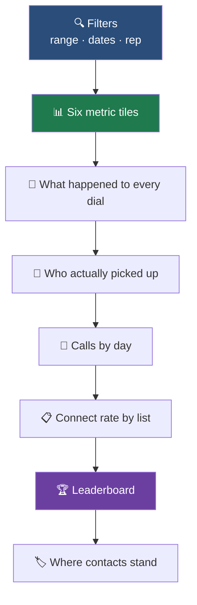

The Dialer Performance dashboard answers one question: **is the floor working,
and if not, why.** Everything on it comes from a single query, so no two numbers
on this screen can disagree with each other.

Open it from **Dashboard → Dialer**.

<Note>
Every term used here is defined once in
[How Calls Actually Work](/dialer/how-calls-work). If "connected" and "answered"
sound like the same word to you, read that page first — the difference is the
whole point of this dashboard.
</Note>

## 🧭 What is on the page

The order is deliberate. Headline numbers first, then *why* they are what they
are, then *who* and *which list* produced them.

## 📊 The six tiles

| Tile | What it tells you | Act on it when |
|---|---|---|
| **All calls** | Every call in the window, inbound and outbound. | You want raw volume. The subtitle shows how many were dialled out. |
| **Connects** | Real conversations between a rep and a person. | This is the number that pays. |
| **Connect rate** | Connects ÷ dials. | It drops without your dial count dropping — check Screened and Bad number. |
| **Avg talk time** | Averaged over every conversation. | It falls sharply: reps are being handed calls that are not ready. |
| **Reps online** | Who is actually able to take a call. | It is lower than you expect mid-shift. |
| **Appointments** | Outcomes booked. | The whole point. |

<Warning>
A tile showing **—** means *not measured*, not zero. We never print 0% for
something we could not measure, because a false zero gets a good list or a good
rep cut.
</Warning>

## 🧱 What happened to every dial

One stacked bar covering every dial in the window, split into outcomes that
never overlap. **The segments always add up to your dial count exactly.**

Three segments are worth money the moment you look at them:

<CardGroup cols={3}>
<Card title="🙅 Declined" icon="ban">
They saw the call and said no. High numbers point at your caller ID reputation
or a tired list — not at your reps.
</Card>
<Card title="🔙 Rep hung up first" icon="rotate-left">
You cancelled before they could answer. This is pacing. Lower lines per rep or
add reps.
</Card>
<Card title="☎️ Bad number" icon="circle-xmark">
Numbers that do not exist. Clean these out and stop paying to dial them.
</Card>
</CardGroup>

<Tip>
Hover any segment for its exact count and share. Hover a key entry for a
plain-English explanation of what that outcome means.
</Tip>

## 👥 Who actually picked up

Three things look like an answer and only one is sellable. This panel separates
them:

| Card | Meaning |
|---|---|
| **Talked to a person** | A rep and a lead on the same call. |
| **Picked up, no rep** | They answered and got nobody. Your abandonment number. |
| **Answering machine** | Detected as a machine, never counted as a conversation. |
| **Handset screened it** | iPhone or carrier screening answered instead of the person. |
| **Avg conversation** | Across every call, with the long-call average shown beside it. |

<Note>
Machines and screening fail **differently**. A machine means leave a message. A
screened call means a real human may still call you back. Merging them hides
both, which is why they are counted apart.
</Note>

## 📅 Calls by day

Dials and connects as paired bars on one shared scale — never two scales,
because connects are a subset of dials and a second axis would let a bad day
draw like a good one.

Bars are bucketed in **your** time zone. Hover a day for dials, connects and the
rate for that day.

## 📋 Connect rate by list

Which lists are worth calling. Bars are sized by **rate**, not volume, because
"which list did we call most" is not the question.

<Warning>
A list with fewer than 10 dials shows its dial count and **no bar at all**. A
rate from four dials is noise, and shown as a percentage it gets a good list
deleted.
</Warning>

## 🏆 Leaderboard

Your reps, ranked. Sort by connects, dials, connect rate, or talk time by
clicking the buttons in the panel header.

Default sort is **connects**, because it rewards conversations rather than
whoever burned through the list fastest.

<Note>
A rep under 10 dials shows a dash instead of a rate, and can never win a
rate-based sort. Ranking a rep with four dials as your best closer is how a good
rep gets moved off a good list.
</Note>

## 🔍 Filters and export

<Steps>
<Step title="Pick a range">
Use the pills for common ranges, or the Range dropdown for the full list
including custom dates.
</Step>
<Step title="Narrow to one rep">
The **Rep** filter shows the reps you are allowed to see. Managers see their
team, owners see everyone. Choosing a rep narrows every panel at once.
</Step>
<Step title="Set custom dates">
Choose **Custom dates** in Range, then set From and To. Dates are read in your
own time zone.
</Step>
<Step title="Export">
**Export** downloads the leaderboard as a CSV with the filters you applied. An
unmeasured rate exports blank, never as 0.
</Step>
</Steps>

## 🩺 When a number looks wrong

<AccordionGroup>

<Accordion title="Everything reads — or 0" icon="circle-question">
Hard-refresh the page first (**Cmd+Shift+R** or **Ctrl+F5**). If it persists,
your session may have expired — the page will say so. See
[Troubleshooting](/go-live/troubleshooting).
</Accordion>

<Accordion title="Today shows nothing but reps are dialling" icon="clock">
Check your time zone in your profile. If it is wrong, today's calls may be filed
under yesterday. See [How Calls Actually Work](/dialer/how-calls-work).
</Accordion>

<Accordion title="Connect rate dropped and dials did not" icon="arrow-trend-down">
Look at Screened and Voicemail in the outcome bar. A rise in either lowers your
rate without anybody doing anything wrong. Then check Bad number.
</Accordion>

<Accordion title="The bars do not add up to the dial count" icon="triangle-exclamation">
They always should. If they do not, report it — that is a real bug, not a
rounding quirk.
</Accordion>

</AccordionGroup>

## ➡️ Where to go next

<CardGroup cols={2}>
<Card title="How calls actually work" icon="diagram-project" href="/dialer/how-calls-work">
The definitions behind every number here.
</Card>
<Card title="Predictive pacing" icon="gauge-high" href="/dialer/predictive-pacing">
Why the engine dials the number of lines it does.
</Card>
<Card title="Ask your agent instead" icon="robot" href="/agents/asking-about-your-data">
Get these answers in plain language without opening the dashboard.
</Card>
<Card title="Call reports" icon="file-lines" href="/reports/call-reports">
Per-call detail behind the totals.
</Card>
</CardGroup>
