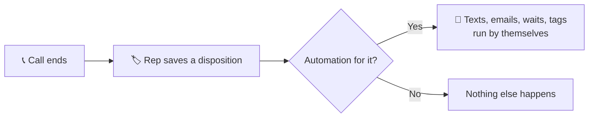

When a rep saves a disposition, AI Sync can follow up for them automatically.
You decide what happens after each one, once, in **Dialer → Automations**.

## ⚡ Set one up (about a minute)

1. In the dialer, open the **Automations** tab at the top.
2. Find the disposition, for example *Voicemail*, and click **Add**.
3. Pick a template. AI Sync suggests one based on the disposition's name.
4. Edit the words if you like, keep **Turn on now** ticked, and click **Save automation**.

Only the account owner or an admin can change automations. Reps can see them.

## 📚 Templates

| Template | What it does |
|---|---|
| Voicemail follow-up text | Texts right after a voicemail so they know who called |
| No answer: 3-touch nurture | Text now, email tomorrow, a final text two days later |
| Appointment set: confirmation | Confirms by text and email and tags the contact |
| Interested: send info | Emails your information and texts a heads-up |
| Call back later: reminder text | Confirms you'll call back so they pick up next time |
| Not interested: tag and stop | Tags the contact; sends nothing |
| Custom text | One text you write yourself |

Texts go out from **the same number that called the lead**, and
`{{first_name}}` (or any contact field) is filled in for each person. Waits
count business days only.

<Tip>
Want to text someone **during** the call? Use the **Text** tab under the contact
while you're on the call. Automations are for what happens **after** the
disposition is saved.
</Tip>

## 🔧 Good to know

- **Each automation is a normal workflow.** It also appears in **Workflows**,
  where you can add more steps.
- **Workflows you built yourself** that run on a disposition show on its row as
  one line, marked *edit in Workflows*. They can't be switched off here,
  because one workflow often serves several dispositions.
- **Ask your AI assistant.** With AI Sync connected (see
  [Use your ChatGPT plan](/agents/use-your-chatgpt-plan)), try: *"Add the
  voicemail follow-up text to my Voicemail disposition and turn it on."*

## 🆕 What changed recently

<Update label="28 Sep 2026" description="Automations">
**New: Dialer → Automations.** Map each disposition to a follow-up from
ready-made templates, with no support ticket needed. The contact screen also
now shows dispositions first and the contact's activity below.
</Update>

See [What's New](/go-live/changelog) for the full history.
