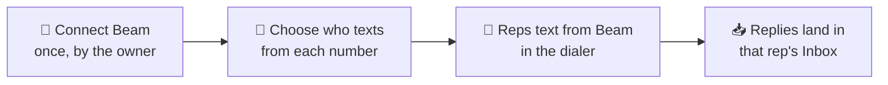

Beam gives you dedicated texting numbers. Once it's connected, AI Sync uses
those numbers as **texting lines**:

- Reps text from Beam in the dialer's **Text** tab and the **[Inbox](/dialer/inbox)**.
- **Automations** text from Beam.
- Each lead keeps **one number**, and their replies come back to the right rep.

## ✅ Before you start

- You're the **account owner** in AI Sync. Only the owner can connect Beam.
- You can sign in to your **Beam workspace** as its owner.
- The workspace has at least **one active number** assigned to it.

---

## 🔌 Connect (about 2 minutes)

<Steps>
<Step title="Open the Beam page">
In AI Sync, go to **Settings → Integrations**, find the **Beam** card, and
click **Connect Beam**. Then click the blue **Connect Beam** button.

<Frame caption="The Beam page before you connect.">
  
</Frame>
</Step>

<Step title="Sign in to Beam and approve">
Beam opens. Click **Sign in**, then choose your workspace and the number to
send from. Click approve. Nothing connects until you approve.

<Frame caption="Beam's sign-in screen. Click Sign in if you already have a workspace.">
  
</Frame>

<Note>
The link from AI Sync is only valid for **10 minutes**. If it expires, click
**Connect Beam** again.
</Note>
</Step>

<Step title="Back in AI Sync: you're connected">
You land back on the Beam page with a green **Connected** badge and your
workspace name. Click **Check connection** any time to confirm it's working.
It asks Beam live and refreshes your numbers.

<Frame caption="Connected, with two Beam numbers. Sample data.">
  
</Frame>
</Step>

<Step title="Choose who texts from each number">
In **Who texts from each number**, for each Beam number pick:

- **A rep.** It becomes their own line. Leads save a real person's number,
  and replies always go to that rep.
- **Team line.** Any rep without a line of their own texts from it.

Click **Save**.
</Step>
</Steps>

---

## 🧪 Test it (2 minutes, every new client)

<Steps>
<Step title="Text your own phone">
Open the dialer, pick a contact with **your own mobile number**, and open the
**Text** tab. **From** should say *Your Beam line* or *Beam Team line*. Send a
text.
</Step>
<Step title="Reply">
Reply from your phone.
</Step>
<Step title="Check the Inbox">
Within seconds the reply shows in the dialer's **Inbox**, with an unread dot,
for the right rep.
</Step>
</Steps>

<Info>
**Passed?** Beam is live for this client. **The reply didn't show up?** Click
**Check connection** on the Beam page, then see the fixes below.
</Info>

---

## ⚙️ How it works

| Situation | Number used |
|---|---|
| Lead was texted before | The **same number** as last time, always |
| New lead, rep has their own line | The rep's line (Beam or Twilio) |
| New lead, rep has no line | Beam's **default number**, then other Beam team lines, then Twilio team lines |
| Automation after a disposition | Same rules, for the rep who saved the disposition |
| Rep picks a number in **From** | That number, and it becomes the lead's number from then on |

Replies go to the rep who owns the number, else the last rep who texted or
called the lead. Full rules: [Texting lines](/dialer/texting-lines).

<Warning>
**Leads already texted from a Twilio number stay on it.** That's on purpose:
their number never changes under them. To move a lead to Beam, pick the Beam
line in **From** once.
</Warning>

**Disconnecting** stops Beam texts at once. Reps fall back to your other
texting lines, and nobody is left unable to text if you have one.

Contacts marked **Do Not Text** are never texted, from Beam or anywhere else.

---

## 📋 SOP: onboarding a client onto Beam

Copy this into your onboarding checklist.

1. ☐ Client has a Beam workspace with at least one **active, assigned** number.
2. ☐ Client's **account owner** is signed in to AI Sync.
3. ☐ **Settings → Integrations → Beam → Connect Beam**, then sign in and approve.
4. ☐ Beam page shows **Connected**. Click **Check connection** and see a green result.
5. ☐ **Who texts from each number** is set and saved.
6. ☐ Two-minute test passed: the text arrived, the reply showed in the Inbox for the right rep.
7. ☐ A second text went from the **same** number.
8. ☐ Tell the reps: "Your texts now go from your Beam line. Replies land in your Inbox."

---

## 🧯 If something is off

<AccordionGroup>

<Accordion title="&quot;Could not verify Beam&quot;">
AI Sync couldn't confirm the connection. Check that:
- your Beam workspace has an **active number assigned** to it;
- you approved **Read, Send, Automation and Webhooks**.

Then click **Connect Beam** again. Your previous settings are unchanged.
</Accordion>

<Accordion title="&quot;Beam did not accept the connection just now&quot;">
Beam didn't answer, or refused the connection. Wait a minute and click
**Check connection** again. If it keeps failing, click **Reconnect Beam**.
Your connection is never switched off because of a temporary problem.
</Accordion>

<Accordion title="&quot;Connected, but Beam has no active number&quot;">
Assign a number to the workspace in Beam, then click **Check connection**.
</Accordion>

<Accordion title="Texts still go from a Twilio number">
That lead was texted from it before, so they keep it. Pick the Beam line in
**From** once. For new leads, check the rep doesn't have a Twilio number of
their own; theirs comes first.
</Accordion>

<Accordion title="&quot;Connection expired. Start again from Integrations.&quot;">
More than 10 minutes passed between clicking Connect and approving in Beam.
Start again.
</Accordion>

<Accordion title="I don't see the Connect button">
Only the account owner can connect Beam. Everyone else sees "Your account
owner manages this connection".
</Accordion>

</AccordionGroup>

---

## 🤖 With your AI assistant

Ask *"What number will a text to Jordan Lee go out from?"* It shows the Beam
line and why. See
[Texting & Inbox with your AI assistant](/agents/texting-and-inbox).
