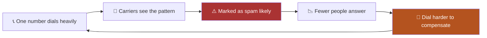

The number you call **from** decides how many people pick up. Everything else —
list quality, scripts, pacing — sits downstream of whether the phone gets
answered at all.

## 📉 How a number gets burned

This loop is self-feeding. Once a number is flagged, dialing harder from it
makes the flag worse, and the answer rate keeps falling.

<Warning>
Dialing more lines per rep without adding numbers accelerates this. Pace and
number count have to move together.
</Warning>

## 🔢 How many numbers do you need

<Note>
Number count scales with **simultaneous lines**, not with rep count. Five reps
on three lines each is fifteen calls in flight, and fifteen calls out of a small
pool burns that pool quickly.
</Note>

| Floor size | Lines each | Calls in flight | Numbers to plan for |
|---|---|---|---|
| 2 reps | 3 | 6 | 10–15 |
| 5 reps | 3 | 15 | 25–40 |
| 5 reps | 5 | 25 | 40–60 |

These are planning figures, not hard limits. Watch your **Declined** and
**Screened** counts on the
[Dialer Performance dashboard](/dashboard/dialer-performance) — both rise when
numbers are getting flagged.

## 📍 Local presence

Local presence dials from a number matching the lead's area code. People answer
local numbers far more often than unfamiliar ones.

<Steps>
<Step title="Buy numbers in the area codes you call">
Local presence can only use numbers you actually own. See
[Phone numbers](/phone-numbers/phone-numbers).
</Step>
<Step title="Turn Local Presence on">
The toggle sits in the dialer's left-hand panel.
</Step>
<Step title="Check the match rate">
If most of your list is in area codes you do not own, buy numbers there or turn
it off.
</Step>
</Steps>

## 🩺 Signs your numbers need attention

<AccordionGroup>

<Accordion title="Declined is climbing" icon="ban">
People are seeing the call and rejecting it. Often a spam label on your caller
ID rather than anything about your list.
</Accordion>

<Accordion title="Screened is climbing" icon="shield-halved">
More handsets are screening you. Unknown or flagged numbers get screened far
more often than recognised ones.
</Accordion>

<Accordion title="Connect rate fell but dials did not" icon="arrow-trend-down">
The classic burn signature. Same effort, fewer conversations.
</Accordion>

<Accordion title="One list dropped while others held" icon="list-check">
Probably the list, not the numbers. Check
[connect rate by list](/dashboard/dialer-performance).
</Accordion>

</AccordionGroup>

## ➡️ Where to go next

<CardGroup cols={2}>
<Card title="Spam protection" icon="shield" href="/spam-protection/numbers">
Monitor and protect your numbers.
</Card>
<Card title="Buy numbers" icon="cart-shopping" href="/phone-numbers/phone-numbers">
Add capacity before you raise your pace.
</Card>
<Card title="Predictive pacing" icon="gauge-high" href="/dialer/predictive-pacing">
Pace and number count move together.
</Card>
<Card title="Dialer Performance" icon="chart-line" href="/dashboard/dialer-performance">
Watch Declined and Screened for early warning.
</Card>
</CardGroup>
