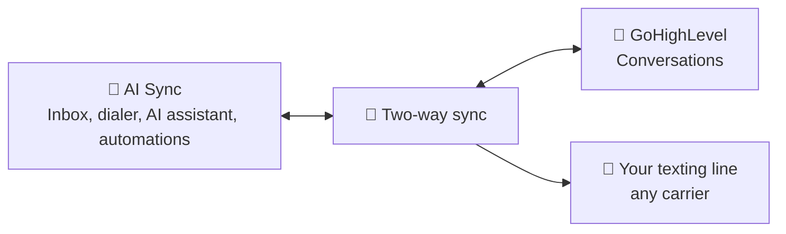

Once GoHighLevel is connected, you can work from either side. A text or call
in AI Sync shows up on the contact in GoHighLevel. A message in GoHighLevel
shows up in the AI Sync Inbox. Nothing is sent twice.

---

## 🔌 Connect GoHighLevel

<Steps>
<Step title="Open Settings → Integrations">
Start the GoHighLevel connection and sign in as an admin of the sub-account.
</Step>
<Step title="Pick the client's sub-account (location)">
Choose the location where the contacts already live, not the agency account.
</Step>
<Step title="Approve every permission">
If any permission is declined, part of the sync stops working later.
</Step>
</Steps>

<Info>
**Check:** open a contact in AI Sync that also exists in GoHighLevel. Its
GoHighLevel contact ID should be filled in. A blank ID means the wrong location
is connected.
</Info>

---

## 🔄 What syncs, and when

| What | AI Sync → GoHighLevel | GoHighLevel → AI Sync |
| --- | --- | --- |
| Texts you send | Within about a minute, on the contact's conversation | Within about 5 minutes, in the Inbox |
| Replies from the lead | Within about a minute | Within about 5 minutes |
| Calls | With the call result and the recording | Shown in the contact's history |
| Emails and chats | n/a | Shown in the Inbox |

A text is copied over **as a record only**: the lead is never texted a second
time.

---

## 📤 Text from GoHighLevel through AI Sync

You can type a text in GoHighLevel and have AI Sync send it. It goes out from
the contact's texting line in AI Sync, on whatever carrier that line uses. The
lead sees the same number as when you text from AI Sync, and the reply comes
back to both places.

<Steps>
<Step title="Open the contact's conversation in GoHighLevel">
Use the normal Conversations screen.
</Step>
<Step title="Choose AI Sync as the channel">
In the message box, open the channel picker and choose **AI Sync**.
</Step>
<Step title="Type and send">
AI Sync sends it within a few seconds. GoHighLevel marks it **Delivered**. If
it can't go out, it is marked **Failed** with the reason, for example *This
contact is marked Do Not Text.*
</Step>
</Steps>

All the AI Sync texting rules still apply:

- Do Not Text contacts are never texted.
- The number comes from [Texting Lines](/dialer/texting-lines): the same number
  the lead already knows, or else the rep's line, or else the team line.
- If no texting line is set up, the text is marked Failed with *No texting
  line is set up yet*.
- A contact that is new to AI Sync is added automatically from GoHighLevel.

---

## ✅ Five-minute test

Use your own cell phone as the lead.

<Steps>
<Step title="Text from AI Sync">
Send a text from the AI Sync Inbox. Within a minute it appears on the contact
in GoHighLevel.
</Step>
<Step title="Reply from your phone">
The reply appears in the AI Sync Inbox straight away, and in GoHighLevel within about a minute.
</Step>
<Step title="Text from GoHighLevel on the AI Sync channel">
Your phone receives it from the same number. GoHighLevel shows **Delivered**,
and the AI Sync Inbox shows the text.
</Step>
<Step title="Call the contact from the dialer">
After the call, GoHighLevel shows it on the contact with the recording.
</Step>
</Steps>

---

## 🛠️ Troubleshooting

<AccordionGroup>
<Accordion title="Texts from AI Sync don't appear in GoHighLevel" icon="circle-question">
The contact must be linked to GoHighLevel (it has a GoHighLevel contact ID).
New contacts are linked within a couple of minutes, and the text is copied
once they are. If it never links, check that the right location is connected.
</Accordion>
<Accordion title="AI Sync isn't in GoHighLevel's channel picker" icon="circle-question">
The AI Sync app must be installed on that sub-account. Reconnect GoHighLevel
from Settings → Integrations, then reload GoHighLevel.
</Accordion>
<Accordion title="A text sent from GoHighLevel shows Failed" icon="circle-question">
Hover over it to read the reason. It is usually a Do Not Text contact, a
missing texting line, or a number that isn't registered for texting (10DLC).
</Accordion>
</AccordionGroup>
