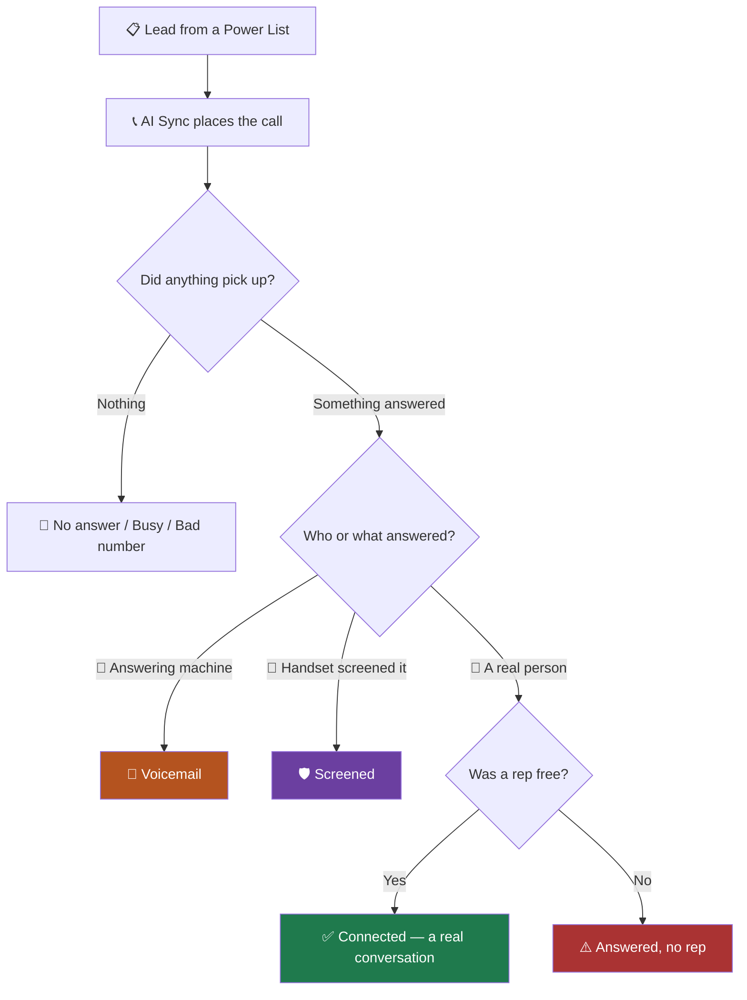

Every number on every dashboard comes from one path through the system. If you
know the path, you know what each figure is counting — and, just as important,
what it is *not* counting.

<Note>
This page is the shared vocabulary for the whole product. The
[Dialer Performance dashboard](/dashboard/dialer-performance), the
[reports](/reports/call-reports), and your
[AI agent](/connect-mcp) all use the definitions below. When a
number looks wrong, start here.
</Note>

## 🗺️ The path of one dial

Only the green box is a conversation. Everything else answered in some sense,
which is exactly why "answered" and "connected" are different words here.

<Warning>
**Answered, no rep** is the one to watch. A real person picked up and reached
nobody. Regulators call this an abandoned call, and the limit is 3% of live
human answers. Our engine stops itself well before that — see
[Predictive pacing](/dialer/predictive-pacing).
</Warning>

## 📖 What each outcome means

<AccordionGroup>

<Accordion title="✅ Connected — a rep and a lead talked" icon="circle-check">
A person answered and reached one of your reps. This is the only outcome that
can become a sale.

**Counted when:** a human answered, the call bridged to a rep, and there was
real audio. A machine verdict, a voicemail verdict, or a screening verdict can
never be counted here, no matter how long the call lasted.
</Accordion>

<Accordion title="⚠️ Answered, no rep" icon="triangle-exclamation">
Somebody picked up the phone and never got a human. Usually every rep was
already talking when the call landed.

**What to do:** lower your lines per rep, or put more reps on the floor. This is
the number the pacing engine exists to hold down.
</Accordion>

<Accordion title="📼 Voicemail" icon="voicemail">
An answering machine picked up. The system detects this by listening to the
greeting, then stops the call from reaching a rep.

**Why it matters:** a voicemail is a dial that cost you money and reached
nobody. It is counted in your dials, never in your connects.
</Accordion>

<Accordion title="🛡️ Screened" icon="shield-halved">
The lead's phone answered on their behalf — iPhone Call Screening, Google Call
Screen, or a carrier screening service. A recorded voice asks who is calling.

**Why it is its own category:** a screened call is not a machine and not a
person. The lead may well call you back. Merging it into "voicemail" hides that,
and counting it as a connect inflates your rate with conversations that never
happened. See [iPhone screening](/dialer/iphone-screening).
</Accordion>

<Accordion title="📵 No answer" icon="phone-slash">
It rang out. Nobody home.
</Accordion>

<Accordion title="🙅 Declined" icon="ban">
They saw the call and actively rejected it. This is a signal about your list or
your caller ID, not a missed opportunity.
</Accordion>

<Accordion title="🔙 Rep hung up first" icon="rotate-left">
Your side cancelled before the lead could answer. Almost always pacing: too many
lines for the reps available.
</Accordion>

<Accordion title="☎️ Bad number" icon="circle-xmark">
The number does not exist. You are paying to dial it every time it comes round
in the list. Worth cleaning.
</Accordion>

<Accordion title="📡 Carrier problem" icon="tower-cell">
The call failed on the network. Watch the trend, not the individual call.
</Accordion>

</AccordionGroup>

## 🧮 The formulas, in plain words

| Metric | How it is worked out | Common misreading |
|---|---|---|
| **Dials** | Every outbound call placed, including ones that hit voicemail. | People expect voicemails to be excluded. They are dials — they cost money. |
| **Connects** | Dials where a person answered **and** reached a rep. | Not "answered". A voicemail is answered and is not a connect. |
| **Connect rate** | Connects ÷ dials. | If this seems low, check your Screened and Voicemail counts before blaming reps. |
| **Avg talk time** | Averaged over **every** conversation, short ones included. | A 30-second floor makes this look far higher than reality. We do not use one. |
| **Answered, no rep** | A human answered, no rep took it. | This is your abandonment number. Watch it. |

<Tip>
**One reconciliation rule.** On the dashboard, the outcome breakdown always adds
up to your dial count exactly. If the bars sum to a different number than the
tile above them, something is wrong — tell your agent, or see
[Troubleshooting](/go-live/troubleshooting).
</Tip>

## 🌍 Time zones change your numbers

Every figure is bucketed by **your** day, not the server's. "Today" means today
where you are.

<Steps>
<Step title="Set your time zone once">
Open your profile in the top right, choose your time zone, and save. See
[Profile settings](/profile-settings/profile).
</Step>
<Step title="Check the dashboard header">
The Dialer Performance header shows the time zone the numbers are using. If it
does not match where your reps sit, the day boundaries will be wrong.
</Step>
</Steps>

<Warning>
If your time zone is wrong, an evening call can land on the next day's report.
The numbers are still correct — they are just filed under a day you did not
expect.
</Warning>

## 🆕 What changed recently

<Update label="22 Sep 2026" description="Definitions">
**These definitions are now enforced everywhere.** The dashboard, the reports
and any AI agent connected to your account all use the same rules, so two
screens can no longer disagree about what a connection is.

**Phone screening became its own outcome**, separate from voicemail and from a
real conversation.
</Update>

See [What's New](/go-live/changelog) for the full history.

## ➡️ Where to go next

<CardGroup cols={2}>
<Card title="Dialer Performance dashboard" icon="chart-line" href="/dashboard/dialer-performance">
Read your numbers and know which ones to act on.
</Card>
<Card title="Predictive pacing" icon="gauge-high" href="/dialer/predictive-pacing">
How the engine decides how many lines to dial.
</Card>
<Card title="iPhone screening" icon="shield-halved" href="/dialer/iphone-screening">
What screening is and how we detect it.
</Card>
<Card title="Ask your AI agent" icon="robot" href="/connect-mcp">
Get these answers without opening the dashboard.
</Card>
</CardGroup>
