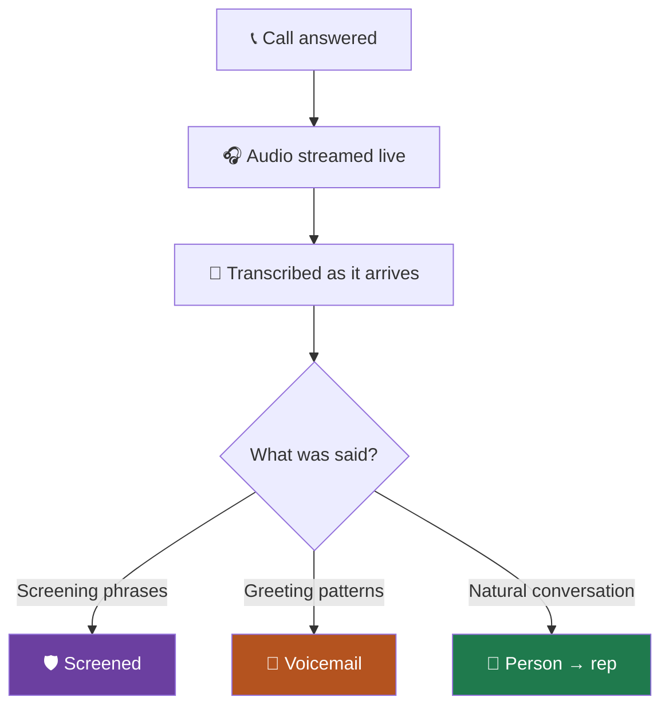

A growing share of the phones you dial answer **on the lead's behalf**. iPhone
Call Screening, Google Call Screen and carrier screening services all pick up,
play a recorded prompt, and ask who is calling.

To a dialer this looks like an answer. It is not a person.

## 🤔 Why it is its own outcome

<CardGroup cols={3}>
<Card title="📼 Voicemail" icon="voicemail">
A machine took a message. The lead may never hear it.
</Card>
<Card title="🛡️ Screened" icon="shield-halved">
The handset is asking who you are. **The lead is often standing right there**,
deciding whether to pick up.
</Card>
<Card title="🧑 Person" icon="user">
A human answered and can talk.
</Card>
</CardGroup>

<Note>
Screening sits between the other two, which is exactly why it gets its own
category. Counting it as voicemail hides a lead who is about to answer.
Counting it as a connect inflates your rate with conversations that never
happened.
</Note>

## 🔬 How detection works

AI Sync listens to the **words**, not just the rhythm of the audio. That
distinction matters: a screening prompt sounds acoustically like a recorded
greeting, so systems that judge cadence alone routinely call it an answering
machine.

<Warning>
If screening is misread as a machine, the call is dropped and you lose a lead
who was about to answer. If it is misread as a person, a rep is connected to a
recording. Both are expensive, which is why this is detected on words.
</Warning>

## 🎙️ Set up your screening script

When a handset screens your call, it asks who is calling. Whatever you record
here is what the lead sees or hears before deciding.

<Steps>
<Step title="Open the dialer settings">
Find **iPhone Script** in the dialer's left-hand panel.
</Step>
<Step title="Pick or record a script">
Keep it short, human, and specific. A name and a reason beats a pitch.
</Step>
<Step title="Turn iPhone Screening on">
The toggle sits beside Local Presence and Detect Voicemail.
</Step>
<Step title="Test it on your own phone">
Dial yourself from a screened iPhone and listen to what plays. This is the only
way to hear what your leads hear.
</Step>
</Steps>

<Tip>
A good script sounds like a person leaving a doorstep message: *"Hi, this is a
real person calling. Please say your name and reason for your call and I will
connect you right now."* A script that sounds like an advert gets declined.
</Tip>

## 📊 Where screened calls appear

Screened calls show up in two places on the
[Dialer Performance dashboard](/dashboard/dialer-performance):

- As **Screened** in the outcome bar, so you can see what share of your list is
  screening you.
- As **Handset screened it** in *Who actually picked up*, beside machines and
  real people.

They are never counted as connects, and never counted toward your connect rate
as successes.

<Note>
A rising screened share is a signal about your caller ID, not your reps. See
[Caller ID and numbers](/dialer/caller-id-and-numbers).
</Note>

## ➡️ Where to go next

<CardGroup cols={2}>
<Card title="How calls actually work" icon="diagram-project" href="/dialer/how-calls-work">
Every outcome in one place.
</Card>
<Card title="Caller ID and numbers" icon="hashtag" href="/dialer/caller-id-and-numbers">
Why screening rises when your numbers get tired.
</Card>
</CardGroup>
