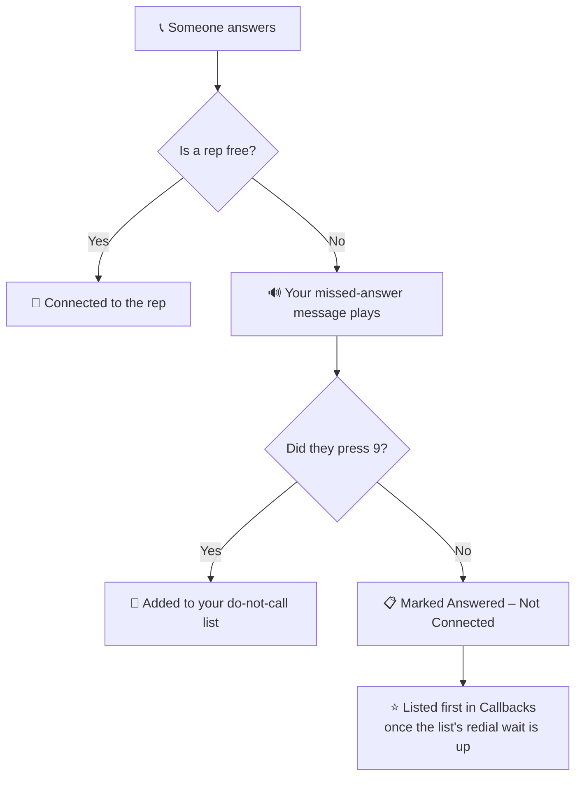

When you dial several lines at once, two people sometimes answer at the same
moment, or someone answers after a rep has stepped away. Only one of them can
talk to a rep.

The other person hears your **missed-answer message** instead of silence.

## 🔁 What happens on a missed answer

A person who answered is the most valuable lead on your list, so they are put
at the **top of your callbacks**, not back at the end of the list.

## ✍️ Write your own

Go to **Dialer → Missed-Answer Message**. Only the account owner or an admin can
change it.

1. Pick one of the three examples, or write your own (400 characters max).
2. Click **Save and create audio**.
3. Press play under **What callers hear now** to hear the exact recording.

The examples are filled in with your business name and phone number from your
business profile. If a number is missing, add one to your business profile so
callers can reach you.

<Note>
Every message ends with **"To be added to our do-not-call list, press 9 now."**
This is added automatically and cannot be removed: federal rules require every
missed-answer message to let the caller opt out on the spot. Pressing 9 adds
the number to your do-not-call list, and the dialer will not call it again.
</Note>

If you never write one, AI Sync uses the first example for you, so nobody who
answers ever hears silence or a sales pitch.

## ⚖️ What the message is allowed to say

Federal rules (FTC Telemarketing Sales Rule and FCC 47 CFR 64.1200) limit this
recording to three things:

<CardGroup cols={3}>
<Card title="Why you called" icon="bullhorn">
That the call was for telemarketing.
</Card>
<Card title="Who you are" icon="building">
Your business name.
</Card>
<Card title="How to reach you" icon="phone">
A number they can call back.
</Card>
</CardGroup>

<Warning>
Anything more (an offer, a price, "we'll call you right back", a reason to
book) can turn this into an unlawful recorded sales call. Your wording is your
responsibility; have your compliance advisor review it.
</Warning>

## 📏 Keep missed answers rare

The rules also cap missed answers at **3% of calls a person answers**, per
campaign, over each 30 days. The message is required, but it is not a licence
to miss answers. If your rate climbs, dial fewer lines per rep or add reps.
See [Predictive pacing](/dialer/predictive-pacing).

## 🆕 What changed recently

<Update label="28 Sep 2026" description="Missed-answer message">
**Missed answers now hear your message instead of your voicemail.**
Before this, a person who answered with no rep free waited in silence and then
heard your campaign's voicemail recording. They now hear your own short
message, can press 9 to stop future calls, and go to the top of your callbacks.
</Update>

See [What's New](/go-live/changelog) for the full history.
