# 📞 Power Dialer

The Power Dialer is a comprehensive outbound calling solution that enables efficient, automated dialing campaigns with advanced call management features. It streamlines your calling process by automatically dialing through contact lists while providing real-time analytics and call controls.

## 🚀 Overview

The Power Dialer interface provides a complete calling workspace with:
- **Real-time call statistics** (Remaining, Dialed, Connected calls)
- **Live call duration tracking**
- **PowerList management**
- **Integrated dialpad**
- **Call history access**
- **Audio device controls**

## 📊 Key Features

### 🎯 Smart Dialing System
- **Automated dialing** through PowerLists
- **Configurable dial timing** (Dial At Time)
- **Daily and total attempt limits**
- **Real-time status monitoring**

### 📈 Live Analytics Dashboard
- **Call Statistics**: Track remaining, dialed, and connected calls
- **Talk Time Monitoring**: Real-time call duration display (00:39:06)
- **Status Indicators**: Dialer and call status updates
- **Performance Metrics**: Success rates and call outcomes

### 🎧 Audio Management
- **Device Selection**: Microphone, ringtone, and speaker configuration
- **Audio Testing**: Built-in test functionality
- **Tone Controls**: Hangup tones and ringback settings
- **Background Noise Reduction**: USB headset optimization

## 🔧 Interface Components

### Main Dialer Panel

The main interface includes:

#### 📊 Statistics Display
- **5 Remaining**: Contacts left to dial
- **40 Dialed**: Total numbers dialed
- **0 Connected**: Successful connections
- **Talk Time**: 00:39:06 total conversation time

#### 📋 PowerList Configuration
- **PowerList Selection**: Choose from available contact lists
- **One Dial**: Primary calling list
- **devVS**: Secondary test list

#### ⚙️ Dialer Settings
| Field | Value | Description |
|-------|-------|-------------|
| **Uploaded** | 0 | Contacts uploaded to current list |
| **Removed** | 0 | Contacts removed from list |
| **Dial At Time** | 1 | Scheduled dialing time |
| **Max Attempts Daily** | 1 | Maximum daily attempts per contact |
| **Max Attempts Total** | 1 | Total lifetime attempts per contact |

### 📞 Integrated Dialpad

The dialpad feature provides:
- **Manual dialing capability** with number input (+1800XXXXXXX)
- **Standard keypad layout** with alphabetic shortcuts
- **Call initiation button** (purple call button)
- **Quick access** for manual outbound calls

### 📋 Call History Management

Comprehensive call tracking includes:

#### 🔍 Advanced Filtering
- **Date Range Selection**: Last Week (Sun - Sat)
- **Custom Date Ranges**: 08/24/2025 - 08/30/2025
- **Status Filtering**: All, Completed, Cancelled, etc.
- **Search Functionality**: Search through call logs

#### 📊 Call Log Details
| Column | Information |
|--------|-------------|
| **Sr.No** | Sequential call number |
| **From/To Number** | Complete phone number details |
| **Status** | Call outcome (Completed, Cancel) |
| **Date** | Timestamp of call |
| **Actions** | Call/SMS follow-up buttons |

#### 🎵 Audio Playback
- **Call Recording Access**: Play recorded conversations
- **Audio Controls**: Play, pause, volume adjustment
- **Call Duration**: 0:00 timestamp display

### 🎧 Audio Device Management

Complete audio configuration includes:

#### 🎤 Microphone Settings
- **Device Selection**: External Microphone (Realtek Audio)
- **Voice Input Configuration**: Optimized for call quality

#### 🔊 Ringtone Configuration
- **Speaker Selection**: Default - Headphones (Realtek Audio)
- **Test Functionality**: Audio testing capability
- **Incoming Call Audio**: Dedicated ringtone device

#### 📢 Output Speaker Settings
- **Remote Audio**: DTMF sound configuration
- **Speaker Device**: Default - Headphones (Realtek Audio)
- **Audio Testing**: Built-in test controls

#### 🔄 Device Management
- **Reload Audio Devices**: Refresh available devices
- **Refresh Devices**: Update device list
- **USB Headset Tip**: Noise reduction recommendation

#### 🎵 Audio Tone Settings
- **Hangup Tone**: Enable/disable call end tones
- **Ringtone Controls**: Test, Mute, Enable options
- **Outbound Ringback Tone**: Test, Mute, Enable controls

### 📊 Status Monitoring

Real-time status indicators show:
- **Dialer Status**: "Not ready..." (preparation phase)
- **Call Status**: "idle" (ready to dial)
- **User Status**: Offline/Online toggle
- **System Readiness**: Connection status

## 🔄 Power Dialer Workflow

```mermaid
graph TD
    A[🚀 Start Power Dialer] --> B[⚙️ Configure Audio Devices]
    B --> C[📋 Select PowerList]
    C --> D[🎯 Set Dialing Parameters]
    D --> E[▶️ Start Dialing Campaign]
    E --> F[📞 Automated Dialing]
    F --> G{📊 Call Outcome}
    G -->|✅ Connected| H[💬 Handle Conversation]
    G -->|❌ No Answer| I[📝 Log Attempt]
    G -->|🚫 Busy/Failed| I
    H --> J[📋 Update Call Status]
    I --> J
    J --> K{📊 More Contacts?}
    K -->|✅ Yes| F
    K -->|❌ No| L[📈 Campaign Complete]
    L --> M[📊 Review Analytics]
```

## 📋 Step-by-Step Usage Guide

### 1. 🎧 Initial Setup
1. **Configure Audio Devices**
   - Select microphone input device
   - Choose ringtone speaker
   - Set output speaker device
   - Test audio functionality

2. **PowerList Selection**
   - Choose your target contact list
   - Verify contact count
   - Review list parameters

### 2. ⚙️ Campaign Configuration
1. **Set Dialing Parameters**
   - Configure "Dial At Time" schedule
   - Set maximum daily attempts
   - Define total attempt limits

2. **Audio Settings**
   - Enable/disable hangup tones
   - Configure ringtone settings
   - Test outbound ringback tones

### 3. 🚀 Campaign Execution
1. **Start Dialing**
   - Click "Start Dialing" button
   - Monitor real-time statistics
   - Track call progress

2. **Call Management**
   - Handle connected calls
   - Use integrated dialpad if needed
   - Access call history for follow-ups

### 4. 📊 Monitoring & Analytics
1. **Real-Time Tracking**
   - Monitor remaining contacts
   - Track dialed numbers
   - Count successful connections
   - Watch talk time accumulation

2. **Call History Review**
   - Filter by date ranges
   - Review call outcomes
   - Access recorded conversations
   - Plan follow-up actions
