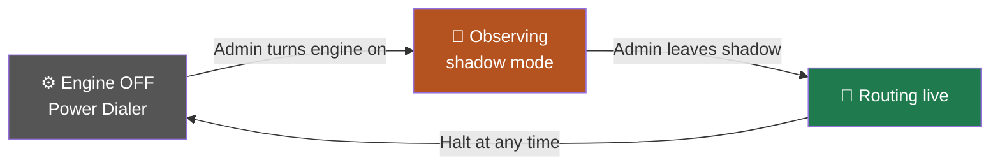
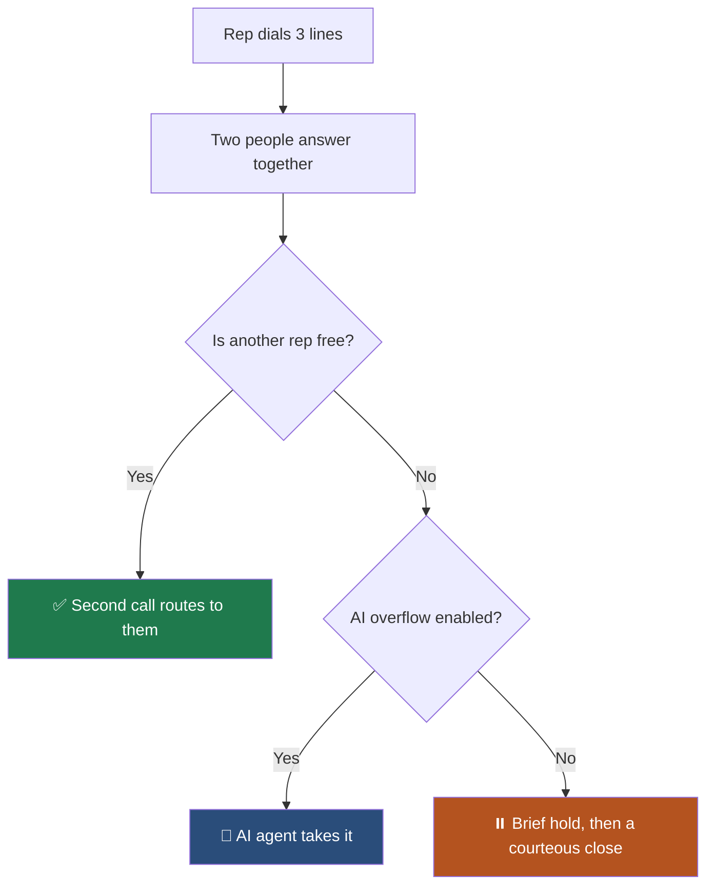

Power Dialer gives each rep a fixed number of lines. **Predictive pacing** takes
that decision away from the rep and gives it to the engine, which watches how
often people are actually answering and adjusts.

The goal is simple: **a rep should never sit idle, and never be handed a call
they cannot take.**

## ⚖️ The two modes

<CardGroup cols={2}>
<Card title="Power Dialer" icon="phone">
The rep picks their lines. Predictable, fully in their control, and the right
choice for a small floor or a high-touch list.
</Card>
<Card title="Predictive Campaign" icon="gauge-high">
The engine owns the pace. Reps never choose lines. Best when several reps work
one shared list together.
</Card>
</CardGroup>

<Note>
Which mode runs is a **campaign** setting chosen by an admin — never a rep's
browser setting. Pacing carries compliance consequences, so it is not a personal
preference.
</Note>

## 🔒 Turning it on takes two deliberate steps

<Steps>
<Step title="Turn the engine on">
It always lands in **observing** mode first. The engine records what it *would*
have done against live traffic without moving a single call.
</Step>
<Step title="Read what it would have done">
Check the pacing explanation on the campaign. Every decision states the
constraint that bound it in plain language.
</Step>
<Step title="Leave observing mode">
A second, separate action. Only now does the engine route real calls.
</Step>
</Steps>

<Warning>
There is no single switch that goes straight to routing live. That is
deliberate: nobody should be able to tick one box and start spraying calls.
</Warning>

## 🧱 The limits it will not cross

<AccordionGroup>

<Accordion title="At least 2 reps on the floor" icon="users">
Predictive routing needs **2 reps minimum**, and **3** before the fastest
setting is allowed.

With one rep and multiple lines, most simultaneous answers have nowhere to go.
Below the floor the campaign quietly falls back to Power Dialer — reps keep
working at full speed, they just stop being paced predictively.
</Accordion>

<Accordion title="A hard abandonment ceiling" icon="shield">
Regulators cap abandoned calls at **3%** of live human answers, measured per
campaign over a rolling 30 days. The engine stops launching new calls well
before that.

No setting, no target and no "be more aggressive" instruction can push it past
the ceiling. A human can make the dialer slower. Nothing can make it riskier.
</Accordion>

<Accordion title="A ceiling on lines per rep" icon="arrow-up-right-dots">
The engine never dials more than **2 leads per free rep**, whatever the maths
suggests.

Published guidance is consistent that true predictive pacing needs a much larger
floor before the statistics behave. On a small team a higher ceiling buys
nothing real and costs abandoned calls.
</Accordion>

<Accordion title="It holds still after every change" icon="clock">
After any adjustment the engine waits before adjusting again.

There is a delay of 20 to 30 seconds between launching a call and learning
whether it connected. Without a pause, the engine reacts to the effect of its
own last move and oscillates — a burst of calls, everyone buried, a stop, then
everyone idle. Reps feel that as feast or famine.
</Accordion>

<Accordion title="Slow up, fast down" icon="arrows-up-down">
Speeding up requires sustained evidence. Slowing down happens immediately on the
first sign of risk.

Over-dialing costs a regulated abandoned call. Under-dialing costs a few idle
seconds. The penalties are wildly different, so the response is too.
</Accordion>

</AccordionGroup>

## 🎯 What it actually steers

The engine targets the **wait between conversations** — the gap where a rep is
free and nothing has landed.

<Note>
It cannot target the time between connections. That includes talk time, which
belongs to your rep and your prospect. If a rep talks for three minutes, no
dialer on earth can hand them another conversation 20 seconds later.
</Note>

A voicemail greeting is never treated as an answer. If machines counted, the
engine would read them as people picking up and dial **faster** into a list that
is not answering.

## 📞 When two people answer at once

<Warning>
A person who picked up the phone is **never** hung up on in silence. The worst
outcome available is a short hold with a message, and every one of those is
recorded as an abandoned call so the engine slows down rather than repeating it.
</Warning>

## 🆕 What changed recently

<Update label="22 Sep 2026" description="Pacing">
**Predictive pacing is available for live human reps.** It needs at least two
reps online, holds itself well under the 3% abandonment limit, and takes two
deliberate steps to switch on so nothing goes live by accident.
</Update>

See [What's New](/go-live/changelog) for the full history.

## ➡️ Where to go next

<CardGroup cols={2}>
<Card title="How calls actually work" icon="diagram-project" href="/dialer/how-calls-work">
What each outcome means before you tune anything.
</Card>
<Card title="Dialer Performance" icon="chart-line" href="/dashboard/dialer-performance">
Watch the effect of your pacing in the numbers.
</Card>
<Card title="Phone numbers" icon="hashtag" href="/dialer/caller-id-and-numbers">
Why dialing harder needs more numbers.
</Card>
<Card title="Power Dialer" icon="phone" href="/dialer/power-dialer">
The manual mode and when to prefer it.
</Card>
</CardGroup>
