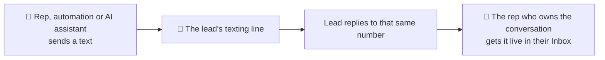

Calls and texts follow different rules on purpose.

- **Calls rotate.** Your caller ID changes from dial to dial to protect your
  answer rate. See [Caller ID and numbers](/dialer/caller-id-and-numbers).
- **Texts never rotate.** Each lead is texted from **one number**, and the reply
  goes to **the rep who owns that conversation**.

If texts followed the calling number, a lead would get every message from a
different number and their replies would scatter. A texting line prevents that.

---

## 🧩 What counts as a texting line

A texting line is a phone number that:

1. Is a **Twilio number connected to AI Sync**.
2. Shows **A2P linked** on the Phone Numbers page. Carriers block texts from
   unregistered numbers. See [10DLC](/setup/10dlc/brand).
3. Is **not** assigned to an AI agent. AI agent numbers are kept for the agent.

There are two kinds:

| Kind | How you make one | Who texts from it |
|---|---|---|
| **A rep's own line** | Phone Numbers → the number → **Set inbound routing → Route to a User** | That rep |
| **Team line** | An A2P-linked number that isn't routed to anyone | Any rep who has no line of their own |

<Tip>
**The simplest good setup:** one A2P-linked number per rep, each routed to that
rep. Leads save a real person's number, and every reply lands with the right
rep.

**The cheapest setup:** a single A2P-linked number left unrouted. Everyone texts
from that team line, and replies still reach the right rep (see
[Where replies go](#-where-replies-go)).
</Tip>

If a rep has several numbers routed to them, texts go from the first one you
added. With several team lines, the first one added is used.

---

## 📤 Which number a text goes out from

Every way of texting uses the same rule: the dialer's Text tab, **Text them**,
the Inbox, the Messages page, automations, workflows and AI assistants.

<Steps>
<Step title="The number you picked">
If you choose a number in the **From** menu, that number is used. Reps can pick
their own line or a team line, never a colleague's line.
</Step>
<Step title="The number this lead was last texted from">
Once a lead has been texted, they keep that number. This is what stops a lead
getting messages from a new number every time.
</Step>
<Step title="Your own line">
For a lead nobody has texted yet, it's the line routed to you. For an
automation, "you" is the rep who saved the disposition.
</Step>
<Step title="A team line">
If you have no line of your own.
</Step>
<Step title="Nothing, with a clear message">
If none of these exist, the text isn't sent and you see **"No texting line set
up."** AI Sync never picks a random number.
</Step>
</Steps>

<Warning>
**When a lead changes hands, their number doesn't move with them.** Texts keep
going from the first rep's line, and replies keep going to that rep. To take a
lead over, pick **your** line in the From menu once. From then on your line is
that lead's number, and replies come to you.
</Warning>

### Workflows and automations

In a workflow's **Send SMS** step:

| From setting | What it does |
|---|---|
| **Same as dial** | The lead's texting line, using the rule above (the default). It no longer means "the number that last called them". |
| **Assigned User Numbers** | The same rule |
| **A specific number** | That number. If it isn't A2P linked, a linked number with the lead's area code is used, then any linked number. |

[Dialer Automations](/dialer/automations) use the texting line automatically.

---

## 📥 Where replies go

When a lead replies, AI Sync picks one rep, in this order:

<Steps>
<Step title="The owner of the number they replied to">
If they replied to a rep's own line, it goes to that rep.
</Step>
<Step title="The last rep who texted or called them">
Covers team lines. The rep who was talking to this lead gets the reply.
</Step>
<Step title="The lead's assigned rep">
If nobody has contacted them from AI Sync yet.
</Step>
<Step title="The account owner">
The safety net, so a reply is never dropped.
</Step>
</Steps>

That rep sees the reply **live in the dialer's [Inbox](/dialer/inbox)** with an
unread dot and a count on the Inbox tab, plus a notification. The whole
company's replies are also in the **Messages** page.

---

## ✅ Make sure replies actually reach AI Sync

A text can go out perfectly while the reply goes somewhere else. The number's
own reply setting decides where replies land.

<AccordionGroup>

<Accordion title="Numbers added on the Phone Numbers page" icon="circle-check">
Set automatically. When you import a Twilio number there, AI Sync points its
calls and replies at itself.
</Accordion>

<Accordion title="Numbers inside a Twilio Messaging Service" icon="triangle-exclamation">
A Messaging Service's own setting **overrides** the number's. If it sends
replies to a webhook of its own, AI Sync never sees them.

In Twilio: **Messaging → Services → your service → Integration → Incoming
Messages**, choose **Defer to sender's webhook**, and save.

<Warning>
If GoHighLevel also uses that Messaging Service, changing this setting changes
where GoHighLevel gets its replies. Talk to support before you change it, and
we'll set it up so both keep working.
</Warning>
</Accordion>

<Accordion title="Numbers brought in during onboarding" icon="circle-question">
Don't assume these were pointed at AI Sync. Run the two-minute test below. If
the reply doesn't show up, ask support to check the number's reply routing.
</Accordion>

</AccordionGroup>

---

## 🧪 Two-minute test (do this for every new client)

<Steps>
<Step title="Text your own phone">
In the dialer, open a contact with **your** mobile number and send a text from
the Text tab. Check the **From** line shows the number you expect.
</Step>
<Step title="Reply from your phone">
Reply with anything.
</Step>
<Step title="Watch the Inbox">
Within seconds, the reply appears in the dialer's **Inbox** against that
contact, with an unread dot, for the rep you expect.
</Step>
<Step title="Text again">
Send a second text. It must go from the **same** number as the first.
</Step>
</Steps>

<Info>
**Passed?** Texting is set up correctly for that number. **No reply after a
minute?** See the Messaging Service accordion above, then contact support.
</Info>

---

## 🔧 Customize it

| You want | Do this |
|---|---|
| Each rep texts from their own number | Route one A2P-linked number to each rep |
| Everyone texts from one company number | Leave one A2P-linked number unrouted |
| A rep takes over a lead | They pick their own line in **From** once |
| An automation always uses one number | Set that number in the workflow's Send SMS step |
| A number stays for an AI agent only | Assign it to the agent; it's never used as a texting line |
| Check what a lead will be texted from | Open the contact's Text tab and read **From**, or ask your AI assistant |

Setting this up with Claude, ChatGPT or Codex instead? See
[Texting & Inbox with your AI assistant](/agents/texting-and-inbox).

---

## 🧯 If something is off

<AccordionGroup>

<Accordion title="&quot;No texting line set up&quot;">
There's no A2P-linked Twilio number that isn't used by an AI agent. Link a
number to your 10DLC campaign on the Phone Numbers page.
</Accordion>

<Accordion title="Texts go from a number I didn't expect">
That lead was texted from it before, and leads keep their number. Pick the
number you want in **From** once.
</Accordion>

<Accordion title="A reply went to the wrong rep">
Replies to a rep's own line always go to that rep. Check which number the lead
replied to, and who that number is routed to on the Phone Numbers page.
</Accordion>

<Accordion title="Texts say sent but never arrive">
Almost always 10DLC. Confirm the brand and campaign are **approved**, not just
submitted, and the number shows **A2P linked**.
</Accordion>

<Accordion title="Replies never show up anywhere">
The number or its Messaging Service sends replies somewhere else. See
[Make sure replies actually reach AI Sync](#-make-sure-replies-actually-reach-ai-sync).
</Accordion>

</AccordionGroup>
