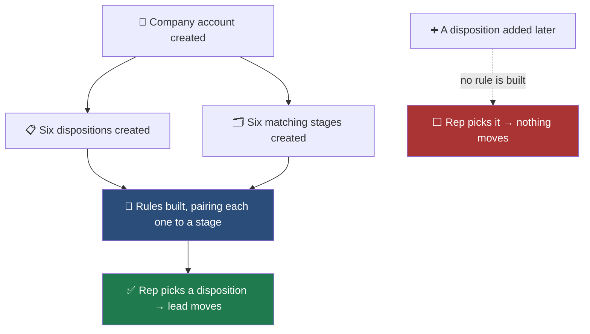

This is the part of setup that quietly fails. Everything looks configured, reps
dial happily, and a week later the client asks why nothing is moving in their
pipeline.

<Warning>
**Read this before you add a disposition.** The link between a disposition and a
pipeline stage is built **once, when the company account is created**. Adding a
disposition afterwards does **not** create a link, no matter what you call it.
The rep can pick it, the call saves, and the lead never moves.

This is a current product limitation, not a setup mistake you can fix by
renaming things.
</Warning>

---

## 🧩 How the pieces actually connect

<CardGroup cols={3}>
<Card title="Disposition" icon="tag">
What the **rep picks** at the end of a call. "Not Interested", "App Set",
"Call Back".
</Card>
<Card title="Pipeline stage" icon="list-check">
Where the **lead sits** in the sales process. "New Lead", "Contacted",
"Appointment Set".
</Card>
<Card title="The link" icon="link">
A **saved rule** created at signup that ties one specific disposition to one
specific stage. Not the name.
</Card>
</CardGroup>

<Note>
Because the starter dispositions and stages are created together with the same
names, it **looks** as though names are what connect them. They are not. The
names match by coincidence of setup, and renaming either one does not break
anything.
</Note>

---

## ✅ What this means in practice

<AccordionGroup>

<Accordion title="Renaming a disposition or a stage is safe" icon="pen">
The link survives a rename. If a client wants "App Set" to read "Appointment
Booked", change it. Leads keep moving exactly as before.

This is the opposite of what you might expect, and the opposite of what earlier
versions of this guide said.
</Accordion>

<Accordion title="A disposition added after signup will not move leads" icon="triangle-exclamation">
It will appear for reps, save correctly, and show in reports. It just will not
move the lead to a stage, because no rule exists for it.

**What to do:** use it for reporting and move those leads by hand, or raise it
with support so the mapping can be built for that client.
</Accordion>

<Accordion title="A stage added after signup has nothing pointing at it" icon="list-check">
Same reason. Existing rules point at the stages that already existed.
</Accordion>

<Accordion title="Deleting a disposition breaks its rule" icon="trash">
The rule refers to a disposition that no longer exists, so nothing happens when
its replacement is chosen. Prefer renaming over deleting.
</Accordion>

</AccordionGroup>

---

## 🧪 How to check a client is actually wired up

Do not trust the screen. Test it.

<Steps>
<Step title="Pick a test contact">
Any contact you can safely move. Note which stage it is in now.
</Step>
<Step title="Dial it and save a real disposition">
Use one of the outcome dispositions, not Didn't Answer.
</Step>
<Step title="Open the pipeline and look for that contact">
It should be in the matching stage within a few seconds.
</Step>
<Step title="If it did not move">
The disposition has no rule behind it. That is the limitation above, not
something you can fix by renaming. Raise it with support.
</Step>
</Steps>

<Tip>
Do this once per client during onboarding, with one disposition. It takes two
minutes and it is the only way to know the wiring is real.
</Tip>

---

## ✍️ Setting up dispositions

Build the disposition list first. The pipeline is shaped to match it.

<Steps>
<Step title="Use the client's own words">
If they say "DQ" rather than "Not Qualified", call it DQ. Reps pick the right
option faster when it sounds like how they talk. Renaming the starter
dispositions is safe and is the recommended way to customise.
</Step>
<Step title="Keep the list short">
Six to ten is healthy. A rep scanning twenty options mid-call picks whatever is
nearest, and your reporting becomes fiction.
</Step>
<Step title="Set exactly one Didn't Answer disposition">
One disposition is wired to the **Didn't Answer** button. Set it with the
**Didn't Answer** action on the Dispositions screen — not the separate default
option setting, which controls something else.
</Step>
<Step title="Keep one appointment outcome">
"App Set", "Appointment Set", whatever they call it. This is the one that
matters most for reporting.
</Step>
</Steps>

Full screen reference: [Dispositions](/manage/disposition).

---

## 🗂️ Setting up the pipeline

<Steps>
<Step title="Rename the starter stages to suit the client">
Renaming is safe and keeps the links intact.
</Step>
<Step title="Put them in the order a lead actually travels">
Left to right should read like the real sales process.
</Step>
<Step title="Confirm the Appointment Set stage">
Every pipeline has one. Check it exists and sits where the client expects it.
</Step>
</Steps>

Full screen reference: [Pipelines](/pipeline/pipeline).

<Note>
**"Didn't Answer" deliberately does not move a lead.** Someone who did not pick
up has not progressed, and moving them would make the pipeline meaningless.
They stay where they are and remain in the calling rotation.
</Note>

---

## 🩺 When leads are not moving

<AccordionGroup>

<Accordion title="It never worked for this client" icon="circle-xmark">
Run the test above. If a starter disposition moves a lead and a newer one does
not, you have hit the limitation — the newer one has no rule behind it.
</Accordion>

<Accordion title="It worked and then stopped" icon="clock-rotate-left">
Check whether a disposition or stage was **deleted** and recreated. A recreated
one is a new record with no rule attached, even with an identical name.
</Accordion>

<Accordion title="Some dispositions move leads and others do not" icon="scale-balanced">
Expected if dispositions were added after signup. The originals work; the added
ones do not.
</Accordion>

<Accordion title="The lead moved to a stage nobody expected" icon="shuffle">
Check which pipeline it landed in. A client with several pipelines has rules
pointing at one of them.
</Accordion>

</AccordionGroup>

---

## ➡️ Where to go next

<CardGroup cols={2}>
<Card title="Take a client live" icon="rocket" href="/go-live/client-onboarding">
The full runbook this page belongs to.
</Card>
<Card title="Troubleshooting" icon="wrench" href="/go-live/troubleshooting">
Organised by what the customer tells you.
</Card>
<Card title="Dispositions screen" icon="tag" href="/manage/disposition">
Every field on the screen.
</Card>
<Card title="Pipelines screen" icon="list-check" href="/pipeline/pipeline">
Stages and how to order them.
</Card>
</CardGroup>
