  

  

  

    

      

        

        

 
      

    

    <h1 className="text-5xl md:text-6xl font-extrabold text-white mb-4 tracking-tight">
      
        AI Sync
      
    </h1>
    

      The Future of Intelligent Business Communication
    

    

      

        

        Voice Automation
      

      

        

        Smart Dialing
      

      

        

        CRM Integration
      

    

    

      

        

          

          Live & Ready
        

      

    

  

  

# 🚀 The Future of Business Communication

Welcome to **Ai sync** — the communication backbone that modern businesses trust to streamline operations, accelerate growth, and deliver exceptional customer experiences. Whether you're a startup scaling rapidly or an enterprise managing thousands of interactions daily, Ai sync is designed to be your single source of truth for all communication needs.

<Note>
**Why Choose Ai sync?** We've eliminated the chaos of juggling multiple tools. One platform, infinite possibilities.
</Note>

## 🎯 What Ai sync Delivers

Ai sync transforms your business communication through six core pillars:

<CardGroup cols={2}>
  <Card title="📞 Power Dialer" icon="phone" href="/dialer/power-dialer">
    Branded caller ID with spam-free delivery and local presence technology
  </Card>
  <Card title="🤖 AI Voice Agents" icon="robot" href="/ai/agents">
    Human-like AI agents that handle calls, qualify leads, and book appointments
  </Card>
  <Card title="📋 Smart IVR System" icon="list" href="/setup/configuration">
    Code-based logic for intelligent call routing and customer experience
  </Card>
  <Card title="📱 Automation Workflows" icon="bolt" href="/manage/voice-campaign">
    SMS, email, and follow-up sequences that run on autopilot
  </Card>
  <Card title="📊 Real-Time Analytics" icon="chart-line" href="/dashboard/analytics">
    Performance tracking and insights that drive data-driven decisions
  </Card>
  <Card title="🔗 CRM Integration" icon="link" href="/business-management/companies">
    Native CRM or seamless integration with your existing tools
  </Card>
</CardGroup>

## 🔄 Complete Workflow Architecture

Here's how Ai sync creates a seamless communication ecosystem for your business:

```mermaid
graph TB
    A[🏢 Your Business] --> B[📞 Ai sync Platform]
    B --> C[🎯 Power Dialer]
    B --> D[🤖 AI Voice Agents]
    B --> E[📋 Smart IVR]
    B --> F[📱 SMS/Email Automation]
    B --> G[📊 CRM Integration]
    
    C --> H[📈 Real-time Analytics]
    D --> H
    E --> H
    F --> H
    G --> H
    
    H --> I[💰 Increased Sales]
    H --> J[⚡ Better Efficiency]
    H --> K[📈 Business Growth]
    

```

