# 🚀 The Future of Business Communication

Welcome to **Ai sync** — the communication backbone that modern businesses trust to streamline operations, accelerate growth, and deliver exceptional customer experiences. Whether you're a startup scaling rapidly or an enterprise managing thousands of interactions daily, Ai sync is designed to be your single source of truth for all communication needs.

<Note>
**Why Choose Ai sync?** We've eliminated the chaos of juggling multiple tools. One platform, infinite possibilities.
</Note>

## 🎯 What Ai sync Delivers

Ai sync transforms your business communication through six core pillars:

<CardGroup cols={2}>
  <Card title="📞 Power Dialer" icon="phone" href="/dialer/power-dialer">
    Branded caller ID with spam-free delivery and local presence technology
  </Card>
  <Card title="🤖 AI Voice Agents" icon="robot" href="/ai/agents">
    Human-like AI agents that handle calls, qualify leads, and book appointments
  </Card>
  <Card title="📋 Smart IVR System" icon="list" href="/setup/configuration">
    Code-based logic for intelligent call routing and customer experience
  </Card>
  <Card title="📱 Automation Workflows" icon="bolt" href="/manage/voice-campaign">
    SMS, email, and follow-up sequences that run on autopilot
  </Card>
  <Card title="📊 Real-Time Analytics" icon="chart-line" href="/dashboard/analytics">
    Performance tracking and insights that drive data-driven decisions
  </Card>
  <Card title="🔗 CRM Integration" icon="link" href="/business-management/companies">
    Native CRM or seamless integration with your existing tools
  </Card>
</CardGroup>

## 🔄 Complete Workflow Architecture

Here's how Ai sync creates a seamless communication ecosystem for your business:

```mermaid
graph TB
    A[🏢 Your Business] --> B[📞 Ai sync Platform]
    B --> C[🎯 Power Dialer]
    B --> D[🤖 AI Voice Agents]
    B --> E[📋 Smart IVR]
    B --> F[📱 SMS/Email Automation]
    B --> G[📊 CRM Integration]
    
    C --> H[📈 Real-time Analytics]
    D --> H
    E --> H
    F --> H
    G --> H
    
    H --> I[💰 Increased Sales]
    H --> J[⚡ Better Efficiency]
    H --> K[📈 Business Growth]
    

```

## 📋 Core Features & Fields

### 🎯 Power Dialer Module

**Key Fields & Actions:**
- **Caller ID Management**: Custom branding and local presence
- **Contact Lists**: Upload, segment, and manage prospect databases
- **Dial Modes**: Predictive, progressive, and manual dialing options
- **Spam Protection**: Built-in reputation management and carrier relationships

**Primary Actions:**
- Launch campaigns with one-click deployment
- Real-time call monitoring and coaching
- Automatic lead scoring and disposition
- Performance analytics and optimization

### 🤖 AI Voice Agents

**Configuration Fields:**
- **Voice Models**: Choose from GPT-4, Claude, or Gemini
- **Personality Settings**: Tone, speaking style, and conversation flow
- **Knowledge Base**: Upload documents, FAQs, and training materials
- **Integration Points**: CRM sync, calendar booking, and workflow triggers

**Agent Actions:**
- Inbound call handling and routing
- Outbound prospecting and qualification
- Appointment scheduling and follow-up
- Lead nurturing and customer support

### 📋 Smart IVR System

**IVR Components:**
- **Menu Options**: Custom voice prompts and keypad routing
- **Access Codes**: Secure department routing and VIP handling
- **Call Queues**: Wait time management and music options
- **Escalation Rules**: Automatic agent assignment and overflow handling

### 📱 Automation Workflows

**Workflow Fields:**
- **Trigger Events**: Call outcomes, time delays, and behavioral actions
- **Message Templates**: SMS, email, and voicemail drop templates
- **Sequence Logic**: Multi-step campaigns with conditional branching
- **Performance Tracking**: Open rates, response rates, and conversion metrics

## 🎮 Action Center: What You Can Do

### 📞 Make Your First Call
<Steps>
  <Step title="Upload Contacts">
    Import your lead list via CSV or integrate with your CRM
  </Step>
  <Step title="Configure Campaign">
    Set dialer mode, caller ID, and success metrics
  </Step>
  <Step title="Launch & Monitor">
    Start dialing and track performance in real-time
  </Step>
</Steps>

### 🤖 Deploy AI Agents
<Steps>
  <Step title="Choose Your Model">
    Select AI engine and configure personality traits
  </Step>
  <Step title="Train Your Agent">
    Upload knowledge base and define conversation flows
  </Step>
  <Step title="Test & Optimize">
    Run test calls and refine responses
  </Step>
  <Step title="Go Live">
    Route calls to your AI agent and monitor interactions
  </Step>
</Steps>

### 📊 Track Performance

**Key Metrics:**
- **Call Volume**: Daily, weekly, and monthly call statistics
- **Conversion Rates**: Lead-to-opportunity and close ratios
- **Agent Performance**: Individual and team productivity metrics
- **Revenue Attribution**: Direct ROI tracking and campaign profitability

## 🏗️ Platform Architecture

### 🔧 Technical Stack
- **Backend**: Scalable cloud infrastructure with 99.9% uptime
- **AI Models**: GPT-4, Claude Haiku/Sonnet, and Gemini integration
- **Telephony**: Twilio and Plivo carrier partnerships
- **Security**: SOC 2 compliance and end-to-end encryption

### 🔗 Integration Ecosystem
<CardGroup cols={3}>
  <Card title="CRM Systems" icon="database">
    Salesforce, HubSpot, Pipedrive, and custom APIs
  </Card>
  <Card title="Communication" icon="comments">
    Slack, Microsoft Teams, and email platforms
  </Card>
  <Card title="Analytics" icon="chart-bar">
    Google Analytics, Mixpanel, and custom dashboards
  </Card>
</CardGroup>

## 🎯 Use Cases & Industries

### 🏢 Sales Organizations
- **Lead Qualification**: AI agents pre-qualify prospects before human handoff
- **Pipeline Acceleration**: Automated follow-up sequences increase conversion rates
- **Performance Optimization**: Real-time coaching and analytics improve team results

### 🏥 Healthcare & Professional Services
- **Appointment Scheduling**: AI handles booking, rescheduling, and confirmations
- **Patient Communication**: Automated reminders and follow-up care sequences
- **Emergency Routing**: Smart IVR routes urgent calls to appropriate departments

### 🏪 E-commerce & Retail
- **Customer Support**: AI agents handle common inquiries and order tracking
- **Abandoned Cart Recovery**: Automated phone and SMS sequences recover lost sales
- **Upsell Campaigns**: Intelligent product recommendations via voice and text

## 🚀 Getting Started Journey

### 🎯 Quick Setup (5 Minutes)
<CardGroup cols={2}>
  <Card title="📋 Upload Contacts" icon="upload" href="/manage/contacts">
    Import your leads and start dialing immediately
  </Card>
  <Card title="🤖 Deploy AI Agent" icon="robot" href="/ai/agents">
    Launch your first AI agent in under 5 minutes
  </Card>
  <Card title="📱 Configure SMS" icon="message" href="/manage/sms-template">
    Set up automated text campaigns
  </Card>
  <Card title="📊 View Analytics" icon="chart-line" href="/dashboard/analytics">
    Monitor performance from day one
  </Card>
</CardGroup>

### 📚 Deep Dive Resources
<AccordionGroup>
  <Accordion title="🎯 Campaign Management" icon="bullseye">
    Learn how to create, optimize, and scale your outbound campaigns for maximum ROI.
  </Accordion>
  <Accordion title="🤖 AI Agent Training" icon="graduation-cap">
    Master the art of training AI agents that convert prospects into customers.
  </Accordion>
  <Accordion title="📊 Analytics & Reporting" icon="chart-line">
    Understand your data and make informed decisions that drive growth.
  </Accordion>
  <Accordion title="🔗 Advanced Integrations" icon="link">
    Connect Ai sync with your existing tech stack for seamless operations.
  </Accordion>
</AccordionGroup>

## 💬 Community & Support
  

You're joining a community of growth-focused professionals who believe in the power of intelligent communication.

<CardGroup cols={2}>
  <Card title="🏫 Skool Community" icon="users" href="#">
    Private community for sharing strategies, wins, and getting peer support
  </Card>
  <Card title="💬 Live Support" icon="headset" href="#">
    Direct access to our team via dashboard chat or Slack integration
  </Card>
  <Card title="📚 Knowledge Base" icon="book" href="/ai/knowledge-base">
    Comprehensive guides, tutorials, and best practices
  </Card>
  <Card title="🎓 Training Programs" icon="graduation-cap" href="#">
    Certified courses to maximize your platform ROI
  </Card>
</CardGroup>

## 🎯 The Vision Forward

Ai sync isn't just software — it's your competitive advantage. We're building the future where:

<Note>
**🚀 Every interaction is intelligent** — AI understands context and responds appropriately  
**⚡ Workflows run automatically** — Set it once, scale infinitely  
**📊 Data drives decisions** — Real-time insights optimize every conversation  
**🔗 Tools work together** — One platform replaces dozens of disconnected solutions
</Note>

### 🛣️ Roadmap Highlights
- **Q1 2024**: Advanced AI personality customization and multi-language support
- **Q2 2024**: Video calling integration and advanced analytics dashboards
- **Q3 2024**: Mobile app launch and offline capabilities
- **Q4 2024**: Enterprise-grade security features and white-label solutions

---

  <h2>🎯 Ready to Transform Your Communication?</h2>
  
Join thousands of businesses already scaling with Ai sync

  <Button href="/quickstart" size="lg">Start Your Journey →</Button>

---

**Welcome to the future of business communication. Welcome to Ai sync.**
