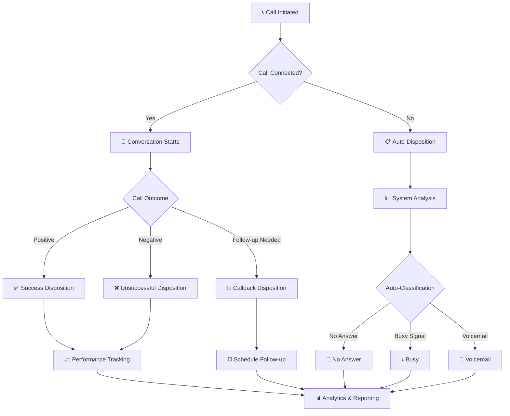
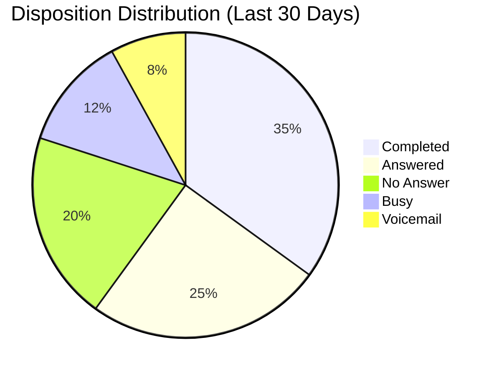
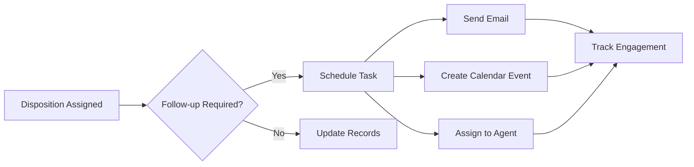

Call dispositions are the backbone of effective call tracking and outcome analysis. This guide covers everything you need to know about disposition workflow, field management, and practical applications.

## 🔄 Disposition Workflow

Understanding the disposition workflow is crucial for maximizing call tracking effectiveness:

### 🎯 Workflow Stages

<Card title="Pre-Call Setup" icon="gear">
Configure disposition options and auto-assignment rules before initiating calls
</Card>

<Card title="During Call" icon="phone">
Monitor call progress and prepare for outcome classification
</Card>

<Card title="Post-Call Action" icon="clipboard-check">
Assign appropriate disposition and trigger follow-up actions
</Card>

<Card title="Analytics Review" icon="chart-bar">
Analyze disposition data for performance insights and optimization
</Card>

## 📋 Disposition Fields

**🧩 Core Fields Overview**

| Field | Type | Description | Example |
|-------|------|-------------|---------|
| **ID** | `Number` | Unique identifier for each disposition | `1`, `2`, `3` |
| **Disposition Name** | `String` | Clear, descriptive outcome label | `"Interested"`, `"Not Available"` |
| **Setup Didn't Answer Button** | `Toggle` | **Auto-assign when call goes unanswered** | Enabled  / Disabled  |
| **Call Status** | `Enum` | Current status of the disposition | `Completed`, `Answered`, `No`, `Ringing`, `Busy`, `Cancelled`, `In Progress`, `Failed`, `AMD` |
| **Color Preview** | `Swatch` | Visual color indicator for the disposition Useful for quick recognition and workflow mapping | |
| **Created At** | `DateTime` | Timestamp of disposition creation | `09-13-2024 01:19 PM` |
| **Action** | `Buttons` | Available operations for each disposition | `Edit`, `Delete` |

### 🛠️ Field Configuration Details

#### 🏷️ Disposition Name
- **Purpose**: Primary identifier for call outcomes

#### 🚫 Setup Didn't Answer Button
- **Function**: Automatically applies disposition when calls go unanswered
- **Use Cases**:
  - ✅ **Enable** for: No Answer, Busy, Voicemail
  - ❌ **Disable** for: Sale, Interested, Appointment Set
- **Impact**: Reduces manual disposition assignment by 60-80%

#### 📞 Call Status Options
- **Completed**: ✅ Call finished with clear outcome
- **Answered**: 📞 Call was answered but ongoing
- **No**: ❌ Call attempt unsuccessful
 
 
 

## 🎛️ Managing Dispositions

### ➕ Adding New Dispositions

Creating new dispositions allows you to customize call outcome tracking to match your business needs. The interface provides a streamlined approach to disposition management.

**📝 Required Fields**

| Field             | Description                                                                                             | Example / Notes                                                  |
|-------------------|--------------------------------------------------------------------------------------------------------|------------------------------------------------------------------|
| **Disposition**   | Enter a clear, descriptive name for the call outcome.                                                  | "Interested", "Not Available", "Decision Maker Not Present"      |
| **Assign role to view** | Assign which user roles can see/apply this disposition. Select one or more from the available roles. | (e.g. Admin, Agent)                                              |
| **GHL Location**  | Select the CRM (GoHighLevel) account location relevant to this disposition.                            | Allows CRM-specific tracking and analytics.                      |
| **Fields For Notes** | Optional. Select additional note fields, typically available after setting a location.                  | Unique to each CRM location                                      |
| **Text Color**    | Choose the text color for this disposition label in the interface.                                     | Example: White (`#FFFFFF`)                                       |
| **Background Color** | Select a background color for the disposition button. Aids in quick visual identification in call logs and workflow mapping. | Example: Blue (`#0000FF`)                                        |

> The form includes all the above fields. "Assign role to view" allows you to select multiple roles. "Fields For Notes" dynamically appears once a GHL Location is selected. Use text and background color pickers to customize appearance for clarity in dashboards and call screens.

**💡 Tip:**  
Use consistent naming and color-coding conventions to make disposition outcomes intuitive and actionable for agents and managers.

  

### ✏️ Edit Disposition

> **✏️ Edit Disposition Example:**  
> The form lets you modify all disposition properties, including:
> - **Disposition:** Name (e.g., "dev")
> - **Assign role to View:** Multi-role selection (e.g., Agent, dev)
> - **GHL Location:** Select relevant CRM/account
> - **Fields For Notes:** Appears after location is selected
> - **Text Color & Background Color:** Color pickers for customizing the label/button
> - **Submit:** Save changes after editing
> 
> Use the **Back** button to return to the disposition list without saving changes.

Modify existing dispositions to reflect changing business needs or improve tracking accuracy.

<Warning>
⚠️ Editing disposition names will affect historical reporting. Consider creating new dispositions instead of modifying existing ones for data consistency.
</Warning>

### 🗑️ Delete Disposition

Remove unused or outdated dispositions from your system.

<Note>
🗒️ Deleted dispositions cannot be recovered. Ensure all historical data using this disposition is properly archived before deletion.
</Note>

 

## 📊 Analytics & Performance

### 📈 Disposition Usage Statistics

### 🎯 Key Performance Indicators

<CardGroup cols={3}>
  <Card title="Conversion Rate" icon="percent">
**24.5%**
     ↗️ +3.2% from last month
</Card>

  <Card title="Contact Rate" icon="phone">
    **68.3%**
     ↗️ +5.1% from last month
</Card>
  <Card title="Follow-up Success" icon="repeat">
    **41.7%**
     ↘️ -1.8% from last month
</Card>
</CardGroup>
 

#### ⚙️ Configuration Options

| Setting | Description | Recommended Use |
|---------|-------------|-----------------|
| **Auto-Assignment** | Automatically apply this disposition for specific call outcomes | Enable for "No Answer", "Busy", "Voicemail" |
| **Follow-up Required** | Mark if this disposition requires scheduled follow-up | Enable for "Callback Requested", "Follow-up Needed" |
| **Success Indicator** | Classify as positive outcome | Enable for "Sale", "Appointment Set", "Interested" |
| **Final Disposition** | Mark as call completion (no further attempts) | Enable for "Do Not Call", "Sale Completed" |

## 🚀 Advanced Features

### 🤖 AI-Powered Auto-Disposition

<Note>
🧠 Enable intelligent disposition assignment based on conversation analysis and customer sentiment detection.
</Note>

- **Sentiment Analysis**: Automatically detect positive/negative outcomes
- **Intent Recognition**: Classify customer intent during conversations  
- **Pattern Learning**: Improve accuracy through machine learning
- **Confidence Scoring**: Provide reliability metrics for auto-assignments

### 🔗 Integration Capabilities

<CardGroup cols={2}>
  <Card title="CRM Sync" icon="database">
    🔄 Automatically update lead status in connected CRM systems based on disposition
</Card>

  <Card title="Workflow Triggers" icon="bolt">
    ⚡ Launch automated follow-up sequences, emails, and task creation
</Card>
</CardGroup>

### 📅 Follow-up Automation

