Call dispositions are the backbone of effective call tracking and outcome analysis. This guide covers everything you need to know about disposition workflow, field management, and practical applications.

## 🔄 Disposition Workflow

Understanding the disposition workflow is crucial for maximizing call tracking effectiveness:

```mermaid
flowchart TD
    A[📞 Call Initiated] --> B{Call Connected?}
    B -->|Yes| C[💬 Conversation Starts]
    B -->|No| D[📋 Auto-Disposition]
    
    C --> E{Call Outcome}
    E -->|Positive| F[✅ Success Disposition]
    E -->|Negative| G[❌ Unsuccessful Disposition]
    E -->|Follow-up Needed| H[📅 Callback Disposition]
    
    D --> I[📊 System Analysis]
    F --> J[📈 Performance Tracking]
    G --> J
    H --> K[⏰ Schedule Follow-up]
    
    I --> L{Auto-Classification}
    L -->|No Answer| M[📵 No Answer]
    L -->|Busy Signal| N[📞 Busy]
    L -->|Voicemail| O[📧 Voicemail]
    
    J --> P[📊 Analytics & Reporting]
    K --> P
    M --> P
    N --> P
    O --> P
```

### 🎯 Workflow Stages

<Card title="Pre-Call Setup" icon="gear">
Configure disposition options and auto-assignment rules before initiating calls
</Card>

<Card title="During Call" icon="phone">
Monitor call progress and prepare for outcome classification
</Card>

<Card title="Post-Call Action" icon="clipboard-check">
Assign appropriate disposition and trigger follow-up actions
</Card>

<Card title="Analytics Review" icon="chart-bar">
Analyze disposition data for performance insights and optimization
</Card>

## 📋 Disposition Fields

### Core Fields Overview

| Field | Type | Description | Example |
|-------|------|-------------|---------|
| **ID** | `Number` | Unique identifier for each disposition | `1`, `2`, `3` |
| **Disposition Name** | `String` | Clear, descriptive outcome label | `"Interested"`, `"Not Available"` |
| **Setup Didn't Answer** | `Toggle` | **Auto-assign when call goes unanswered** | `Enabled` / `Disabled` |
| **Call Status** | `Enum` | Current status of the disposition | `Completed`, `Answered`, `No`,`Ringing` ,`Busy`,`Cancelled`,`In Progress`,`Failed`,`AMD` |
| **Created At** | `DateTime` | Timestamp of disposition creation | `09-13-2024 01:19 PM` |
| **Actions** | `Buttons` | Available operations | `Edit`, `Delete` |

### 🔧 Field Configuration Details

#### Disposition Name
- **Purpose**: Primary identifier for call outcomes

#### Setup Didn't Answer Button
- **Function**: Automatically applies disposition when calls go unanswered
- **Use Cases**:
  - ✅ **Enable** for: No Answer, Busy, Voicemail
  - ❌ **Disable** for: Sale, Interested, Appointment Set
- **Impact**: Reduces manual disposition assignment by 60-80%

#### Call Status Options
- **Completed**: ✅ Call finished with clear outcome
- **Answered**: 📞 Call was answered but ongoing
- **No**: ❌ Call attempt unsuccessful
 
 
 

## 🎛️ Managing Dispositions

### ➕ Adding New Dispositions

Creating new dispositions allows you to customize call outcome tracking to match your business needs. The interface provides a streamlined approach to disposition management.

#### Required Fields
<Card title="Name" icon="tag">
**Purpose**: Enter a clear, descriptive name for the disposition outcome
 **Example**: "Interested", "Not Available", "Decision Maker Not Present"
 **Best Practice**: Use consistent naming conventions across your team
</Card>
<Card title="Agent Role" icon="users">
**Function**: Assign specific agent role or permission level for this disposition
 **Options**: Select from available user roles (Admin, Manager, Agent, etc.)
 **Note**: Controls which team members can apply this disposition to calls
</Card>
<Card title="GHL Location" icon="map-pin">
**Purpose**: Specify the CRM system name for integration and tracking
 **Use Case**: Useful for multi-CRM environments or system-specific campaigns
 **Impact**: Enables CRM-based disposition analytics and integration
</Card>
  

### ✏️ Edit Disposition

Modify existing dispositions to reflect changing business needs or improve tracking accuracy.

<Warning>
Editing disposition names will affect historical reporting. Consider creating new dispositions instead of modifying existing ones for data consistency.
</Warning>

### 🗑️ Delete Disposition

Remove unused or outdated dispositions from your system.

<Note>
Deleted dispositions cannot be recovered. Ensure all historical data using this disposition is properly archived before deletion.
</Note>

 

## 📊 Analytics & Performance

### 📈 Disposition Usage Statistics

### 🎯 Key Performance Indicators

<CardGroup cols={3}>
  <Card title="Conversion Rate" icon="percent">
**24.5%**
     ↗️ +3.2% from last month
</Card>

  <Card title="Contact Rate" icon="phone">
    **68.3%**
     ↗️ +5.1% from last month
</Card>
  <Card title="Follow-up Success" icon="repeat">
    **41.7%**
     ↘️ -1.8% from last month
</Card>
</CardGroup>
 

#### Configuration Options

| Setting | Description | Recommended Use |
|---------|-------------|-----------------|
| **Auto-Assignment** | Automatically apply this disposition for specific call outcomes | Enable for "No Answer", "Busy", "Voicemail" |
| **Follow-up Required** | Mark if this disposition requires scheduled follow-up | Enable for "Callback Requested", "Follow-up Needed" |
| **Success Indicator** | Classify as positive outcome | Enable for "Sale", "Appointment Set", "Interested" |
| **Final Disposition** | Mark as call completion (no further attempts) | Enable for "Do Not Call", "Sale Completed" |

## 🚀 Advanced Features

### 🤖 AI-Powered Auto-Disposition

<Note>
Enable intelligent disposition assignment based on conversation analysis and customer sentiment detection.
</Note>

- **Sentiment Analysis**: Automatically detect positive/negative outcomes
- **Intent Recognition**: Classify customer intent during conversations  
- **Pattern Learning**: Improve accuracy through machine learning
- **Confidence Scoring**: Provide reliability metrics for auto-assignments

### 🔗 Integration Capabilities

<CardGroup cols={2}>
  <Card title="CRM Sync" icon="database">
    Automatically update lead status in connected CRM systems based on disposition
</Card>

  <Card title="Workflow Triggers" icon="bolt">
    Launch automated follow-up sequences, emails, and task creation
</Card>
</CardGroup>

### 📅 Follow-up Automation

 