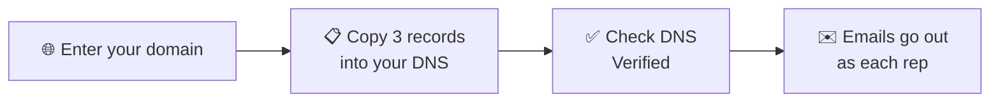

When a rep emails a lead from the dialer, the Inbox or an automation, the lead
should see a real person at your company, not a platform address. Set up your
domain once and every email goes out like this:

> **Maria Gomez** &lt;maria@harbordental.com&gt;

and when the lead replies, it lands in **Maria's own inbox**.

## ✅ Before you start

- You're the **account owner** in AI Sync.
- You can sign in to wherever your domain is managed: GoDaddy, Cloudflare,
  Namecheap, Google, Squarespace or similar. If someone else manages it,
  send them the three records from step 2.
- Your domain is a business domain. Gmail, Yahoo, Outlook and other free
  addresses can't be used.

---

## 🧭 Set it up

<Steps>
<Step title="Enter your domain">
Go to **Settings → Email Setting** and click **Set up your domain** on the
*Send from your own domain* card. Type your domain, like `harbordental.com`,
and click **Continue**.

<Frame caption="Enter just the domain: the part after the @ in your business email.">
  
</Frame>
</Step>

<Step title="Add the three records to your DNS">
AI Sync shows three **CNAME** records. In your domain provider, open **DNS**
and add each one. Use the **Copy** buttons so nothing is mistyped.

<Frame caption="Three CNAME records. The Status column updates each time you check. Sample data.">
  
</Frame>

<Tip>
Some providers add your domain to the end of **Host** automatically. If yours
does, paste only the first part, for example `aisync` or `s1._domainkey`.
Don't change or delete any records that are already there.
</Tip>
</Step>

<Step title="Click Check DNS">
Back in AI Sync, click **Check DNS**. New records usually show up within a few
minutes, sometimes up to an hour. When all three say **✓ Found**, the badge
turns green: **Verified**.

<Frame caption="Verified: emails to leads now go out from your domain.">
  
</Frame>
</Step>

<Step title="Check who emails come from">
Under **Who emails come from**, set the company address (for example `hello`)
and your company name. Click **Save**.
</Step>
</Steps>

---

## ✉️ Who each email comes from

| The rep's AI Sync login | Email goes out as | Replies go to |
|---|---|---|
| On your domain, e.g. maria@harbordental.com | **Maria Gomez** &lt;maria@harbordental.com&gt; | Maria |
| Somewhere else, e.g. sam@gmail.com | **Sam Patel** &lt;hello@harbordental.com&gt; | Sam's own address |
| No rep involved | The **account owner**, the same way | The account owner |

This covers the dialer's **Email** tab, the **Inbox** and **Send Email** steps
in automations and workflows. For automations, "the rep" is whoever saved the
disposition.

<Note>
**Before your domain is verified,** emails still send, from the AI Sync
address, and replies still go to the rep. Nothing breaks while you wait for
DNS.
</Note>

**Already using your own SendGrid account** under Email Setting? That keeps
working exactly as before. A workflow step that names its own From address
also keeps it.

---

## 📋 SOP: onboarding a client

1. ☐ Client's **account owner** is signed in to AI Sync.
2. ☐ **Settings → Email Setting → Set up your domain**, enter the domain.
3. ☐ The three CNAME records are added in the client's DNS (by them, or whoever runs their website).
4. ☐ **Check DNS** shows **Verified**.
5. ☐ Company address and name saved under **Who emails come from**.
6. ☐ Test: from the dialer, email a contact with **your own** email address. It arrives from the rep's address, and replying goes to the rep.
7. ☐ Tell reps: "Your emails now go out from your work address, and replies come to you."

---

## 🧯 If something is off

<AccordionGroup>

<Accordion title="Still &quot;Waiting for DNS&quot; after an hour">
Check each record's **Host** in your provider. The most common mistake is the
domain added twice, like `aisync.harbordental.com.harbordental.com`. If your
provider adds the domain for you, enter only the first part.
</Accordion>

<Accordion title="&quot;Use your business domain&quot;">
Free addresses like Gmail or Outlook can't be set up. Use the domain your
business email and website are on.
</Accordion>

<Accordion title="&quot;That domain is already set up on another AI Sync account&quot;">
Another account already added it. Contact support to move it.
</Accordion>

<Accordion title="A rep's emails come from hello@ instead of their name@">
Their AI Sync login email isn't on your domain. Change their login email to
their work address in **User Management**, or leave it: replies still go to
them.
</Accordion>

<Accordion title="Emails land in spam">
Make sure all three records say **✓ Found**. Keep emails personal and short;
long promotional emails to people who didn't ask for them get filtered
whatever the setup.
</Accordion>

<Accordion title="Switching back">
Click **Remove domain**. Emails go out from the AI Sync address again at once,
with replies to the rep. You can delete the three records from your DNS
afterwards.
</Accordion>

</AccordionGroup>

<Note>
**Lead replies don't come into the dialer's Inbox yet.** They go to the rep's
own email inbox. See [Inbox](/dialer/inbox).
</Note>
