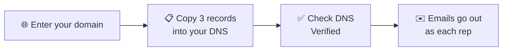

When a rep emails a lead from the dialer, the Inbox or an automation, the lead
should see a real person at your company, not a platform address. Set up your
domain once and every email goes out like this:

> **Maria Gomez** &lt;maria@harbordental.com&gt;

and when the lead replies, it lands in **Maria's own inbox**.



## ✅ Before you start

- You're the **account owner** in AI Sync.
- You can sign in to wherever your domain is managed: GoDaddy, Cloudflare,
  Namecheap, Google, Squarespace or similar. If someone else manages it,
  send them the three records from step 2.
- Your domain is a business domain. Gmail, Yahoo, Outlook and other free
  addresses can't be used.

---

## 🧭 Set it up

<Steps>
<Step title="Enter your domain">
Go to **Settings → Email Setting** and click **Set up your domain** on the
*Send from your own domain* card. Type your domain, like `harbordental.com`,
and click **Continue →**.

<Frame caption="Enter just the domain: the part after the @ in your business email.">
  
</Frame>
</Step>

<Step title="Add the three records to your DNS">
AI Sync shows three **CNAME** records. Pick where your domain is managed and
the page shows exactly where to click there. Add each record with the **Copy**
buttons so nothing is mistyped.

Someone else runs your website? Click **Copy instructions for your web
person** and paste it into an email to them.

<Frame caption="Three CNAME records. The Status column updates each time you check. Sample data.">
  
</Frame>

| Provider | Where | Host / Name field | Value field | Watch out |
|---|---|---|---|---|
| GoDaddy | My Products → domain → **DNS** → Add New Record | **Name**: `aisync` | **Value** | |
| Cloudflare | domain → **DNS → Records** → Add record | **Name**: `aisync` | **Target** | Set **Proxy status** to **DNS only** (grey cloud) |
| Namecheap | Domain List → Manage → **Advanced DNS** | **Host**: `aisync` | **Value** | Click the green ✓ to save |
| Squarespace / Google | Domains → domain → **DNS** | **Host**: `aisync` | **Data** | |
| Other | DNS settings where the domain is registered or hosted | The short name | The value | If it asks for the full name, use `aisync.yourdomain.com` |

The table shows record 1. Records 2 and 3 work the same way with
`s1._domainkey` and `s2._domainkey`. Don't change or delete any records that
are already there.
</Step>

<Step title="Click Check DNS">
Click **Check DNS now**. Leave the page open and it checks again every minute
by itself. New records usually show up within a few minutes, sometimes up to
an hour. When all three say **✓ Found**, you land on **Verified**, with a
preview of exactly what your leads will see.

<Frame caption="Verified: emails to leads now go out from your domain.">
  
</Frame>
</Step>

<Step title="Check who emails come from">
Under **Who emails come from**, set the company address (for example `hello`)
and your company name. Click **Save**.
</Step>
</Steps>

---

## 🤖 Or let your AI assistant do it

With Claude, ChatGPT or Codex connected to AI Sync (see
[Connect MCP](/connect-mcp)), paste this:

```text
Set up my business email domain in AI Sync so emails to leads go out from my
own domain. Use my AI Sync connection: look up the email domain setup, add my
domain if it isn't there yet, and show me the three DNS records in a simple
table with exactly what to type for my DNS provider. If you can reach my DNS
provider, add them for me (Cloudflare: proxy off). Then check DNS until it's
verified, and tell me in one line when it's done.
```

The same prompt is on the setup page, with a **Copy prompt** button.

- **Your assistant can reach your DNS** (for example Cloudflare's own
  connector): it adds the records itself, and you just approve.
- **It can't:** it gives you a table of exactly what to type, then checks for
  you.

<AccordionGroup>
<Accordion title="For people building agents: the tools" icon="screwdriver-wrench">

| Tool | What it does |
|---|---|
| `email_domain_get` | Status (`not_set_up`, `pending`, `verified`), the 3 records and a plain `next_step` |
| `email_domain_setup` | Add the domain; returns the records. Safe to repeat. |
| `email_domain_check` | Check DNS now. Wait a minute between checks. |
| `email_domain_sender` | Set the company address (e.g. `hello`) and name |
| `email_domain_remove` | Remove it. Confirm with the user first. |

Each record has `host` (full name) and `host_short` (what most providers
want). Only the account owner can use these. The API behind them is
`/api/settings/email-domain`.
</Accordion>
</AccordionGroup>

---

## ✉️ Who each email comes from

| The rep's AI Sync login | Email goes out as | Replies go to |
|---|---|---|
| On your domain, e.g. maria@harbordental.com | **Maria Gomez** &lt;maria@harbordental.com&gt; | Maria |
| Somewhere else, e.g. sam@gmail.com | **Sam Patel** &lt;hello@harbordental.com&gt; | Sam's own address |
| No rep involved | The **account owner**, the same way | The account owner |

This covers the dialer's **Email** tab, the **Inbox** and **Send Email** steps
in automations and workflows. For automations, "the rep" is whoever saved the
disposition.

<Note>
**Before your domain is verified,** emails still send, from the AI Sync
address, and replies still go to the rep. Nothing breaks while you wait for
DNS.
</Note>

**Already using your own SendGrid account** under Email Setting? That keeps
working exactly as before. A workflow step that names its own From address
also keeps it.

---

## 📋 SOP: onboarding a client

1. ☐ Client's **account owner** is signed in to AI Sync.
2. ☐ **Settings → Email Setting → Set up your domain**, enter the domain.
3. ☐ The three CNAME records are added in the client's DNS (by them, or whoever runs their website).
4. ☐ **Check DNS** shows **Verified**.
5. ☐ Company address and name saved under **Who emails come from**.
6. ☐ Test: from the dialer, email a contact with **your own** email address. It arrives from the rep's address, and replying goes to the rep.
7. ☐ Tell reps: "Your emails now go out from your work address, and replies come to you."

---

## 🧯 If something is off

<AccordionGroup>

<Accordion title="Records still &quot;Not found yet&quot; after an hour">
Check each record's **Host** in your provider. The most common mistake is the
domain added twice, like `aisync.harbordental.com.harbordental.com`: enter
only the short name. On **Cloudflare**, the proxy must be off (grey cloud,
"DNS only").
</Accordion>

<Accordion title="&quot;Use your business domain&quot;">
Free addresses like Gmail or Outlook can't be set up. Use the domain your
business email and website are on.
</Accordion>

<Accordion title="&quot;That domain is already set up on another AI Sync account&quot;">
Another account already added it. Contact support to move it.
</Accordion>

<Accordion title="A rep's emails come from hello@ instead of their name@">
Their AI Sync login email isn't on your domain. Change their login email to
their work address in **User Management**, or leave it: replies still go to
them.
</Accordion>

<Accordion title="Emails land in spam">
Make sure all three records say **✓ Found**. Keep emails personal and short;
long promotional emails to people who didn't ask for them get filtered
whatever the setup.
</Accordion>

<Accordion title="Switching back">
Click **Remove domain**. Emails go out from the AI Sync address again at once,
with replies to the rep. You can delete the three records from your DNS
afterwards.
</Accordion>

</AccordionGroup>

<Note>
**Lead replies don't come into the dialer's Inbox yet.** They go to the rep's
own email inbox. See [Inbox](/dialer/inbox).
</Note>
