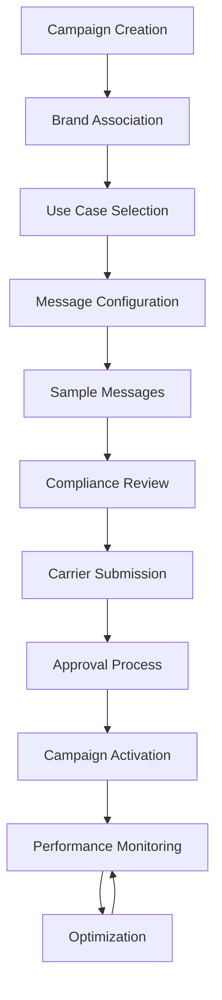
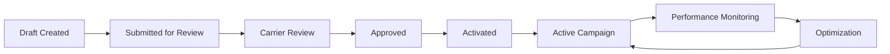

# 10DLC Campaign Management

Build powerful, compliant messaging campaigns that drive engagement and deliver results. Our 10DLC Campaign system provides enterprise-grade campaign management with intelligent automation, advanced targeting, and comprehensive compliance monitoring.

## 🎯 What is 10DLC Campaign?

10DLC (10-Digit Long Code) Campaigns are Application-to-Person (A2P) messaging solutions that enable businesses to send SMS messages at scale while maintaining carrier trust and regulatory compliance. Unlike traditional short codes, 10DLC campaigns use standard 10-digit phone numbers and provide enhanced deliverability, better cost efficiency, and improved user experience.


## 🎯 Campaign Management Overview

10DLC Campaigns are the heart of your business messaging strategy, enabling you to send Application-to-Person (A2P) messages at scale while maintaining carrier trust and regulatory compliance.
<CardGroup cols={3}>
  <Card title="Campaign Creation" icon="plus">
    Streamlined campaign setup with intelligent field validation and compliance checking
  </Card>
  <Card title="Message Management" icon="envelope">
    Advanced message templating with dynamic content and personalization
  </Card>
  <Card title="Performance Analytics" icon="chart-line">
    Real-time campaign metrics with deliverability insights and optimization recommendations
  </Card>
</CardGroup>

## 🚀 Campaign Workflow

### Phase 1: Campaign Foundation
1. **Navigate to Setup > 10DLC > Campaign**
2. **Click "Add New Campaign"** to initiate creation
3. **Select Brand Association** from your verified brand portfolio
4. **Choose Campaign Type** based on your messaging volume and use case

### Phase 2: Strategic Configuration
1. **Define Use Cases** - Select from approved messaging categories
2. **Configure Message Flow** - Design your customer interaction journey
3. **Set Campaign Attributes** - Enable required compliance features
4. **Upload Sample Messages** - Provide examples for carrier approval

### Phase 3: Launch & Monitor
1. **Submit for Review** - Automated compliance validation
2. **Carrier Approval** - Industry-standard verification process
3. **Campaign Activation** - Go live with real-time monitoring
4. **Performance Optimization** - Continuous improvement based on analytics

## 📊 10DLC vs Traditional Messaging

| Feature | 10DLC Campaign | Short Code | Long Code |
|---------|----------------|------------|-----------|
| **Setup Time** | 24-48 hours | 6-8 weeks | Immediate |
| **Cost** | Low to moderate | High | Very low |
| **Deliverability** | Excellent | Excellent | Poor |
| **Carrier Support** | All major carriers | All carriers | Limited |
| **Compliance** | Built-in | Manual | Manual |
| **Scalability** | High | Very high | Low |
| **User Experience** | Familiar number | Short, memorable | Standard |
| **Trust Score** | Dynamic | Static | None |

## 🔄 Campaign Lifecycle Management



## 📋 Campaign Fields & Configuration

### Required Campaign Information


#### Brand ID Selection
- **Purpose**: Associates campaign with your verified business identity
- **Format**: Dropdown showing "Company Name (Brand ID)"
- **Example**: "Volt Tech Solutions LLC (B4KOEKA)"
- **Impact**: Determines trust score and messaging limits

#### Campaign Type Classification
- **Low Volume**: Up to 1,000 messages per day
- **Standard**: Up to 10,000 messages per day  
- **High Volume**: Up to 100,000+ messages per day
- **Enterprise**: Unlimited with carrier approval

#### Use Case Selection (Multi-Select)
<CardGroup cols={2}>
  <Card title="Authentication" icon="shield">
    - 2FA (Two-Factor Authentication)
    - Account Notification
    - Login Alerts
  </Card>
  <Card title="Notifications" icon="bell">
    - Delivery Notification
    - Appointment Reminders
    - Status Updates
  </Card>
  <Card title="Education" icon="graduation-cap">
    - Higher Education
    - Course Updates
    - Academic Alerts
  </Card>
  <Card title="Customer Care" icon="headphones">
    - Support Updates
    - Issue Resolution
    - Service Notifications
  </Card>
</CardGroup>

#### Compliance Links
- **Privacy Policy URL** (Required, max 2048 characters)
- **Terms & Conditions URL** (Required, max 2048 characters)
- **Purpose**: Demonstrate regulatory compliance and transparency

#### Campaign Description
- **Length**: 40-4096 characters
- **Content**: Detailed explanation of campaign purpose and messaging strategy
- **Example**: "Sending first-party messages for 2FA, Account Notification, Delivery Notification, and Higher Education by Volt Tech Solutions LLC to customers in the ENERGY industry."

#### Message Flow Documentation
- **Length**: 40-4096 characters  
- **Content**: Complete customer interaction journey and opt-in process
- **Includes**: Opt-in methods, consent language, frequency expectations, opt-out instructions


### Sample Messages Section


Provide 5 representative message examples that demonstrate your campaign's messaging style and content:

#### Message Requirements
- **Length**: 20-1024 characters each
- **Content**: Real examples of messages customers will receive
- **Compliance**: Must include opt-out instructions (Reply STOP)
- **Branding**: Should reflect your company identity

#### Example Messages
```text
1. "Your Signal House code is: 54321. Please do not share this with anyone. 
   If you did not request this, please reach out to our support ASAP."

2. "Your code is: 54321. Please do not share this with anyone. 
   If you did not request this from Signal House, please reach out to our support ASAP."

3. "Your 10DLC campaign is now fully approved, congratulations! 
   Respond STOP to opt out from Volt Tech Solutions LLC"

4. "Your payment has been successfully received. 
   Respond STOP to opt out from Volt Tech Solutions LLC"

5. "Your package was successfully delivered. 
   Respond STOP to opt out from Volt Tech Solutions LLC"
```

### Campaign Attributes Configuration

<Image
  src="/images/setup/10dlc/campaign-attributes.png"
  alt="Campaign Attributes Toggle Settings"
/>

#### Required Attributes (Always Enabled)
<CardGroup cols={2}>
  <Card title="Subscriber Opt-in" icon="user-check">
    Enables customers to subscribe to your messaging service
  </Card>
  <Card title="Subscriber Opt-Out" icon="user-minus">
    Allows customers to unsubscribe (Reply STOP)
  </Card>
  <Card title="Subscriber Help" icon="circle-question">
    Provides customer support information (Reply HELP)
  </Card>
  <Card title="Embedded Link" icon="link">
    Permits clickable links in messages
  </Card>
</CardGroup>

### Additional Settings


#### Advanced Configuration Options
<CardGroup cols={3}>
  <Card title="Embedded Phone" icon="phone">
    Allows clickable phone numbers in messages
  </Card>
  <Card title="Age Gated" icon="calendar">
    Indicates age-restricted content (18+)
  </Card>
  <Card title="Auto Renewal" icon="arrows-rotate">
    Enables automatic subscription renewal
  </Card>
  <Card title="Direct Lending" icon="credit-card">
    Indicates financial services content
  </Card>
  <Card title="Terms Agreement" icon="file-contract">
    Requires terms acceptance for opt-in
  </Card>
  <Card title="Number Pool" icon="users">
    Uses shared number pool (50+ numbers)
  </Card>
</CardGroup>

### 📝 Optional Information

#### Reference ID
- **Purpose**: Internal tracking and organization
- **Format**: Alphanumeric, max 50 characters
- **Example**: "Q4_MARKETING_2024"

#### Tags
- **Purpose**: Campaign categorization and filtering
- **Format**: Comma-separated, max 255 characters
- **Example**: "marketing, customer-care, alerts"

#### MNO IDs
- **Purpose**: Specific carrier network targeting
- **Format**: Comma-separated carrier identifiers
- **Use Case**: Advanced targeting for specific mobile networks

## ✅ Field Validation & Requirements

### Required Field Checklist
<CardGroup cols={2}>
  <Card title="Brand Information" icon="building">
    ✅ Brand ID Selection<br/>
    ✅ Campaign Type<br/>
    ✅ Use Case Selection (1-5)
  </Card>
  <Card title="Compliance Links" icon="shield">
    ✅ Privacy Policy URL<br/>
    ✅ Terms & Conditions URL<br/>
    ✅ Valid URLs (max 2048 chars)
  </Card>
  <Card title="Campaign Details" icon="file-alt">
    ✅ Campaign Description (40-4096 chars)<br/>
    ✅ Message Flow (40-4096 chars)<br/>
    ✅ Sample Messages (5 required)
  </Card>
  <Card title="Attributes" icon="sliders">
    ✅ Subscriber Opt-in<br/>
    ✅ Subscriber Opt-out<br/>
    ✅ Subscriber Help<br/>
    ✅ Embedded Link
  </Card>
</CardGroup>

### Character Limits & Validation Rules

| Field | Min Length | Max Length | Format | Validation |
|-------|------------|------------|--------|------------|
| **Campaign Description** | 40 | 4096 | Text | Required, descriptive |
| **Message Flow** | 40 | 4096 | Text | Required, detailed |
| **Sample Messages** | 20 | 1024 | Text | 5 required, unique |
| **Privacy Policy URL** | 1 | 2048 | URL | Valid, accessible |
| **Terms & Conditions URL** | 1 | 2048 | URL | Valid, accessible |
| **Reference ID** | 0 | 50 | Alphanumeric | Optional |
| **Tags** | 0 | 255 | Comma-separated | Optional |
| **MNO IDs** | 0 | 100 | Comma-separated | Optional |

### Common Validation Errors
- **Incomplete Use Cases**: Must select 1-5 use cases
- **Invalid URLs**: Privacy policy and terms must be accessible
- **Short Descriptions**: Campaign description must be at least 40 characters
- **Missing Sample Messages**: All 5 sample messages are required
- **Duplicate Content**: Sample messages must be unique
- **Missing Opt-out Instructions**: All sample messages must include STOP instructions

## 📊 Campaign Status & Lifecycle

### Status Tracking
<CardGroup cols={4}>
  <Card title="DRAFT" icon="file-pen" color="gray">
    Campaign created but not submitted
  </Card>
  <Card title="PENDING" icon="hourglass" color="yellow">
    Under carrier review
  </Card>
  <Card title="APPROVED" icon="check" color="green">
    Ready for activation
  </Card>
  <Card title="ACTIVE" icon="rocket" color="blue">
    Live and sending messages
  </Card>
</CardGroup>

### Campaign Lifecycle Timeline



## 🎯 Use Cases & Applications

### Business Communication
<CardGroup cols={2}>
  <Card title="Customer Support" icon="headphones">
    - Order status updates
    - Support ticket notifications
    - Appointment confirmations
    - Issue resolution updates
  </Card>
  <Card title="Marketing & Promotions" icon="megaphone">
    - Special offers and discounts
    - Product announcements
    - Event invitations
    - Loyalty program updates
  </Card>
</CardGroup>

### 🔐 Security & Authentication
<CardGroup cols={2}>
  <Card title="Two-Factor Authentication" icon="shield">
    - Login verification codes
    - Account security alerts
    - Password reset confirmations
    - Suspicious activity notifications
  </Card>
  <Card title="Account Management" icon="user">
    - Profile update confirmations
    - Security setting changes
    - Account verification
    - Login notifications
  </Card>
</CardGroup>
 


## 🔧 Advanced Features
### 🤖 Campaign Automation
<CardGroup cols={2}>
  <Card title="Triggered Messages" icon="bolt">
    - Event-based messaging
    - Time-based campaigns
    - Behavioral triggers
    - Geographic targeting
  </Card>
  <Card title="Dynamic Content" icon="code">
    - Personalized messaging
    - Variable substitution
    - Conditional content
    - Real-time data integration
  </Card>
</CardGroup>

### 🔗 Integration Capabilities
- **API Integration**: Programmatic campaign management
- **Webhook Support**: Real-time event notifications
- **CRM Integration**: Customer data synchronization
- **Analytics Integration**: Third-party reporting tools

### ✅ Compliance Automation
- **Opt-in Management**: Automated consent tracking
- **Opt-out Processing**: Instant unsubscribe handling
- **Regulatory Monitoring**: Automated compliance checking
- **Audit Trail**: Complete activity logging
