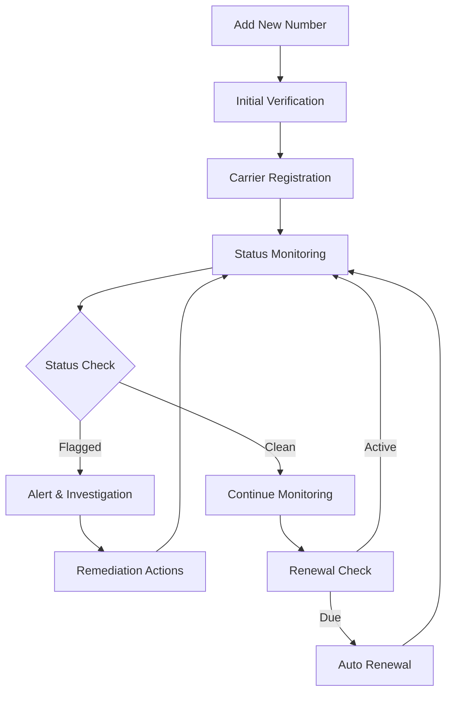

import { Callout } from 'nextra/components'


<Callout type="info" emoji="ℹ️">
  **What are Spam Protected Numbers?**
  
  These are phone numbers that are continuously monitored for spam reputation, carrier compliance, and deliverability status. The system helps prevent your numbers from being flagged or blocked by carriers.
</Callout>

## 🔄 Workflow

The spam protection system follows a comprehensive monitoring and management workflow:



 **Step-by-Step Process**

1. **🆕 Number Addition**: Add phone numbers to the protection system
2. **✅ Initial Verification**: System verifies number validity and carrier compatibility
3. **📋 Carrier Registration**: Number is registered with relevant carriers and compliance databases
4. **🔍 Continuous Monitoring**: 24/7 monitoring for spam reports and reputation changes
5. **⚠️ Alert System**: Immediate notifications for status changes or flags
6. **🔧 Remediation**: Automated and manual actions to resolve issues
7. **🔄 Renewal Management**: Automatic renewal of protection services


The dashboard provides a comprehensive view of all your protected numbers with the following components:

### 🎛️ Control Panel
- **➕ Add Number**: Quick action to add new numbers to protection
- **🔍 Search**: Real-time search functionality
- **📄 Pagination**: Navigate through large number lists
- **⚙️ Items per page**: Customize table display

### 📋 Data Table Fields

| Field | Description | Purpose |
|-------|-------------|---------|
| **#** | Row number for easy reference | Quick identification |
| **📞 Number** | The protected phone number | Primary identifier |
| **🏷️ Type** | Number type (Rizz, SMS, Voice, etc.) | Service classification |
| **🚦 Status** | Current protection status | Health monitoring |
| **🔄 Renewal** | Next renewal date and time | Subscription management |
| **📅 Latest Check** | Last system verification time | Monitoring frequency |
| **📅 Added On** | Registration timestamp | Historical tracking |
| **⚡ Action** | Available operations | Management controls |

## 🚦 Status Types

The system uses color-coded status indicators for quick visual assessment:

**✅ Clean Status**
```
Status: Clean
Color: Green
Meaning: Number is in good standing with no spam flags
```

**🚨 Flagged Status**
```
Status: Flagged
Color: Red
Meaning: Number has been reported for spam or compliance issues
Additional Info: Shows carrier details (T-Mobile, Verizon, etc.)
```

**⏳ Pending Status**
```
Status: Pending
Color: Yellow
Meaning: Number is under review or verification
```

**❌ Blocked Status**
```
Status: Blocked
Color: Dark Red
Meaning: Number is blocked by carriers

```
# ➕ Add Number


 When you click the **Add** button, a dialog box appears allowing you to add a custom number.


> **Add Number Modal:**  
> - **Title**: "Add Custom Number"
> - **Field**: Phone Number input  
> - **Actions**:  
>   - **Save** (blue button): Confirms and adds the new number for spam protection  
>   - **Close** (light blue button): Cancels the process  
> - Used to register a new phone number in the spam protection system.  
> - Only custom numbers can be edited or deleted after adding.

_Example: Add Custom Number dialog allowing you to input a new phone number for spam protection. Click **Save** to register, or **Close** to cancel._

## ⚙️ Flag Settings Configuration

Control how many carriers must report your number as spam before it's marked "Flagged". Adjust the sensitivity to match your business needs.


<Callout type="tip" emoji="💡">
  **Quick Setup:** Click the **"Flag Settings"** button → Choose your preference → Click **"Save Settings"**
</Callout>


| Setting | When It Flags | Best For |
|---------|---------------|----------|
| **1+ Carrier** 🚨 | Immediately when any carrier reports | Strict compliance, brand protection |
| **2+ Carriers** ⭐ **Default** | When 2 carriers agree | Most businesses (Recommended) |
| **3+ Carriers** 🛡️ | When 3+ carriers agree | High-volume call centers |


#### 🚨 Option 1: Flag by 1 Carrier (Most Sensitive)

**Example:** Your number is flagged the moment any carrier (AT&T, T-Mobile, Verizon, etc.) reports it as spam.

**Pros:**
- ✅ Fastest possible detection—instant flagging
- ✅ Maximum caution for strict compliance
- ✅ Good for protecting your brand reputation

**Cons:**
- ⚠️ May result in more false positives
- ⚠️ Might flag due to isolated carrier mistakes

**Recommended For:**
- Businesses prioritizing reputation above all
- Low-volume or sensitive callers
- Compliance-heavy industries

---

#### ⭐ Option 2: Flag by 2 Carriers (Recommended - Default)

**Example:** Your number is only marked "Flagged" when both AT&T AND T-Mobile (or any 2 carriers) report it as spam

**Pros:**
- ✅ Reduces false positives significantly
- ✅ More accurate spam detection
- ✅ Balanced approach for most businesses
- ✅ Set as default for optimal results

**Cons:**
- ⚠️ Slightly slower detection than Option 1

**Recommended For:**
- Most businesses (Default choice)
- Companies with moderate call volumes
- Businesses wanting balance between accuracy and speed

---

#### 🛡️ Option 3: Flag by 3 Carriers (Least Sensitive)

**Example:** Your number is only flagged when AT&T, T-Mobile, AND Verizon (or any 3 carriers) all report it as spam

**Pros:**
- ✅ Almost no false positives
- ✅ Very high confidence in spam detection
- ✅ Won't trigger on isolated incidents

**Cons:**
- ⚠️ May detect spam issues later
- ⚠️ Your number might already have reputation damage before flagging

**Recommended For:**
- High-volume call centers
- Businesses with aggressive calling patterns
- Companies that accept some spam risk for fewer interruptions


## 📱 SOPS

> 

A step-by-step handbook for managing your protected numbers and avoiding spam status.

---

### 🚀 Getting Started

**How to Add a Number**
1. Click the **"Add Number"** button.
2. Enter your phone number.
3. Click **"Save"**.

**What happens:** The system will start monitoring your number across all carriers for spam reputation.

---

### 📊 Status Guide

| Status | Meaning                          | What to Do                        |
|--------|----------------------------------|-----------------------------------|
| 🟡 **In Progress** | Checking with carriers now         | Wait (takes a few hours)          |
| 🟢 **Clean**       | Not flagged as spam                | Keep monitoring regularly         |
| 🔴 **Flagged**     | Marked as spam by one or more carriers | Stop using, contact carrier    |

---

### ⚙️ Configuring Flag Settings

**How to Set It**
1. Click **"Flag Settings"** button.
2. Select option:
   - **1 carrier** = Most sensitive
   - **2 carriers** = Balanced ⭐ (Default)
   - **3 carriers** = Least sensitive
3. Click **"Save Settings"**.

**Which to Choose?**
- **Most businesses:** Use 2 carriers (default)
- **Very cautious:** Use 1 carrier
- **High call volume:** Use 3 carriers

---

### 👁️ Viewing Carrier Details

1. Click the **"View"** button next to any number.
2. See which carriers have flagged your number.
3. Review detailed status for each carrier.

---

### 🎯 Best Practices

#### ✅ DO:
- Check your numbers weekly
- Use the default (2 carriers) setting for sensitivity
- Act quickly if a number is flagged
- Monitor all numbers used by your business

#### ❌ DON'T:
- Don't ignore flag notifications
- Don't change settings too often
- Don't use numbers marked as flagged
- Don't skip number renewal dates

---

### 🔧 Troubleshooting

**Q: Number stuck in "In Progress"?**  
A: Wait 24 hours. Still stuck? Contact support.

**Q: Number is Flagged - what now?**  
A: Stop using it and contact your carrier for remediation.

**Q: Can't edit a number?**  
A: Only custom-added numbers can be edited. Numbers provisioned by the system cannot be changed.

**Q: How to change flag sensitivity?**  
A: Click "Flag Settings", select a sensitivity option, then click "Save".

---

## ⚡ Actions & Operations


#### 👁️ View Details
- **Purpose**: Access comprehensive number information
- **Features**:
  - Historical status changes
  -
  - Carrier reports
  - Performance metrics
  - Compliance details

#### 🗑️ Delete Number
- **Purpose**: Remove numbers from protection
- **Considerations**:
  - Permanent action
  - Loses historical data
  - Requires confirmation


