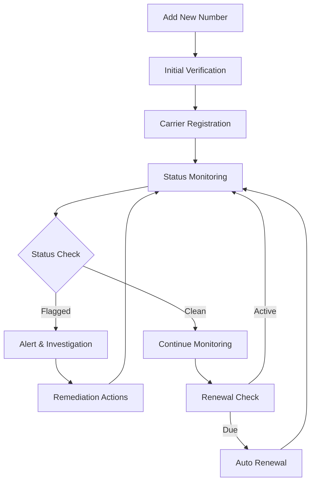

import { Callout } from 'nextra/components'


## 🛡️ Overview

Spam Protected Numbers is a powerful feature that helps you monitor and manage the reputation of your phone numbers to ensure optimal deliverability and compliance. The system automatically tracks number status, renewal dates, and spam flags to maintain clean communication channels.

<Callout type="info" emoji="ℹ️">
  **What are Spam Protected Numbers?**
  
  These are phone numbers that are continuously monitored for spam reputation, carrier compliance, and deliverability status. The system helps prevent your numbers from being flagged or blocked by carriers.
</Callout>

## 🔄 Workflow

The spam protection system follows a comprehensive monitoring and management workflow:



### Step-by-Step Process:

1. **🆕 Number Addition**: Add phone numbers to the protection system
2. **✅ Initial Verification**: System verifies number validity and carrier compatibility
3. **📋 Carrier Registration**: Number is registered with relevant carriers and compliance databases
4. **🔍 Continuous Monitoring**: 24/7 monitoring for spam reports and reputation changes
5. **⚠️ Alert System**: Immediate notifications for status changes or flags
6. **🔧 Remediation**: Automated and manual actions to resolve issues
7. **🔄 Renewal Management**: Automatic renewal of protection services

## 📊 Dashboard Interface


The dashboard provides a comprehensive view of all your protected numbers with the following components:

### 🎛️ Control Panel
- **➕ Add Number**: Quick action to add new numbers to protection
- **🔍 Search**: Real-time search functionality
- **📄 Pagination**: Navigate through large number lists
- **⚙️ Items per page**: Customize table display

### 📋 Data Table Fields

| Field | Description | Purpose |
|-------|-------------|---------|
| **#** | Row number for easy reference | Quick identification |
| **📞 Number** | The protected phone number | Primary identifier |
| **🏷️ Type** | Number type (Rizz, SMS, Voice, etc.) | Service classification |
| **🚦 Status** | Current protection status | Health monitoring |
| **🔄 Renewal** | Next renewal date and time | Subscription management |
| **📅 Latest Check** | Last system verification time | Monitoring frequency |
| **📅 Added On** | Registration timestamp | Historical tracking |
| **⚡ Action** | Available operations | Management controls |

## 🚦 Status Types

The system uses color-coded status indicators for quick visual assessment:

### ✅ Clean Status
```
Status: Clean
Color: Green
Meaning: Number is in good standing with no spam flags
```

### 🚨 Flagged Status
```
Status: Flagged
Color: Red
Meaning: Number has been reported for spam or compliance issues
Additional Info: Shows carrier details (T-Mobile, Verizon, etc.)
```

### ⏳ Pending Status
```
Status: Pending
Color: Yellow
Meaning: Number is under review or verification
```

### ❌ Blocked Status
```
Status: Blocked
Color: Dark Red
Meaning: Number is blocked by carriers
```

## 📱 Mobile Interface

<Callout type="tip" emoji="💡">
  The system provides a responsive mobile interface for on-the-go number management.
</Callout>

The mobile view displays numbers in card format with:
- **📞 Number display**: Large, readable format
- **🚦 Status indicator**: Color-coded status
- **📱 Carrier info**: Mobile network details
- **🔔 Notification controls**: Record, message, and answer options
- **📊 Quick stats**: Essential metrics at a glance

## ⚡ Actions & Operations

### Primary Actions

#### ➕ Add Number
- **Purpose**: Register new numbers for spam protection
- **Process**: 
  1. Click "Add Number" button
  2. Enter phone number
  3. Select number type
  4. Configure protection settings
  5. Confirm registration

#### 👁️ View Details
- **Purpose**: Access comprehensive number information
- **Features**:
  - Historical status changes
  - Carrier reports
  - Performance metrics
  - Compliance details

#### 🗑️ Delete Number
- **Purpose**: Remove numbers from protection
- **Considerations**:
  - Permanent action
  - Loses historical data
  - Requires confirmation

### Bulk Operations
- **📊 Export data**: Download number reports
- **🔄 Bulk renewal**: Renew multiple numbers
- **📋 Status updates**: Mass status changes

## 📈 Monitoring & Analytics

### Real-time Monitoring
- **🔍 24/7 scanning**: Continuous reputation monitoring
- **📊 Performance tracking**: Delivery rate analysis
- **⚠️ Alert system**: Immediate notifications for issues

### Key Metrics
- **📈 Delivery Rate**: Percentage of successful message delivery
- **🚫 Spam Reports**: Number of spam complaints
- **📱 Carrier Compliance**: Status across different networks
- **⏱️ Response Time**: System monitoring frequency

## 🔄 Renewal Management

### Automatic Renewal
- **📅 Schedule**: System checks renewal dates daily
- **💳 Billing**: Automatic charges for active subscriptions
- **📧 Notifications**: Email alerts before renewal dates

### Manual Renewal
- **🎛️ Control**: Override automatic settings
- **💰 Payment**: Custom billing arrangements
- **📊 Reporting**: Detailed renewal history

## 📞 Support & Resources

<Callout type="info" emoji="📞">
  **Need Help?**
  
  Our support team is available 24/7 to assist with spam protection issues and number management.
</Callout>

### Contact Options
- **📧 Email**: support@rizz.com
- **💬 Live Chat**: Available in dashboard
- **📞 Phone**: 1-800-RIZZ-HELP
- **📚 Knowledge Base**: Comprehensive guides and FAQs
