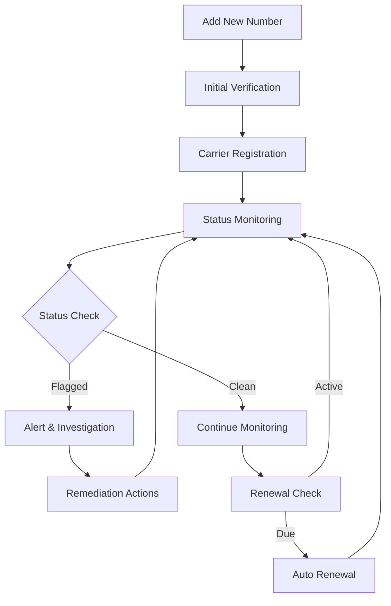

import { Callout } from 'nextra/components'


<Callout type="info" emoji="ℹ️">
  **What are Spam Protected Numbers?**
  
  These are phone numbers that are continuously monitored for spam reputation, carrier compliance, and deliverability status. The system helps prevent your numbers from being flagged or blocked by carriers.
</Callout>

## 🔄 Workflow

The spam protection system follows a comprehensive monitoring and management workflow:


```mermaid
graph TD
    A[Add New Number] --> B[Initial Verification]
    B --> C[Carrier Registration]
    C --> D[Status Monitoring]
    D --> E{Status Check}
    E -->|Clean| F[Continue Monitoring]
    E -->|Flagged| G[Alert & Investigation]
    G --> H[Remediation Actions]
    H --> D
    F --> I[Renewal Check]
    I -->|Due| J[Auto Renewal]
    I -->|Active| D
    J --> D
```

 **Step-by-Step Process**

1. **🆕 Number Addition**: Add phone numbers to the protection system
2. **✅ Initial Verification**: System verifies number validity and carrier compatibility
3. **📋 Carrier Registration**: Number is registered with relevant carriers and compliance databases
4. **🔍 Continuous Monitoring**: 24/7 monitoring for spam reports and reputation changes
5. **⚠️ Alert System**: Immediate notifications for status changes or flags
6. **🔧 Remediation**: Automated and manual actions to resolve issues
7. **🔄 Renewal Management**: Automatic renewal of protection services


The dashboard provides a comprehensive view of all your protected numbers with the following components:

### 🎛️ Control Panel
- **➕ Add Number**: Quick action to add new numbers to protection
- **🔍 Search**: Real-time search functionality
- **📄 Pagination**: Navigate through large number lists
- **⚙️ Items per page**: Customize table display

### 📋 Data Table Fields

| Field | Description | Purpose |
|-------|-------------|---------|
| **#** | Row number for easy reference | Quick identification |
| **📞 Number** | The protected phone number | Primary identifier |
| **🏷️ Type** | Number type (Rizz, SMS, Voice, etc.) | Service classification |
| **🚦 Status** | Current protection status | Health monitoring |
| **🔄 Renewal** | Next renewal date and time | Subscription management |
| **📅 Latest Check** | Last system verification time | Monitoring frequency |
| **📅 Added On** | Registration timestamp | Historical tracking |
| **⚡ Action** | Available operations | Management controls |

## 🚦 Status Types

The system uses color-coded status indicators for quick visual assessment:

**✅ Clean Status**
```
Status: Clean
Color: Green
Meaning: Number is in good standing with no spam flags
```

**🚨 Flagged Status**
```
Status: Flagged
Color: Red
Meaning: Number has been reported for spam or compliance issues
Additional Info: Shows carrier details (T-Mobile, Verizon, etc.)
```

**⏳ Pending Status**
```
Status: Pending
Color: Yellow
Meaning: Number is under review or verification
```

**❌ Blocked Status**
```
Status: Blocked
Color: Dark Red
Meaning: Number is blocked by carriers

```
# ➕ Add Number


 When you click the **Add** button, a dialog box appears allowing you to add a custom number.


> **Add Number Modal:**  
> - **Title**: "Add Custom Number"
> - **Field**: Phone Number input  
> - **Actions**:  
>   - **Save** (blue button): Confirms and adds the new number for spam protection  
>   - **Close** (light blue button): Cancels the process  
> - Used to register a new phone number in the spam protection system.  
> - Only custom numbers can be edited or deleted after adding.

_Example: Add Custom Number dialog allowing you to input a new phone number for spam protection. Click **Save** to register, or **Close** to cancel._

## ⚙️ Configuration Flag Settings    

Control how many carriers must report your number as spam before it's marked "Flagged". Adjust the sensitivity to match your business needs.


<Callout type="tip" emoji="💡">
  **Quick Setup:** Click the **"Flag Settings"** button → Choose your preference → Click **"Save Settings"**
</Callout>


| Setting | When It Flags | Best For |
|---------|---------------|----------|
| **1+ Carrier** 🚨 | Immediately when any carrier reports | Strict compliance, brand protection |
| **2+ Carriers** ⭐ **Default** | When 2 carriers agree | Most businesses (Recommended) |
| **3+ Carriers** 🛡️ | When 3+ carriers agree | High-volume call centers |


#### 🚨 Option 1: Flag by 1 Carrier (Most Sensitive)

**Example:** Your number is flagged the moment any carrier (AT&T, T-Mobile, Verizon, etc.) reports it as spam.

**Pros:**
- ✅ Fastest possible detection—instant flagging
- ✅ Maximum caution for strict compliance
- ✅ Good for protecting your brand reputation

**Cons:**
- ⚠️ May result in more false positives
- ⚠️ Might flag due to isolated carrier mistakes

**Recommended For:**
- Businesses prioritizing reputation above all
- Low-volume or sensitive callers
- Compliance-heavy industries

---

#### ⭐ Option 2: Flag by 2 Carriers (Recommended - Default)

**Example:** Your number is only marked "Flagged" when both AT&T AND T-Mobile (or any 2 carriers) report it as spam

**Pros:**
- ✅ Reduces false positives significantly
- ✅ More accurate spam detection
- ✅ Balanced approach for most businesses
- ✅ Set as default for optimal results

**Cons:**
- ⚠️ Slightly slower detection than Option 1

**Recommended For:**
- Most businesses (Default choice)
- Companies with moderate call volumes
- Businesses wanting balance between accuracy and speed

---

#### 🛡️ Option 3: Flag by 3 Carriers (Least Sensitive)

**Example:** Your number is only flagged when AT&T, T-Mobile, AND Verizon (or any 3 carriers) all report it as spam

**Pros:**
- ✅ Almost no false positives
- ✅ Very high confidence in spam detection
- ✅ Won't trigger on isolated incidents

**Cons:**
- ⚠️ May detect spam issues later
- ⚠️ Your number might already have reputation damage before flagging

**Recommended For:**
- High-volume call centers
- Businesses with aggressive calling patterns
- Companies that accept some spam risk for fewer interruptions


---

# ⏳ How Phone Number Flagging & Verification Works

If a number shows as flagged today, that doesn’t mean it’s flagged forever. The status of your numbers is dynamic and can change daily, as we run these checks five times a week. This means:

- A **flagged** number today could become **clean** tomorrow.
- A **clean** number today might be **flagged** by the next check.

When you **purchase a phone number**, it may initially appear as clean. However, if carrier or device data changes and the number is subsequently flagged, its status will automatically update to **Unverified**. Once conditions improve and the number is no longer flagged, its status will update back to **Verified**.

**Key Points:**
- Each number is checked **once every 24 hours** (one time per day), so there is a natural window between checks where a number's status can change. For example, a number could be clean at the daily check but become temporarily flagged within the next 24 hours before the next scan.
- Our remediation team actively monitors numbers every day to ensure you are aware of any status changes.
- Checks are performed using **real-life devices**, giving you results based on what carriers and devices actually show in practical conditions.

> 🧪 **Note:** Continuous, round-the-clock testing is expensive to operate at scale. That's why your numbers receive standard periodic checks which are sufficient for most large call centers and businesses. If you require more frequent, tighter monitoring, you have the option to purchase additional checks for a specific number.

---


## 📱 SOPS

> 

A step-by-step handbook for managing your protected numbers and avoiding spam status.

### 🛈 Introduction

Rizz Dial monitors your phone numbers across multiple carriers (AT&T, T-Mobile, Verizon, and more) to detect if they are flagged as spam.

**How It Works:**
- Add your number from Phone Numbers, AI Numbers, or this page.
- The system checks with multiple carriers automatically.
- Results display as **Clean**, **Flagged**, or **In Progress**.
- All protected numbers appear here for centralized monitoring.

> **Important:** Once a number is added, the "Spam Protect" button permanently disappears for that number across all pages to prevent duplicate monitoring.

---

### 🚀 Getting Started

**How to Add a Number**
1. Click the **"Add Number"** button.
2. Enter your phone number.
3. Click **"Save"**.

**What happens:** The system will start monitoring your number across all carriers for spam reputation.

---

### 📊 Status Guide

| Status | Meaning                          | What to Do                        |
|--------|----------------------------------|-----------------------------------|
| 🟡 **In Progress** | Checking with carriers now         | Wait (takes a few hours)          |
| 🟢 **Clean**       | Not flagged as spam                | Keep monitoring regularly         |
| 🔴 **Flagged**     | Marked as spam by one or more carriers | Stop using, contact carrier    |

---

### ⚙️ Configuration Flag Settings  

[Click For More Details](#⚙️-configuration-flag-settings)

### 👁️ Viewing Carrier Details

1. Click the **"View"** button next to any number.
2. See which carriers have flagged your number.
3. Review detailed status for each carrier.

---


### 📋 Numnbers Flagging and Verification process

> **Note:** The spam status of a number is not static—statuses are dynamic and can change daily.

#### How Spam Status Updates Work:

- **Daily Changes:**  
  If a number shows as *flagged* today, that doesn’t mean it’s flagged forever. The status of numbers can change day by day, as we run our reputation checks five days a week.  
  - A number flagged today could be clean tomorrow.
  - A number clean today could become flagged in a future check.

- **Upon Purchase:**  
  When you first purchase a phone number, it may look *clean* at the start. However, if device or carrier data changes and the number later becomes flagged, the system will update the status to **Unverified**. Once the number is observed as clean again, its status will return to **Verified**.

- **Monitoring Frequency:**  
  - Each number is checked automatically once every 24 hours (once per day).
  - There is always a window of time between checks—meaning a number's reputation could change between scheduled tests. For example: if a number is clean at this morning’s check, but then gets flagged later today, it will only show as flagged after the next system run.

- **Testing Quality:**  
  Our tests use real-life hardware and real carrier lookups so your dashboard reflects the true, real-world status.

#### What If You Need Tighter Tracking?

- The default setup is single (1x) check per number per day, due to the cost and resource requirements of full device testing.
- If you require more frequent checks (e.g., for mission-critical numbers), you can purchase additional monitoring—contact support for details.
- Most large call centers find the daily, per-number process to be reliable for ongoing brand protection.

#### Our Remediation Team:

- We review flags and status changes every day.
- If your number is flagged unexpectedly, our team can help provide next steps for remediation or escalation.

> **Tip:** For best results, check and review your numbers at least weekly, and respond promptly to any changes in spam status.


### 🎯 Best Practices

#### ✅ DO:
- Check your numbers weekly
- Use the default (2 carriers) setting for sensitivity
- Act quickly if a number is flagged
- Monitor all numbers used by your business

#### ❌ DON'T:
- Don't ignore flag notifications
- Don't change settings too often
- Don't use numbers marked as flagged
- Don't skip number renewal dates

---

### 🔧 Troubleshooting

**Q: Number stuck in "In Progress"?**  
A: Wait 24 hours. Still stuck? Contact support.

**Q: Number is Flagged - what now?**  
A: Stop using it and contact your carrier for remediation.

**Q: Can't edit a number?**  
A: Only custom-added numbers can be edited. Numbers provisioned by the system cannot be changed.

**Q: How to change flag sensitivity?**  
A: Click "Flag Settings", select a sensitivity option, then click "Save".

---


## ⚡ Actions & Operations


#### 👁️ View Details
- **Purpose**: Access comprehensive number information
- **Features**:
  - Historical status changes
  -
  - Carrier reports
  - Performance metrics
  - Compliance details

#### 🗑️ Delete Number
- **Purpose**: Remove numbers from protection
- **Considerations**:
  - Permanent action
  - Loses historical data
  - Requires confirmation


