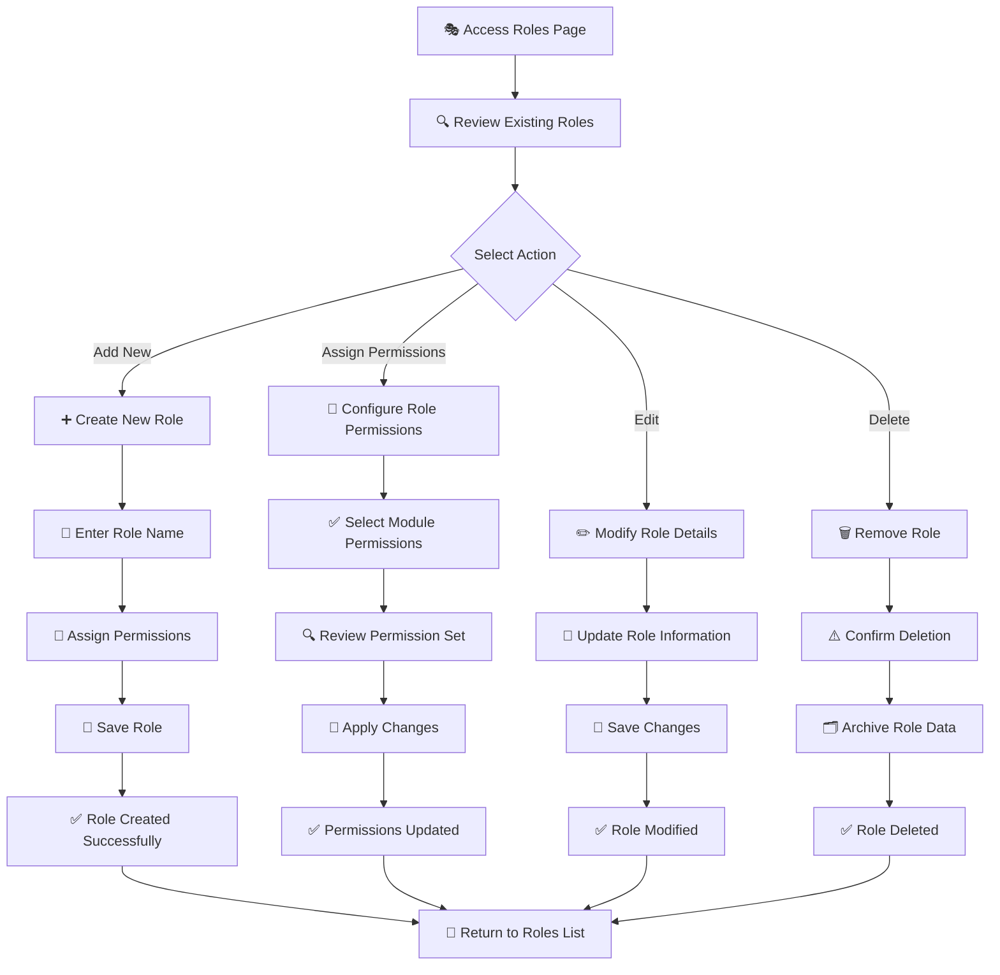

# 🛡️ Roles Management

<Info>
The Roles section is your central hub for defining and managing user roles with granular permissions. Create role-based access controls to ensure users have exactly the permissions they need for their specific responsibilities.
</Info>

## 🔍 Overview

The Roles management interface provides comprehensive control over user access across your entire system. It allows you to:

- 🎭 **Define** custom roles with specific permission sets
- 🔐 **Assign** granular permissions across all system modules
- 📊 **Monitor** role usage and modification history
- ⚡ **Streamline** user management with role-based access
- 🛡️ **Enhance** security through principle of least privilege

## 📋 Role Information & Fields

### Core Role Data

| Field | Description | Purpose | Format |
|-------|-------------|---------|---------|
| **🎭 Role Name** | Unique identifier for the role | Role identification and display | Text (up to 50 characters) |
| **📅 Created At** | Role creation timestamp | Audit trail and tracking | MM-DD-YYYY HH:MM format |
| **🔄 Updated At** | Last modification date | Change tracking and history | MM-DD-YYYY HH:MM format |
| **👥 Assigned Users** | Number of users with this role | Usage monitoring | Numeric count |
| **⚙️ Actions** | Available role operations | Role management controls | Edit/Delete/Permissions |

### Role Management Actions

<CardGroup cols={3}>
<Card title="➕ Add Role" icon="plus">
- **Purpose**: Create new custom roles
- **Use Case**: Define roles for new departments or functions
- **Workflow**: Name role → Assign permissions → Save
</Card>

<Card title="🔐 Assign Permissions" icon="shield">
- **Purpose**: Configure role capabilities
- **Use Case**: Define what actions users can perform
- **Access**: Granular control across all modules
</Card>

<Card title="✏️ Edit Role" icon="pen">
- **Purpose**: Modify role name and basic details
- **Use Case**: Update role names or descriptions
- **Impact**: Changes apply to all assigned users
</Card>

<Card title="🗑️ Delete Role" icon="trash">
- **Purpose**: Remove obsolete roles
- **Use Case**: Clean up unused or outdated roles
- **Safety**: Confirmation required before deletion
</Card>
</CardGroup>

## 🔐 Permissions Management

### Comprehensive Permission Categories

The permissions interface provides granular control across 20+ system modules:

<CardGroup cols={2}>
<Card title="📊 Dashboard Access" icon="chart-line">
**Permissions Available:**
- View Dashboard
- View Leader Board

**Use Case**: Control access to analytics and performance data
</Card>

<Card title="👥 User Management" icon="users">
**Permissions Available:**
- View Users
- Add Users  
- Edit Users
- Delete Users

**Use Case**: Manage user account lifecycle and administration
</Card>

<Card title="🎭 Role Management" icon="shield">
**Permissions Available:**
- Assign Role Permission
- View Role
- Add Role
- Edit Role
- Delete Role

**Use Case**: Control who can manage roles and permissions
</Card>

<Card title="📞 Phone Numbers" icon="phone">
**Permissions Available:**
- View Phone Numbers
- Purchase Phone Numbers
- Delete Phone Numbers

**Use Case**: Manage telephony infrastructure and costs
</Card>
</CardGroup>

<CardGroup cols={3}>
<Card title="📋 Disposition Management" icon="list-check">
**Permissions Available:**
- View Disposition
- Add Disposition
- Edit Disposition
- Delete Disposition
- Only Assign Role

**Use Case**: Control call outcome and disposition tracking
</Card>

<Card title="💬 SMS Templates" icon="message">
**Permissions Available:**
- View SMS Template
- Add SMS Template
- Edit SMS Template
- Delete SMS Template

**Use Case**: Manage messaging templates and content
</Card>

<Card title="📝 Contact Fields" icon="user-plus">
**Permissions Available:**
- View Contact Fields
- Add Contact Fields
- Edit Contact Fields
- Delete Contact Fields

**Use Case**: Customize contact data structure
</Card>

<Card title="📚 PowerLists" icon="database">
**Permissions Available:**
- View PowerLists
- Add PowerList
- Edit PowerList
- Delete PowerList
- View All PowerLists
- Download PowerList

**Use Case**: Manage contact lists and data import/export
</Card>

<Card title="👤 Contacts" icon="address-book">
**Permissions Available:**
- View Contacts
- Add Contact
- Edit Contact
- Delete Contact
- View All Contacts

**Use Case**: Control contact data access and management
</Card>

<Card title="🔗 Webhooks" icon="link">
**Permissions Available:**
- View Webhooks
- Add Webhook
- Edit Webhook
- Delete Webhook
- View All Webhooks

**Use Case**: Manage system integrations and automation
</Card>

<Card title="📈 Reports" icon="bar-chart">
**Permissions Available:**
- View Call Reports
- View Users Timesheet

**Use Case**: Control access to analytics and reporting data
</Card>

<Card title="👥 Teams" icon="user-group">
**Permissions Available:**
- View Teams
- Add Team
- Edit Team
- Delete Team
- Assign Users
- View Data Only Assign Users

**Use Case**: Manage team structure and user assignments
</Card>

<Card title="💳 Billing" icon="credit-card">
**Permissions Available:**
- Manage Subscription
- Transaction History
- Usage History

**Use Case**: Control financial and billing access
</Card>

<Card title="🏷️ Contact Tags" icon="tag">
**Permissions Available:**
- View Contact Tag
- Add Contact Tag
- Edit Contact Tag
- Delete Contact Tag
- Contact Tag Only Assign Role

**Use Case**: Manage contact categorization and organization
</Card>

<Card title="📋 PowerList Tags" icon="tags">
**Permissions Available:**
- View Powerlist Tag
- Add Powerlist Tag
- Edit Powerlist Tag
- Delete Powerlist Tag
- Powerlist Tag Only Assign Role

**Use Case**: Organize and categorize contact lists
</Card>

<Card title="⚡ Trigger Hooks" icon="webhook">
**Permissions Available:**
- View Trigger Hooks
- Add Trigger Hooks
- Edit Trigger Hooks
- Delete Trigger Hooks
- Trigger Hooks Only Assign Role

**Use Case**: Manage automation triggers and workflows
</Card>
</CardGroup>

<CardGroup cols={3}>
<Card title="🤖 AI Management" icon="brain">
**Permissions Available:**
- View/Create/Delete AI Knowledge
- View/Create/Delete AI Agent
- View/Create/Delete AI Number
- View/Create/Delete AI Agent Prompt
- View AI Dashboard
- View All AI Agent

**Use Case**: Control AI features and agent management
</Card>

<Card title="🎙️ Voice Templates" icon="microphone">
**Permissions Available:**
- View Voice Template
- Add Voice Template
- Edit Voice Template
- Delete Voice Template

**Use Case**: Manage voice campaign templates
</Card>

<Card title="📱 10DLC Management" icon="tower-cell">
**Permissions Available:**
- View/View All/Add/Edit/Delete 10DLC Profile
- View/View All/Add/Edit/Delete 10DLC Brand
- View/View All/Add/Edit/Delete 10DLC Campaign

**Use Case**: Manage SMS compliance and carrier requirements
</Card>
<Card title="📢 Voice Campaigns" icon="phone">
**Permissions Available:**
- View Voice Campaign
- Add Voice Campaign
- Edit Voice Campaign
- Delete Voice Campaign

**Use Case**: Control outbound calling campaigns
</Card>

<Card title="📝 PowerList Notes" icon="note-sticky">
**Permissions Available:**
- View/Add/Edit/Delete Powerlist Notes
- View All Powerlist Notes

**Use Case**: Manage notes and annotations on contact lists
</Card>

<Card title="🛡️ Spam Protection" icon="shield-check">
**Permissions Available:**
- View Spam Protected Numbers
- Assign (action button)

**Use Case**: Control spam protection settings and number management
</Card>
</CardGroup>

## 🔄 Role Management Workflow

### Complete Workflow Process

### Step-by-Step Role Creation

<Steps>
<Step title="🎭 Access Roles Management">
**Navigation**: User Management → Roles

- **Location**: Left sidebar navigation
- **Access**: Admin-level permissions required
- **View**: Complete list of existing roles
</Step>

<Step title="➕ Create New Role">
**Action**: Click "Add" button

- **Purpose**: Define new role for specific function
- **Naming**: Use descriptive, clear role names
- **Examples**: "Sales Agent", "Team Lead", "Administrator"
</Step>

<Step title="🔐 Assign Permissions">
**Configuration**: Select module permissions

- **Method**: Check boxes for allowed actions
- **Principle**: Grant minimum necessary permissions
- **Categories**: 20+ module categories available
- **Granularity**: View/Add/Edit/Delete for each module
</Step>

<Step title="💾 Save Role">
**Completion**: Apply role configuration

- **Validation**: System validates permission set
- **Confirmation**: Role created successfully
- **Availability**: Role ready for user assignment
</Step>
</Steps>
 

## 📈 Role Statistics & Insights

<CardGroup cols={3}>
<Card title="🎭 Total Roles" icon="shield">
**Current Count**: Track active roles
**Growth Rate**: Monitor role creation trends
**Utilization**: Measure role assignment rates
</Card>

<Card title="👥 Role Usage" icon="users">
**Most Popular**: Identify commonly used roles
**Underutilized**: Find unused or obsolete roles
**Assignment Trends**: Track role distribution
</Card>

<Card title="🔐 Permission Analysis" icon="lock">
**Permission Distribution**: Analyze permission usage
**Security Gaps**: Identify overly permissive roles
**Optimization**: Suggest permission improvements
</Card>
</CardGroup>

## 🔗 Integration Points

### Related Features

<CardGroup cols={2}>
<Card title="👥 Users Management" icon="users">
**Connection**: Users are assigned specific roles
**Navigation**: `User Management > Users`
**Purpose**: Apply roles to individual user accounts
</Card>

<Card title="👥 Teams Management" icon="user-group">
**Connection**: Teams can have role-based access
**Navigation**: `User Management > Teams`
**Purpose**: Organize users with similar roles
</Card>

<Card title="🔐 Permission Auditing" icon="clipboard-check">
**Connection**: Track permission changes and usage
**Navigation**: System logs and audit trails
**Purpose**: Monitor security and compliance
</Card>

<Card title="📊 Access Reports" icon="chart-bar">
**Connection**: Generate role and permission reports
**Navigation**: Reports section
**Purpose**: Analyze access patterns and security
</Card>
</CardGroup>
 