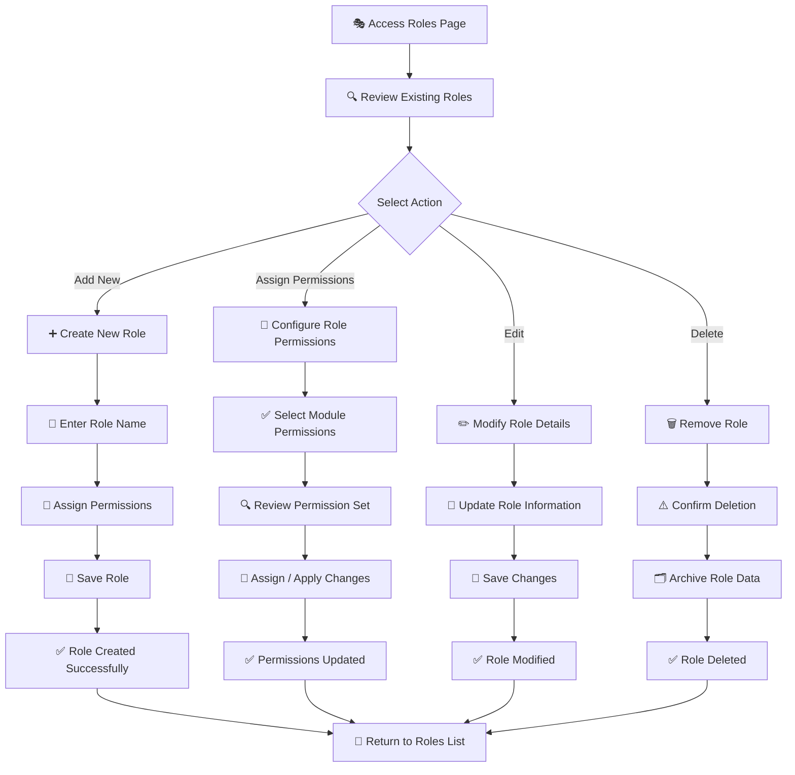

**Roles** let you group **what people are allowed to do** in your workspace. Each role has a **name** you can recognize (for example, “Sales” or “Support”) and a set of **allowed actions** tied to different parts of the product (such as viewing reports or managing users).

## 📋 The Roles list

The main screen is a table of all roles that belong to **your organization**. You do not see roles from other organizations.

**🗂️ Columns**

| Column | What it shows |
|--------|----------------|
| **#** | Row number (1, 2, 3, …) for easy reference. |
| **Name** | The role’s display name—the same name you give when you create or rename the role. |
| **Updated At** | The last time this role was changed, shown in **your** time zone (the one set on your profile). |
| **Created At** | When the role was first added, also in **your** time zone. |
| **Action** | Shortcuts to **change** or **remove** the role (explained below). |

**🔍 Search and paging**

The list can be **searched** (there is a search box with the placeholder “Search…”) and is shown **10 rows per page** by default, so long lists stay easy to skim.

## ➕ Adding a new role

At the top of the list there is an **Add** control.

**What happens when you use Add**

1. The system **creates a new role right away** with a temporary automatic name (it looks like **Role_** followed by random characters). This avoids clashing with names you already use.
2. You are taken straight to the **Permissions** screen for that new role so you can **rename** the role and **choose what it may do**.

If the system cannot create the role after several tries (for example, because of a rare name clash), you may see a message asking you to try again, and you return to the Roles list.

**After adding**

On the Permissions screen you may see a short **success** message explaining that the role was created and that you should assign what it is allowed to do.

## ✏️ Editing a role (opening Permissions)

In the list, each row has an **Edit** control under **Action**.

**Edit** opens the **Permissions** page for that role. There you set the role’s **name** (if you want to change it) and **which actions** are allowed. Details for that page are in the section  below.

## 🗑️ Deleting a role

In the list, next to **Edit**, there is a **delete** control (trash icon).

- The system asks you to confirm: **“Are you sure?”**
- If you confirm, the role is removed and you return to the **Roles** list with a message that the record was deleted.

On the Permissions screen you can also delete the role from there .

**🖊️ Extra screen on the Roles page (name and Submit)**

The Roles page also contains a second block that is normally **hidden**. It includes:

- A **Back** control
- A title line that would read **Add Role** or **Edit Role**
- A **Name** field with short on-screen hints (question-mark style help)
- A **Submit** control

In normal use, **Add** sends you to Permissions after creating a role, so this hidden block is not the usual path for creating roles today. If your workspace ever shows this block, **Name** is where you type the role’s title and **Submit** saves it; feedback text appears above the button (“please wait,” success in green, or errors in red). After a successful save, the page typically returns to the Roles list.

## 🛡️ The Permissions screen

**Title:** **Permissions**  
**Trail:** **Users → Role → Permissions**

This is where you **name** the role (or change the name) and **choose exactly what** that role may do across the product.

**🏷️ Card title**

The card is titled **Assign Permission**.

**📝 Form overview**

Everything on this page works together as **one form** that ends with an **Assign** button. When you use **Assign**, your choices—including the role name, if you changed it—are saved for that role.

**🏷️ Role name**

**Label:** **Role Name**

- The **current name** appears as plain text.
- **Pencil** — Opens an area where you can type a **new name**. Use **Update** to save that name **immediately** without leaving the page. The list on the main Roles screen will show this name after you return there.
- **Trash** — Deletes this role. You are asked to confirm: **“Are you sure you want to delete this role?”**

Helper text under the name says you may **edit the role’s display name**.

If you use the inline **Update** for the name:

- The name **cannot be empty**; you’ll be told to enter a name if it’s blank.
- The name **must not duplicate** another role’s name in your organization. If it does, you’ll see an error message.
- On success, the text on screen updates and a brief success message may appear.

There is also a **hidden** copy of the name used when you press **Assign** at the bottom, so the final save keeps the name in sync with what you see after an inline update.

 **🧩 Select all modules**

**Select All Modules** is a single switch at the top of the permissions area.

- **Turn it on:** Every **module** switch below turns on, and **every individual permission** under every module turns on.
- **Turn it off:** All of those switches turn off.

You can still change individual modules or single permissions afterward; the “select all” switch also updates automatically when your choices no longer match “everything on” or “everything off.”

**📦 Which modules and permissions appear**

The areas you can turn on or off depend on **your organization’s plan** and which product areas are included for you.

Modules are listed **once each** (no duplicates in the list). For each module name, the system shows the **permissions** that belong to that module. If a module has **no** permissions configured, you’ll see a short note: **No permissions for this module.**

Permission labels on the screen use **friendly wording** (words are spaced and capitalized for reading), even though they may be stored with dashes behind the scenes.

The screenshots below show how modules are grouped in the product (your exact list may differ by plan).

### 📑 Left menu and main panel

The screen is split into two parts:

**Left — “Roles & Permissions” menu**

- A vertical list of **module names**, each with an **icon** that matches the type of area (for example, dashboard, users, phone numbers, reports—icons vary by module name).
- **Clicking** a name **highlights** it and **scrolls** the right side so that module’s section is in view. This helps you jump around long lists without losing sight of the full page.

**Right — All modules in one scrollable area**

For **each** module:

1. **Module switch** — Labeled with the **module name**. Turning it **on** checks **all** permissions under that module. Turning it **off** clears all permissions under that module.
2. **Individual switches** — One for each **specific action** in that module. You can turn actions on or off one by one.

The **Select All** switch at the top stays in sync: if every permission in the list is on, **Select All** turns on; otherwise it turns off. Each **module** switch also turns on only when **all** permissions under that module are on.

### 💾 Saving your work — Assign

The **Assign** button sends your **role name** (including any change you made and synced via the hidden field) and **all checked permissions** to be saved.

- If everything succeeds, you are returned to the **Roles** list with a **success** message.
- If something goes wrong (for example, a duplicate role name when saving), you may see a **warning** and stay on or return to a safe state; in a general error case you might see a short **error** style message.

## 🔗 How Roles connect to people

When you **assign a person to a role** elsewhere (on the user profile or user list), that person receives whatever **allowed actions** you configured on this Permissions screen for that role. Changing a role’s permissions **changes behavior for everyone** currently using that role.

## 🔄 Complete Workflow Process

```mermaid
graph TD
    A[🎭 Access Roles Page] --> B[🔍 Review Existing Roles]
    B --> C{Select Action}
    C -->|Add New| D[➕ Create New Role]
    C -->|Assign Permissions| E[🔐 Configure Role Permissions]
    C -->|Edit| F[✏️ Modify Role Details]
    C -->|Delete| G[🗑️ Remove Role]
    
    D --> H[📝 Enter Role Name]
    H --> I[🔐 Assign Permissions]
    I --> J[💾 Save Role]
    
    E --> K[✅ Select Module Permissions]
    K --> L[🔍 Review Permission Set]
    L --> M[💾 Assign / Apply Changes]
    
    F --> N[📝 Update Role Information]
    N --> O[💾 Save Changes]
    
    G --> P[⚠️ Confirm Deletion]
    P --> Q[🗂️ Archive Role Data]
    
    J --> R[✅ Role Created Successfully]
    M --> S[✅ Permissions Updated]
    O --> T[✅ Role Modified]
    Q --> U[✅ Role Deleted]
    
    R --> V[🔄 Return to Roles List]
    S --> V
    T --> V
    U --> V
```

