# 🛡️ Roles Management

<Info>
The Roles section is your central hub for defining and managing user roles with granular permissions. Create role-based access controls to ensure users have exactly the permissions they need for their specific responsibilities.
</Info>

## 🔍 Overview

The Roles management interface gives you full control over user access across your system. With it, you can:

- 🎭 **Define** custom roles with specific permission sets
- 🔐 **Assign** granular permissions across all system modules
- 📊 **Monitor** role usage and modification history
- ⚡ **Streamline** user management with role-based access
- 🛡️ **Enhance** security by following the principle of least privilege

> **Note:** When you click the **Add** button to create a new role, a default role is immediately created for you. You can then edit its details and permissions afterward to fully customize it for your needs.

## 📋 Role Information & Fields

### 🗂️ Core Role Data

| Field | Description | Purpose | Format |
|-------|-------------|---------|---------|
| **🎭 Role Name** | Unique identifier for the role | Role identification and display | Text (up to 50 characters) |
| **📅 Created At** | Role creation timestamp | Audit trail and tracking | MM-DD-YYYY HH:MM format |
| **🔄 Updated At** | Last modification date | Change tracking and history | MM-DD-YYYY HH:MM format |
| **⚙️ Actions** | Available role operations | Role management controls | Edit/Delete |

### ⚙️ Role Management Actions

<CardGroup cols={3}>
<Card title="➕ Add Role" icon="plus">
- **Purpose**: Create new custom roles
- **Use Case**: Define roles for new departments or functions
- **Workflow**: Name role → Assign permissions → Save
</Card>

<Card title="🔐 Assign Permissions" icon="shield">
- **Purpose**: Configure role capabilities
- **Use Case**: Define what actions users can perform
- **Access**: Granular control across all modules
- **Interface**: Role Name field (editable via pencil icon, deletable via trash icon), "Select All Modules" toggle for bulk permission assignment, "Assign" button to save changes
</Card>

<Card title="✏️ Edit Role" icon="pen">
- **Purpose**: Modify role name and basic details
- **Use Case**: Update role names or descriptions
- **Impact**: Changes apply to all assigned users
</Card>

<Card title="🗑️ Delete Role" icon="trash">
- **Purpose**: Remove obsolete roles
- **Use Case**: Clean up unused or outdated roles
- **Safety**: Confirmation required before deletion
</Card>
</CardGroup>

## 🔐 Permissions Management

### 🗝️ Comprehensive Permission Categories

The permissions interface provides granular control across 25+ system modules:

<Info>
**Smart Permission Selection**: When you select "All Modules", all individual module permissions are automatically enabled. Similarly, when you select any individual module, all sub-permissions within that module are automatically selected, streamlining the permission assignment process.
</Info>

**Dashboard, Company, Users, Roles, Logs**
<CardGroup cols={2}>
<Card title="📊 Dashboard Access" icon="chart-line">
**Permissions Available:**
- View Dashboard
- View Leader Board

**Smart Selection**: Selecting the Dashboard module automatically enables all dashboard-related permissions for streamlined access control.

**Use Case**: Control access to analytics and performance data
</Card>

<Card title="🏢 Company" icon="building">
**Permissions Available:**
- View Company
- Add Company
- Edit Company
- Delete Company

**Smart Selection**: Selecting the Company module automatically grants all company management permissions.

**Use Case**: Manage company settings and configuration
</Card>

<Card title="👥 User Management" icon="users">
**Permissions Available:**
- View Users
- Add Users  
- Edit Users
- Delete Users

**Smart Selection**: Selecting the User Management module automatically grants all user-related permissions, ensuring complete administrative access.

**Use Case**: Manage user account lifecycle and administration
</Card>

<Card title="🎭 Role Management" icon="shield">
**Permissions Available:**
- Assign Role Permission
- View Role
- Add Role
- Edit Role
- Delete Role

**Smart Selection**: Selecting the Role Management module automatically enables all role and permission management capabilities.

**Use Case**: Control who can manage roles and permissions
</Card>

<Card title="📋 Logs" icon="document">
**Permissions Available:**
- View Logs
- Delete Logs

**Smart Selection**: Selecting the Logs module automatically enables all log access and management permissions.

**Use Case**: Control access to system logs and audit trails
</Card>
</CardGroup>

**Phone Numbers, Disposition, SMS Template, Contact Fields, PowerLists, Conversations, Contacts**
<CardGroup cols={3}>
<Card title="📞 Phone Numbers" icon="phone">
**Permissions Available:**
- View Phone Numbers
- Purchase Phone Numbers
- Delete Phone Numbers

**Smart Selection**: Selecting the Phone Numbers module automatically grants all telephony management permissions.

**Use Case**: Manage telephony infrastructure and costs
</Card>

<Card title="📋 Disposition Management" icon="list-check">
**Permissions Available:**
- View Disposition
- Add Disposition
- Edit Disposition
- Delete Disposition
- Only Assign Role

**Use Case**: Control call outcome and disposition tracking
</Card>

<Card title="💬 SMS Templates" icon="message">
**Permissions Available:**
- View SMS Template
- Add SMS Template
- Edit SMS Template
- Delete SMS Template

**Use Case**: Manage messaging templates and content
</Card>

<Card title="📝 Contact Fields" icon="user-plus">
**Permissions Available:**
- View Contact Fields
- Add Contact Fields
- Edit Contact Fields
- Delete Contact Fields

**Use Case**: Customize contact data structure
</Card>

<Card title="📚 PowerLists" icon="database">
**Permissions Available:**
- View PowerLists
- Add PowerList
- Edit PowerList
- Delete PowerList
- View All PowerLists
- Download PowerList

**Use Case**: Manage contact lists and data import/export
</Card>

</CardGroup>

**Webhooks, Reports, Teams, Billing**
<CardGroup cols={3}>

<Card title="👤 Contacts" icon="address-book">
**Permissions Available:**
- View Contacts
- Add Contact
- Edit Contact
- Delete Contact
- View All Contacts

**Use Case**: Control contact data access and management
</Card>

<Card title="🔗 Webhooks" icon="link">
**Permissions Available:**
- View Webhooks
- Add Webhook
- Edit Webhook
- Delete Webhook
- View All Webhooks

**Use Case**: Manage system integrations and automation
</Card>

<Card title="📈 Reports" icon="bar-chart">
**Permissions Available:**
- View Call Reports
- View Users Timesheet

**Use Case**: Control access to analytics and reporting data
</Card>

<Card title="👥 Teams" icon="user-group">
**Permissions Available:**
- View Teams
- Add Team
- Edit Team
- Delete Team
- Assign Users
- View Data Only Assign Users

**Use Case**: Manage team structure and user assignments
</Card>

<Card title="💳 Billing" icon="credit-card">
**Permissions Available:**
- Manage Subscription
- Transaction History
- Usage History

**Use Case**: Control financial and billing access
</Card>
</CardGroup>

**Contact Tags, PowerList Tags, Trigger Hooks, AI, Voice Template**
<CardGroup cols={3}>
<Card title="🏷️ Contact Tags" icon="tag">
**Permissions Available:**
- View Contact Tag
- Add Contact Tag
- Edit Contact Tag
- Delete Contact Tag
- Contact Tag Only Assign Role

**Use Case**: Manage contact categorization and organization
</Card>

<Card title="📋 PowerList Tags" icon="tags">
**Permissions Available:**
- View Powerlist Tag
- Add Powerlist Tag
- Edit Powerlist Tag
- Delete Powerlist Tag
- Powerlist Tag Only Assign Role

**Use Case**: Organize and categorize contact lists
</Card>

<Card title="⚡ Trigger Hooks" icon="webhook">
**Permissions Available:**
- View Trigger Hooks
- Add Trigger Hooks
- Edit Trigger Hooks
- Delete Trigger Hooks
- Trigger Hooks Only Assign Role

**Use Case**: Manage automation triggers and workflows
</Card>
<Card title="🤖 AI Management" icon="brain">
**Permissions Available:**
- View AI Knowledge
- Create AI Knowledge
- Edit AI Knowledge
- Delete AI Knowledge
- View AI Agent
- Create AI Agent
- Delete AI Agent
- View AI Number
- Create AI Number
- Delete AI Number
- View AI Agent Prompt
- Create AI Agent Prompt
- Delete AI Agent Prompt
- View AI Dashboard
- View All AI Agent

**Use Case**: Control AI features and agent management
</Card>

<Card title="🎙️ Voice Templates" icon="microphone">
**Permissions Available:**
- View Voice Template
- Add Voice Template
- Edit Voice Template
- Delete Voice Template

**Use Case**: Manage voice campaign templates
</Card>
</CardGroup>

**10DLC, Voice Campaign, PowerList Notes, Spam Protection**
<CardGroup cols={3}>
<Card title="📱 10DLC Management" icon="tower-cell">
**Permissions Available:**
- **10DLC Profile**: View 10DLC Profile, View All 10DLC Profile, Add 10DLC Profile, Edit 10DLC Profile, Delete 10DLC Profile
- **10DLC Brand**: View 10DLC Brand, View All 10DLC Brand, Add 10DLC Brand, Edit 10DLC Brand, Delete 10DLC Brand
- **10DLC Campaign**: View 10DLC Campaign, View All 10DLC Campaign, Add 10DLC Campaign, Edit 10DLC Campaign, Delete 10DLC Campaign

**Use Case**: Manage SMS compliance and carrier requirements
</Card>
<Card title="📢 Voice Campaigns" icon="phone">
**Permissions Available:**
- View Voice Campaign
- Add Voice Campaign
- Edit Voice Campaign
- Delete Voice Campaign

**Use Case**: Control outbound calling campaigns
</Card>

<Card title="📝 PowerList Notes" icon="note-sticky">
**Permissions Available:**
- View Powerlist Notes
- Add Powerlist Notes
- Edit Powerlist Notes
- Delete Powerlist Notes
- View All Powerlist Notes

**Use Case**: Manage notes and annotations on contact lists
</Card>

</CardGroup>

**Pipeline, Marketing, Knowledge Hub**
<CardGroup cols={2}>

<Card title="🛡️ Spam Protection" icon="shield-check">
**Permissions Available:**
- View Spam Protected Numbers
- Assign (action button)

**Use Case**: Control spam protection settings and number management
</Card>

  <Card title="🔄 Pipeline" icon="timeline">
    **Permissions Available:**
    - View Pipeline

    **Use Case**: Control viewing access to sales or workflow pipelines
  </Card>

  <Card title="💼 Marketing" icon="megaphone">
    **Permissions Available:**
    - View Marketing

    **Use Case**: View or analyze marketing data and campaigns
  </Card>

  <Card title="📚 Knowledge Hub" icon="book">
    **Permissions Available:**
    - View Knowledge Hub
    - Create Knowledge Hub
    - Edit Knowledge Hub
    - Delete Knowledge Hub
    - Build Knowledge Hub
    - Join Knowledge Hub
    - Manage Knowledge Hub Categories
    - Manage Knowledge Hub Lessons
    - Manage Knowledge Hub Assignments
    - Manage Knowledge Hub Quizzes

    **Use Case**: Control all operations and management within the Knowledge Hub, including CRUD operations, lessons, assignments, quizzes, and categorization.
  </Card>
</CardGroup>

**Universal Search, Workflow, DND Numbers**
<CardGroup cols={2}>
  <Card title="🔎 Universal Search" icon="search">
    **Permissions Available:**
    - View Universal Search

    **Use Case**: Access and use global platform-wide search capabilities
  </Card>

  <Card title="⚙️ Workflow" icon="diagram-project">
    **Permissions Available:**
    - View Workflow
    - Add Workflow
    - Edit Workflow
    - Delete Workflow
    - View Workflow Execution Log

    **Use Case**: Manage workflow automation and execution logs
  </Card>

  <Card title="🔕 DND Numbers" icon="bell-slash">
    **Permissions Available:**
    - View DND
    - Add DND
    - Edit DND
    - Delete DND

    **Use Case**: Manage Do Not Disturb number lists and preferences
  </Card>
</CardGroup>

## 🔄 Role Management Workflow

### 🧭 Complete Workflow Process

```mermaid
graph TD
    A[🎭 Access Roles Page] --> B[🔍 Review Existing Roles]
    B --> C{Select Action}
    C -->|Add New| D[➕ Create New Role]
    C -->|Assign Permissions| E[🔐 Configure Role Permissions]
    C -->|Edit| F[✏️ Modify Role Details]
    C -->|Delete| G[🗑️ Remove Role]
    
    D --> H[📝 Enter Role Name]
    H --> I[🔐 Assign Permissions]
    I --> J[💾 Save Role]
    
    E --> K[✅ Select Module Permissions]
    K --> L[🔍 Review Permission Set]
    L --> M[💾 Assign / Apply Changes]
    
    F --> N[📝 Update Role Information]
    N --> O[💾 Save Changes]
    
    G --> P[⚠️ Confirm Deletion]
    P --> Q[🗂️ Archive Role Data]
    
    J --> R[✅ Role Created Successfully]
    M --> S[✅ Permissions Updated]
    O --> T[✅ Role Modified]
    Q --> U[✅ Role Deleted]
    
    R --> V[🔄 Return to Roles List]
    S --> V
    T --> V
    U --> V
```

### 📝 Step-by-Step Role Creation

<Steps>
<Step title="🎭 Access Roles Management">
**Navigation**: User Management → Roles

- **Location**: Left sidebar navigation
- **Access**: Admin-level permissions required
- **View**: Complete list of existing roles
</Step>

<Step title="➕ Create New Role">
**Action**: Click "Add" button

- **Purpose**: Define new role for specific function
- **Naming**: Use descriptive, clear role names
- **Examples**: "Sales Agent", "Team Lead", "Administrator"
</Step>

<Step title="🔐 Assign Permissions">
**Configuration**: Select module permissions

- **Method**: Check boxes for allowed actions
- **Principle**: Grant minimum necessary permissions
- **Categories**: 25+ module categories available
- **Granularity**: View/Add/Edit/Delete for each module
</Step>

<Step title="💾 Save Role">
**Completion**: Apply role configuration

- **Validation**: System validates permission set
- **Confirmation**: Role created successfully
- **Availability**: Role ready for user assignment
</Step>
</Steps>
 
