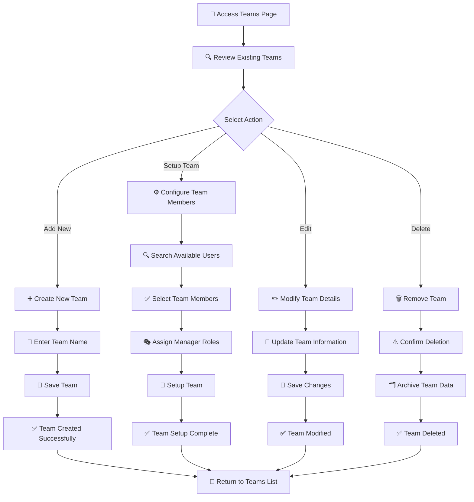

**Teams** lets you give your organization’s groups a name, keep that list up to date, and decide which people belong to each team. For each person on a team, you can also mark whether they act as a **manager** for that team.

## 📋 The main Teams list

You see a table of all teams that belong to your company.

| What you see | What it means |
|--------------|----------------|
| **#** | Row number (1, 2, 3, …). |
| **Name** | The name you gave the team. |
| **Updated At** | The last time that team’s record was changed, **shown in your own time zone** (as set on your profile). |
| **Action** | Things you can do for that row (see below). |

Above the table there is an **Add** button to create a new team.

The list can be searched and sorted using the controls built into the table (for example, a search box and paging), so you can find a team quickly when there are many.

## ➕ Adding a team

1. Click **Add**. The list hides and a form appears.
2. The form title reads **Add Team**.
3. Fill in **Name**. A short hint next to the label says to enter a clear, descriptive name for the team.
4. Click **Submit**. Another hint explains that this saves the team in the system.

**Before you save:** The name cannot be empty. If it is, you are asked to fill in the fields.

**Duplicate names:** You cannot have two teams with the **same name** for your company. If that name is already used, you see a message that it already exists and the team is not created.

**After a successful save:** You see a short success message, then the page returns to the main Teams list automatically.

Use **Back** if you want to return to the list without saving.

## ✏️ Editing a team

1. On the row for the team, click **Edit**. The list hides and the form appears with the title **Edit Team**.
2. The **Name** field is filled with the current team name. You can change it and click **Submit**.

The same rules apply as when adding: the name must be filled in, and it must not duplicate another team’s name in your company (except the team you are editing).

After a successful save, you see a success message and return to the main list.

**Back** returns to the list without requiring you to use the form.

## 🗑️ Deleting a team

1. Click the **delete** control on the row (trash icon).
2. A confirmation asks if you are sure.
3. If you confirm, that team is removed. You are returned to where you were, with a message that the record has been deleted.

## 🧩 Setting up who is on a team (“Setup Team”)

**Setup Team** opens a separate screen whose title is **Assign Users to** followed by the **team’s name**.

### 📝 What this screen does

- It lists **every person in your company** (not only people already on the team).
- For each person you can:
  - **Include them on the team** — turn the option on next to their name, or leave it off to exclude them.
  - **Manager** — choose **Yes** or **No**. This is separate from simply being on the team: you can be on the team without being marked as manager, or be marked as manager.

There is a **search** box at the top. As you type, the list **hides people whose names do not match** what you typed, so you can work faster on large lists. Matching is based on the **name** shown for each person.

At the bottom, **Setup** saves your choices.

### 🚫 If nobody appears

The list only shows rows when there is at least one person in the company to show. If your company has no users in the system, you will not see any rows here.

### 💾 What happens when you click **Setup**

The system **replaces** the team’s membership with exactly what you selected:

- Anyone **checked** is on the team; their **Manager** choice (**Yes** / **No**) is stored for that team.
- Anyone **not checked** is **not** on the team after you save.

So you are always defining the **full** current membership in one go, not “adding one person” in isolation.

After a successful save, you are taken back to the **Teams** list with a message that the update succeeded. If something goes wrong, you may see a warning instead.

**Note:** The system records **who was on the team before** and **who is on the team after** this change, for accountability (for example, member lists in before/after form).

### 🔄 Complete Workflow Process

```mermaid
graph TD
    A[👥 Access Teams Page] --> B[🔍 Review Existing Teams]
    B --> C{Select Action}
    C -->|Add New| D[➕ Create New Team]
    C -->|Setup Team| E[⚙️ Configure Team Members]
    C -->|Edit| F[✏️ Modify Team Details]
    C -->|Delete| G[🗑️ Remove Team]
    
    D --> H[📝 Enter Team Name]
    H --> I[💾 Save Team]
    
    E --> J[🔍 Search Available Users]
    J --> K[✅ Select Team Members]
    K --> L[🎭 Assign Manager Roles]
    L --> M[💾 Setup Team]
    
    F --> N[📝 Update Team Information]
    N --> O[💾 Save Changes]
    
    G --> P[⚠️ Confirm Deletion]
    P --> Q[🗂️ Archive Team Data]
    
    I --> R[✅ Team Created Successfully]
    M --> S[✅ Team Setup Complete]
    O --> T[✅ Team Modified]
    Q --> U[✅ Team Deleted]
    
    R --> V[🔄 Return to Teams List]
    S --> V
    T --> V
    U --> V
```
