# 👥 Teams Management

<Info>
The Teams section is your central hub for organizing users into functional groups. Create teams, assign users with specific roles, and manage team-based workflows to improve collaboration and productivity across your organization.
</Info>

## 🔍 Overview

The Teams management interface provides a comprehensive solution for organizing users into collaborative groups. It allows you to:

- 👥 **Create** teams for different departments or projects
- 👤 **Assign** users to teams with specific roles
- 🎭 **Designate** team managers for leadership roles
- 📊 **Monitor** team composition and changes
- ⚡ **Streamline** team-based workflows and permissions

## 📋 Team Information & Fields

### Core Team Data

| Field | Description | Purpose | Format |
|-------|-------------|---------|---------|
| **👥 Team Name** | Unique identifier for the team | Team identification and display | Text (up to 50 characters) |
| **📅 Updated At** | Last modification timestamp | Change tracking and history | MM-DD-YYYY HH:MM format |
| **👤 Assigned Users** | Number of users in the team | Team size monitoring | Numeric count |
| **⚙️ Actions** | Available team operations | Team management controls | Setup/Edit/Delete |

### Team Management Actions

<CardGroup cols={3}>
<Card title="➕ Add Team" icon="plus">
- **Purpose**: Create new team groups
- **Use Case**: Organize users by department or project
- **Workflow**: Name team → Assign users → Configure roles
</Card>

<Card title="⚙️ Setup Team" icon="settings">
- **Purpose**: Configure team members and roles
- **Use Case**: Assign users and designate managers
- **Access**: User assignment and role management
</Card>

<Card title="✏️ Edit Team" icon="edit">
- **Purpose**: Modify team name and basic details
- **Use Case**: Update team names or descriptions
- **Impact**: Changes apply to team identification
</Card>

<Card title="🗑️ Delete Team" icon="trash">
- **Purpose**: Remove obsolete teams
- **Use Case**: Clean up unused or outdated teams
- **Safety**: Confirmation required before deletion
</Card>
</CardGroup>

## 👤 User Assignment & Management

### Team Member Assignment Interface

The user assignment interface allows you to efficiently organize users into teams with specific roles:

### Assignment Process

<Steps>
<Step title="👥 Access Team Setup">
**Navigation**: Teams → Select Team → Setup Team

- **Location**: Action button on team row
- **Purpose**: Configure team membership and roles
- **Access**: Admin-level permissions required
</Step>

<Step title="🔍 Search Users">
**Function**: Filter available users

- **Search Bar**: Located at top-right of interface
- **Purpose**: Quickly find specific users
- **Filter**: Real-time search across user names
- **Use Case**: Large user bases or specific assignments
</Step>

<Step title="✅ Select Team Members">
**Action**: Check users for team assignment

- **Method**: Checkbox selection for each user
- **Visual**: Clear indication of selected users
- **Flexibility**: Add/remove users as needed
- **Bulk**: Select multiple users simultaneously
</Step>

<Step title="🎭 Assign Manager Roles">
**Configuration**: Designate team leadership

- **Field**: "Manager" dropdown for each user
- **Options**: "Yes" or "No" for manager status
- **Purpose**: Define team hierarchy and leadership
- **Impact**: Manager permissions and responsibilities
</Step>

<Step title="💾 Setup Team">
**Completion**: Apply team configuration

- **Button**: Purple "Setup" button at bottom-left
- **Validation**: System validates team composition
- **Confirmation**: Team setup completed successfully
- **Result**: Users assigned with specified roles
</Step>
</Steps>

### Team Member Roles

<CardGroup cols={2}>
<Card title="👤 Team Member" icon="user">
**Role**: Standard team member
**Permissions**: Basic team access
**Responsibilities**: Contribute to team objectives
**Management**: Assigned by team manager
</Card>

<Card title="🎭 Team Manager" icon="user-check">
**Role**: Team leadership position
**Permissions**: Enhanced team management capabilities
**Responsibilities**: Lead team activities and decisions
**Authority**: Can manage team members and workflows
</Card>
</CardGroup>

## 🔄 Team Management Workflow

### Complete Workflow Process

```mermaid
graph TD
    A[👥 Access Teams Page] --> B[🔍 Review Existing Teams]
    B --> C{Select Action}
    C -->|Add New| D[➕ Create New Team]
    C -->|Setup Team| E[⚙️ Configure Team Members]
    C -->|Edit| F[✏️ Modify Team Details]
    C -->|Delete| G[🗑️ Remove Team]
    
    D --> H[📝 Enter Team Name]
    H --> I[💾 Save Team]
    
    E --> J[🔍 Search Available Users]
    J --> K[✅ Select Team Members]
    K --> L[🎭 Assign Manager Roles]
    L --> M[💾 Setup Team]
    
    F --> N[📝 Update Team Information]
    N --> O[💾 Save Changes]
    
    G --> P[⚠️ Confirm Deletion]
    P --> Q[🗂️ Archive Team Data]
    
    I --> R[✅ Team Created Successfully]
    M --> S[✅ Team Setup Complete]
    O --> T[✅ Team Modified]
    Q --> U[✅ Team Deleted]
    
    R --> V[🔄 Return to Teams List]
    S --> V
    T --> V
    U --> V
```

## 📊 Team Statistics & Insights

<CardGroup cols={3}>
<Card title="👥 Total Teams" icon="user-group">
**Current Count**: Track active teams
**Growth Rate**: Monitor team creation trends
**Utilization**: Measure team assignment rates
</Card>

<Card title="👤 Team Members" icon="users">
**Average Size**: Track team member distribution
**Largest Teams**: Identify major team groups
**Member Distribution**: Analyze team composition
</Card>

<Card title="🎭 Team Managers" icon="user-check">
**Manager Ratio**: Track leadership distribution
**Manager Coverage**: Ensure all teams have leadership
**Leadership Analysis**: Monitor management effectiveness
</Card>
</CardGroup>

    

## 🔗 Integration Points

### Related Features

<CardGroup cols={2}>
<Card title="👤 Users Management" icon="users">
**Connection**: Users are assigned to teams
**Navigation**: `User Management > Users`
**Purpose**: Manage individual user accounts and team assignments
</Card>

<Card title="🎭 Roles Management" icon="shield">
**Connection**: Teams can have role-based access
**Navigation**: `User Management > Roles`
**Purpose**: Define permissions for team members
</Card>

<Card title="📊 Team Analytics" icon="chart-line">
**Connection**: Track team performance and metrics
**Navigation**: Dashboard and Reports sections
**Purpose**: Monitor team productivity and collaboration
</Card>

<Card title="🔐 Team Permissions" icon="lock">
**Connection**: Control team-based access to features
**Navigation**: Settings and configuration areas
**Purpose**: Manage team-specific capabilities and restrictions
</Card>
</CardGroup>

