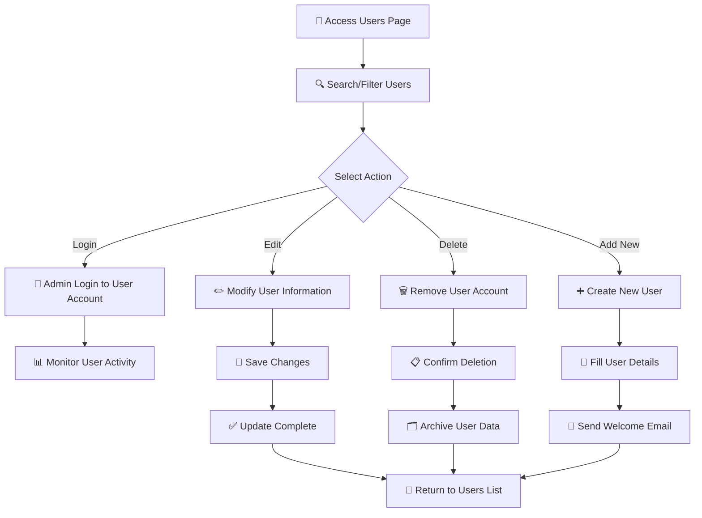

# 👥 Users Management

<Info>
The Users section is your central hub for managing all user accounts in your system. Monitor user activity, manage permissions, and maintain complete control over your user base.
</Info>

## 🔍 Overview

The Users management interface provides a comprehensive view of all users in your system, allowing you to:

- 📊 **Monitor** user accounts and their status
- ✏️ **Edit** user information and settings
- 🔐 **Control** user access and permissions
- 📈 **Track** user creation and activity
- 🔄 **Manage** user sessions and login access

## 📋 User Fields & Information

### Core User Data

| Field | Description | Purpose | Format |
|-------|-------------|---------|---------|
| **👤 Name** | User's display name | Identification and personalization | Text (up to 50 characters) |
| **📧 Email** | Primary email address | Authentication and communication | Valid email format |
| **📞 Phone #** | Contact phone number | Communication and verification | Numeric format |
| **📞 Phone EXT** | Phone extension | Direct contact routing | Numeric extension |
| **🟢 Status** | Account status | Access control | Active/Inactive |
| **📅 Created At** | Account creation date | Audit trail and tracking | MM-DD-YYYY HH:MM format |

### Field Details

<CardGroup cols={2}>
<Card title="👤 Name Field" icon="user">
- **Purpose**: Primary identification
- **Validation**: Required, 2-50 characters
- **Use Case**: Display in interface, reports, communications
</Card>

<Card title="📧 Email Field" icon="envelope">
- **Purpose**: Login credential and communication
- **Validation**: Must be valid email format
- **Use Case**: Authentication, notifications, password reset
</Card>

<Card title="📞 Phone Fields" icon="phone">
- **Purpose**: Alternative contact method
- **Validation**: Numeric format for phone, optional extension
- **Use Case**: Voice communications, 2FA verification
</Card>

<Card title="🟢 Status Field" icon="toggle-on">
- **Purpose**: Account access control
- **Values**: Active (green) / Inactive (red)
- **Use Case**: Enable/disable user access to system
</Card>
</CardGroup>

## ⚡ User Actions & Controls

### Available Actions

<Steps>
<Step title="🔐 Login Action">
**Purpose**: Directly access user's account

- **Use Case**: Technical support, troubleshooting
- **Access**: Admin-level permissions required
- **Security**: Maintains audit log of admin logins
- **Result**: Opens user session in new tab/window
</Step>

<Step title="✏️ Edit Action">
**Purpose**: Modify user information and settings

- **Editable Fields**: Name, email, phone, status, permissions
- **Use Case**: Update contact info, change access levels
- **Validation**: Real-time field validation
- **Result**: Updated user profile with change history
</Step>

<Step title="🗑️ Delete Action">
**Purpose**: Remove user from system

- **Confirmation**: Requires confirmation dialog
- **Use Case**: Deactivate terminated employees, cleanup
- **Data Handling**: Soft delete with data retention options
- **Result**: User marked as deleted, data archived
</Step>
</Steps>

## 🔄 User Management Workflow

### Complete Workflow Process

## 🎯 Use Cases & Applications

### Primary Use Cases

<CardGroup cols={2}>
<Card title="👔 Employee Management" icon="building">
**Scenario**: Managing company staff accounts

- **Add new employees** when they join
- **Update information** during role changes  
- **Deactivate accounts** when employees leave
- **Monitor access** and activity levels
</Card>

<Card title="🤝 Client Account Management" icon="handshake">
**Scenario**: Managing customer/client users

- **Create client accounts** for new customers
- **Update contact details** as needed
- **Control access levels** based on subscription
- **Track usage** and engagement metrics
</Card>

<Card title="🛠️ Technical Support" icon="wrench">
**Scenario**: Providing user assistance

- **Login to user accounts** to troubleshoot issues
- **Update settings** to resolve problems
- **Monitor user activity** to identify patterns
- **Manage permissions** for access control
</Card>

<Card title="📊 User Analytics" icon="chart-line">
**Scenario**: Analyzing user data and trends

- **Track user growth** over time periods
- **Monitor active vs inactive** users
- **Analyze creation dates** for trend insights
- **Generate reports** on user demographics
</Card>
</CardGroup>

## 📈 User Statistics & Insights

<CardGroup cols={3}>
<Card title="📊 Total Users" icon="users">
**Current Count**: 3 active users
**Growth Rate**: Track monthly additions
**Engagement**: Monitor login frequency
</Card>

<Card title="🟢 Active Users" icon="user-check">
**Status Tracking**: Real-time status monitoring
**Last Activity**: Track recent user activity
**Session Data**: Monitor current sessions
</Card>

<Card title="📅 Recent Additions" icon="user-plus">
**New Signups**: Track recent registrations
**Onboarding**: Monitor user activation rates
**Trends**: Identify growth patterns
</Card>
</CardGroup>

## 🔗 Integration Points

### Related Features

<CardGroup cols={2}>
<Card title="👥 Teams Management" icon="users">
**Connection**: Users can be assigned to teams
**Navigation**: `User Management > Teams`
**Purpose**: Organize users into functional groups
</Card>

<Card title="🎭 Roles & Permissions" icon="shield">
**Connection**: Users are assigned specific roles
**Navigation**: `User Management > Roles`
**Purpose**: Control feature access and capabilities
</Card>
</CardGroup>
 