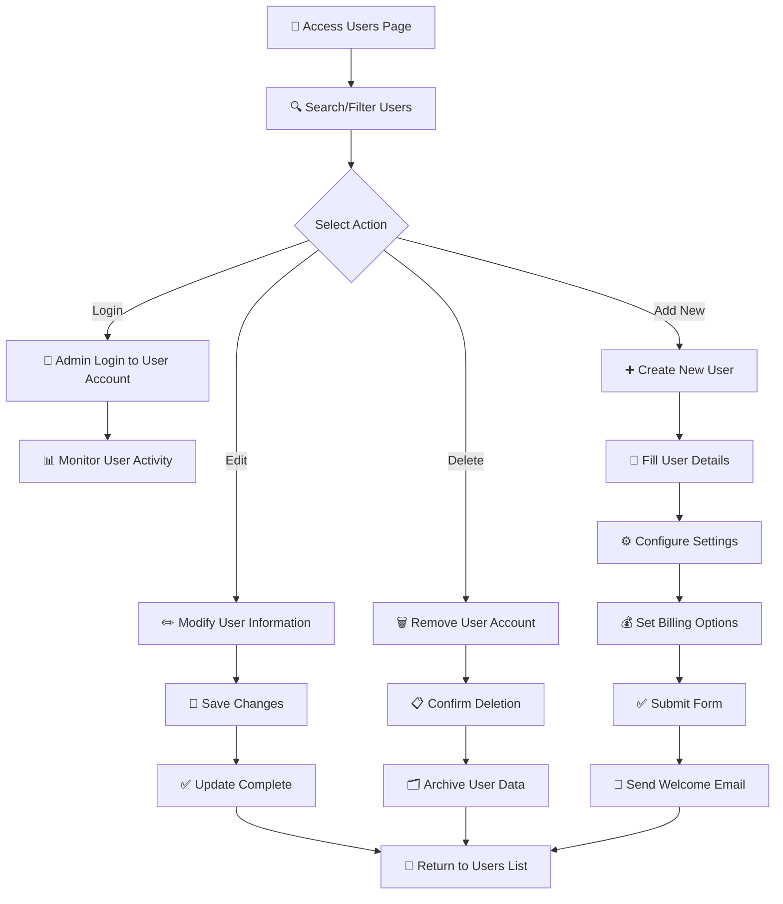

**Users** is where you see everyone who belongs to your company in this product, add new people, change their details, open the product as they see it, or remove someone. Only people tied to your company appear in the list.

## 📋 Main list

**Add** opens the screen to create a new person.

The table shows one row per user. You can:

- **Change how many rows appear** using the “show entries” control (often 10 at a time).
- **Find someone quickly** using the search box; it filters the table by what you type.

### 🧾 Columns

| Column | Meaning |
|--------|--------|
| **#** | Row number in the list (1, 2, 3…). |
| **Name** | The person’s name as stored in the account. |
| **Email** | Their email address (also used to sign in). |
| **Phone #** | The main phone number on file for them. |
| **Phone EXT** | Extra or extension numbers linked to them (when assigned). |
| **Status** | Whether their account is pending, active, inactive, or suspended. |
| **Created At** | When this user record was created, shown in **your** time zone. |

### ⚙️ Actions on each row

- **Login** — Asks you to confirm, then opens the product **as that user**, so you see the same screens and options they do. Use this for support or checking their setup.
- **Edit** — Opens the form with that person’s details so you can change them.
- **Delete** — Removes that user. You must confirm. The message explains that many related items (agents, workflows, pipelines, phone setup, templates, lists, teams, and more) can be removed with the user and that **this cannot be undone**.

## ➕ Add or ✏️ Edit user (form)

Use **Add** for someone new, or **Edit** on a row to change an existing person. **Back** returns you to the list without using the other buttons.

Small **question-mark hints** next to some fields give extra guidance when you point at them.

**👤 Name**

Full name. This is how the person appears in the product.

**📧 Email**

Must be a real address. It is used for signing in and for messages such as the welcome message for new users. **The same email cannot be used twice** in the system.

**📞 Phone number**

Used for calling-related features. You can enter it with or without a country code (for example `+1234567890` or `1234567890`).

**🔒 Password**

- **New user:** You must set a password.
- **Existing user:** Leave this **empty** to keep their current password. Only fill it in if you want to set a new one.

**🚦 Status**

- **Pending** — Not fully ready yet.
- **Active** — Can sign in (subject to the rest of their setup).
- **Inactive** / **Suspended** — Generally cannot use the account as normal.

Use the hint on the field for the exact behavior.

**☎️ Dialer**

**No** — This person does not use the dialer.

**Yes** — They can use dialer features.

Note: Turning dialer on can affect **who pays** for that seat and how **company package seats** are counted (see **Pay for seat** and **Use package seats limits** below, and the examples at the bottom of the form).

**💰 Use balance**

**Company** — Spending comes from the company balance.

**User** — Spending comes from that person’s own balance.

**🏷️ Role**

Choose one **role** from the list your company uses (these are created elsewhere under **Roles**). Name, email, and role are all required before you can save.

**🔢 Assign phone numbers**

You can pick one or more **company phone numbers** (from your connected numbers) to attach to this user. A number that is already assigned to **another** user cannot be assigned again until it is freed.

**🌎 Local presence**

**No** — Local presence is off.

**Yes** — You can choose **area codes** so outbound calls can use numbers that match those areas. When you choose **Yes**, the **Area codes** list appears so you can select one or more codes.

**💺 Pay for seat**

- **No (Company pay for seat)** — The company pays for this seat in the usual company billing flow.
- **Rizzler (Direct to Rizzler)** — This person is billed **directly** to Rizzler (not through the company seat path in the same way).

When **Company pay** is selected, an extra choice appears: **Use package seats limits** (see next).

**📦 Use package seats limits**

(Shown when the company pays for the seat.)

- **Yes** — This user counts toward limits in your **company package** for seats (when dialer is on and this option applies). If the limit is reached, you may see a message that the package seat limit is exceeded.
- **No (Subscription with company card)** — Uses the other billing path described in the option (company card / subscription style setup).

The bullet list at the bottom of the form gives **example combinations** for:

- A typical **admin** setup (dialer off, company pays, using package limits).
- An **agent who pays Rizzler directly** (dialer on, pay to Rizzler).
- **Agents the company pays for** (dialer on, company pays, and how to set package limits vs card).

**✅ Submit**

Saves the user. If something is wrong (duplicate email, seat limit, phone numbers already taken, missing password for a new user, or missing required fields), a message explains what to fix. After a successful save, the page returns to the user list.

**📩 Welcome email**

When you **add** a new user successfully, the system sends a **welcome message** to their email so they know how to get started (including sign-in information your company uses).

**🗑️ Deleting a user**

Deleting removes that user and can remove a large amount of related work tied to them (the confirmation lists examples). Any **personal subscription** tied to that user may be stopped as part of removal. This action should be treated as **permanent**.

## 🔄 User Management 

### 🔁 Complete Workflow Process

```mermaid
graph TD
    A[👥 Access Users Page] --> B[🔍 Search/Filter Users]
    B --> C{Select Action}
    C -->|Login| D[🔐 Admin Login to User Account]
    C -->|Edit| E[✏️ Modify User Information]
    C -->|Delete| F[🗑️ Remove User Account]
    C -->|Add New| G[➕ Create New User]
    
    D --> H[📊 Monitor User Activity]
    E --> I[💾 Save Changes]
    F --> J[📋 Confirm Deletion]
    G --> K[📝 Fill User Details]
    K --> K1[⚙️ Configure Settings]
    K1 --> K2[💰 Set Billing Options]
    K2 --> K3[✅ Submit Form]
    
    I --> L[✅ Update Complete]
    J --> M[🗂️ Archive User Data]
    K3 --> N[📧 Send Welcome Email]
    
    L --> O[🔄 Return to Users List]
    M --> O
    N --> O
```

